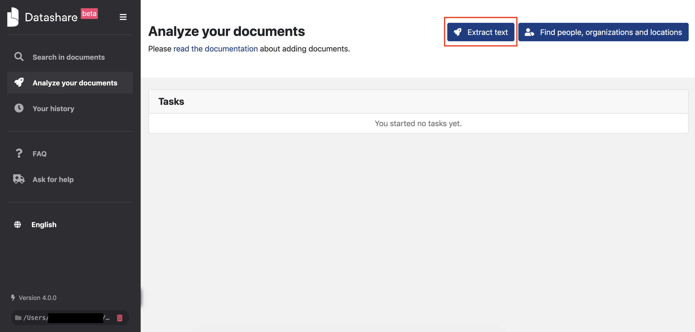
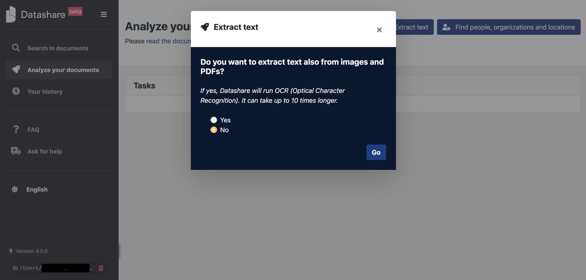
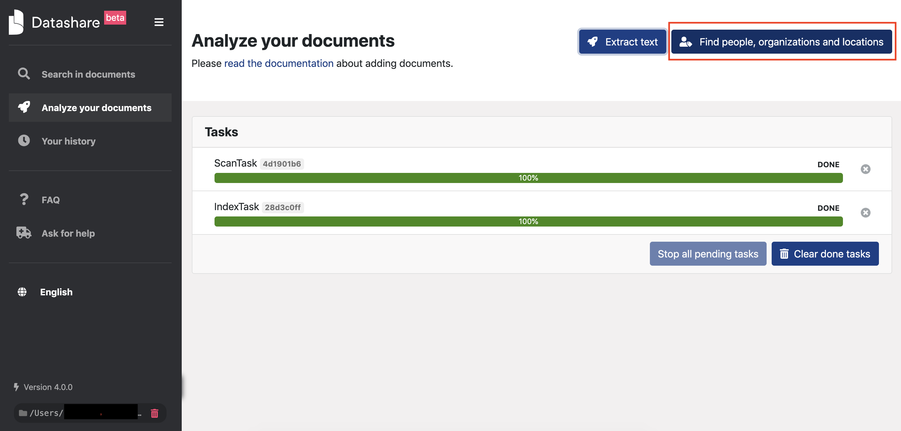
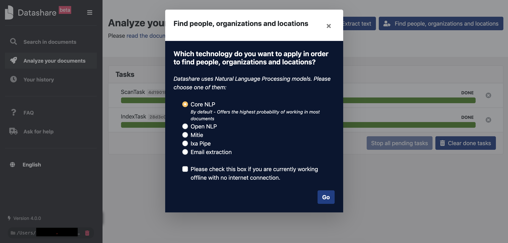
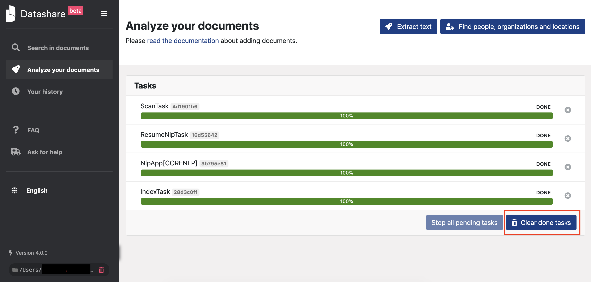
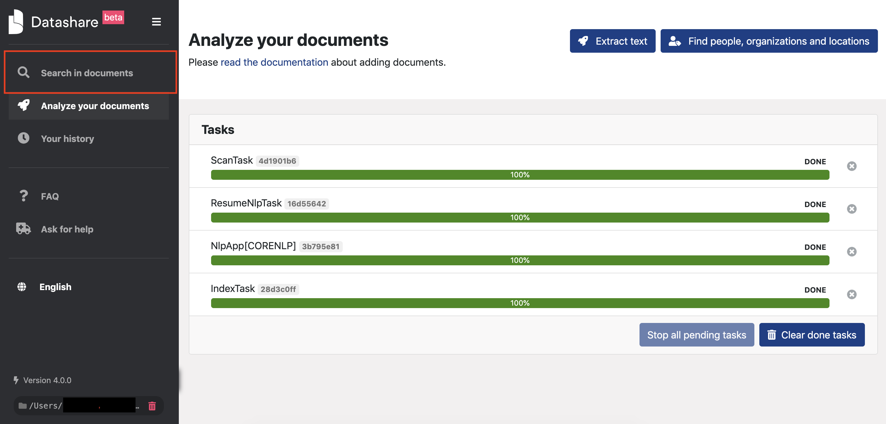
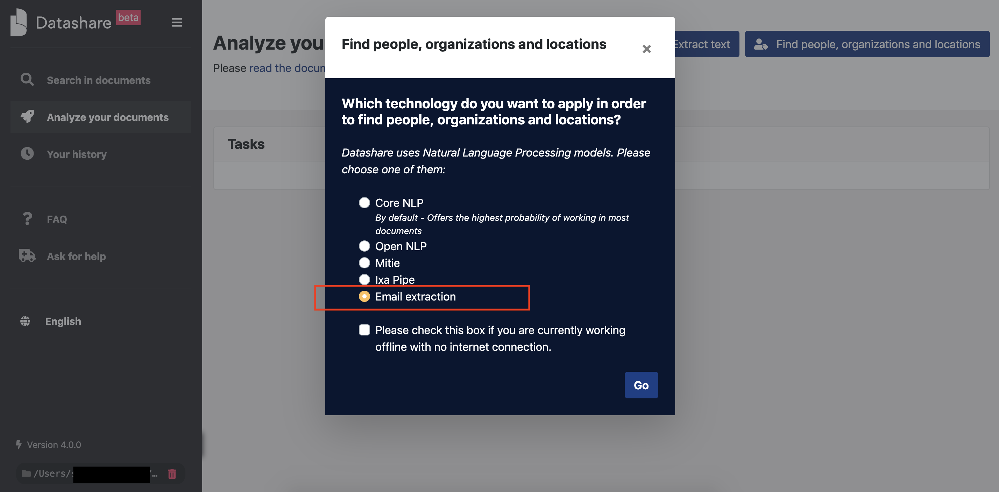

# Analyze documents

## Extract text

1. To index and have your documents in Datashare, click '**Analyze your documents'**.

2. You're now on '[http://localhost:8080/\#/indexing](http://localhost:8080/#/indexing)'. Click '**Extract text'** so that Datashare can extract the texts from your files.

If you want to extract text also from images and PDFs, click '**Yes'** but be aware that it can take up to 10 times longer. You will always be able to do it later.

3. Two extraction tasks are now running: the first is the scanning of your Datashare folder which sees if there are new documents to analyze. The second is the indexing of these files.

It is **not yet** possible to 'Find people, organizations and locations' as long as one of these two tasks is still running. 

4. When tasks are done, you can start exploring documents by clicking '**Search'** but you won't have the named entities \(names of people, organizations and locations\) yet. 

## Find names of people, organizations and locations

1. After the text is extracted, you can launch named entities recognition by clicking the button '**Find people, organizations and locations'**.

2. In the window below, you are asked to choose among different pipelines of 'Natural Language Processing'. These are tools that automatically identify named entities \(names of people, locations and organizations, in our case\) in your documents. You can only choose one at a time. 

Select '**CoreNLP'**, if you want to use the one with the highest probability of working in most of your documents:

3. You can now see running tasks and their progress. After they are done, you can click '**Clear done tasks'** to stop displaying tasks that are completed.

  
4. You can search your indexed documents without having to wait for all tasks to be done. To access your documents, click '**Search in documents'**.

## Extract email addresses

To extract email addresses in your documents:

* Re-click on **'Find people, organizations and locations'** 
* Click ****the last radio button **'Email extraction'**
* Click '**Go**'

Now let's [search your documents](https://icij.gitbook.io/datashare/all/explore-documents).

