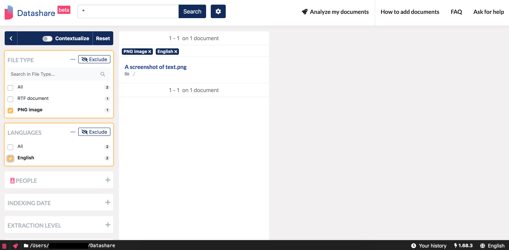
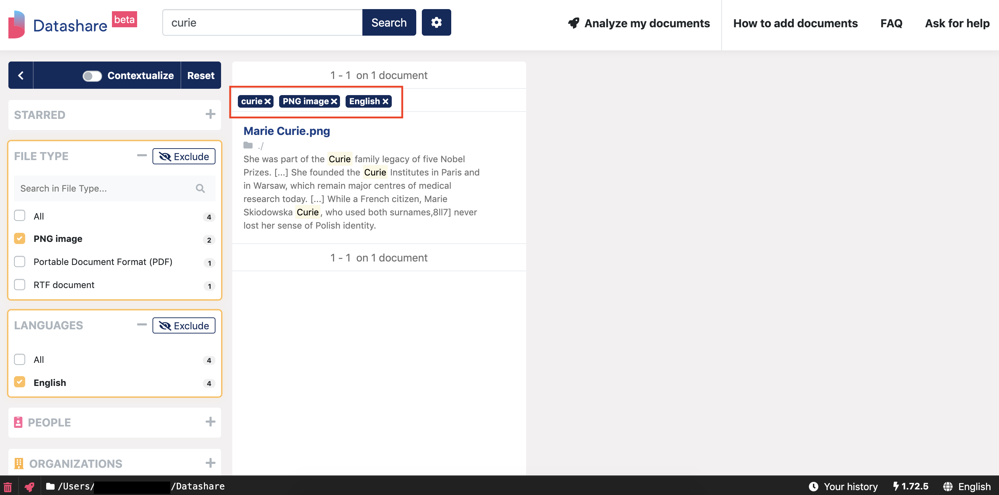
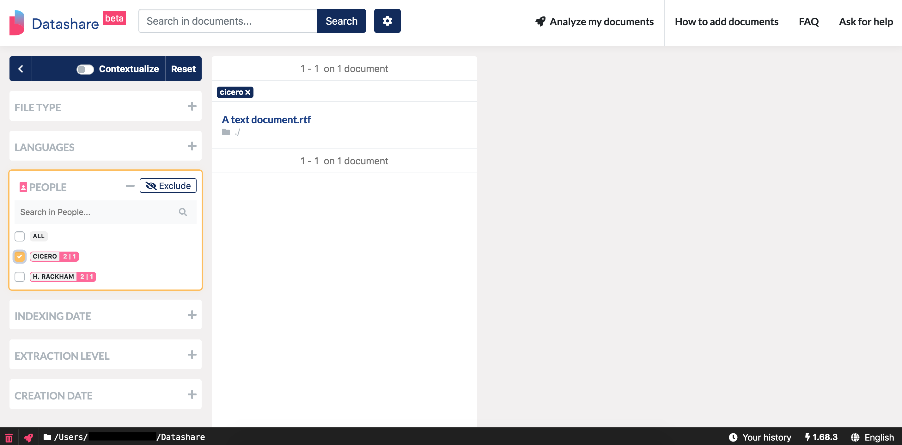
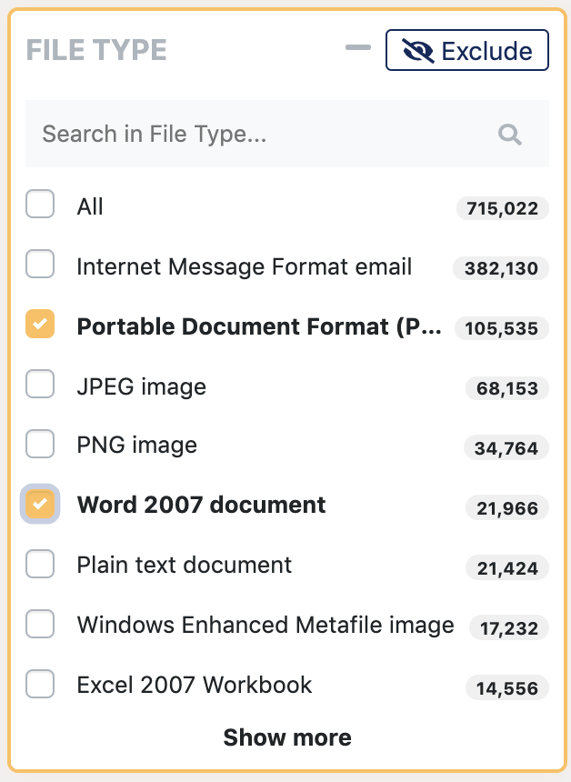
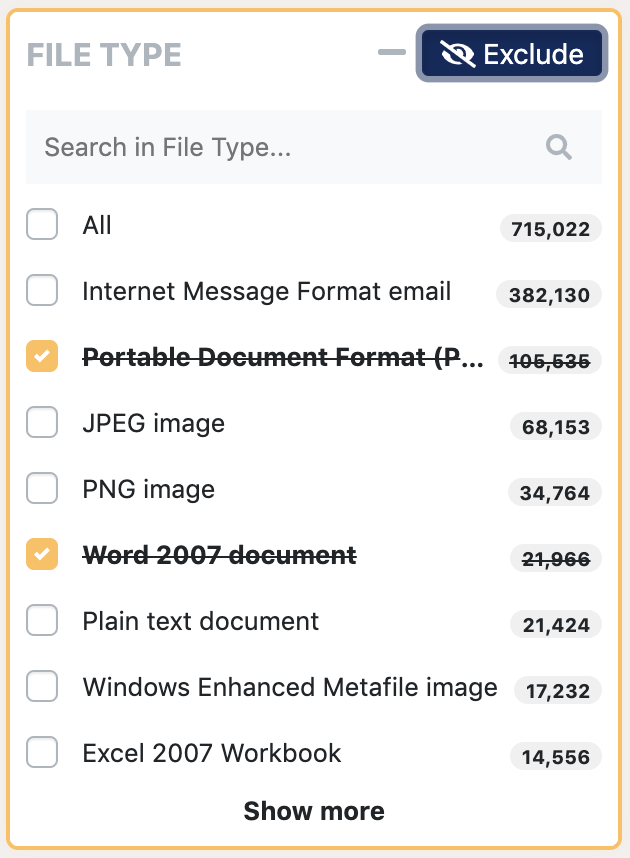
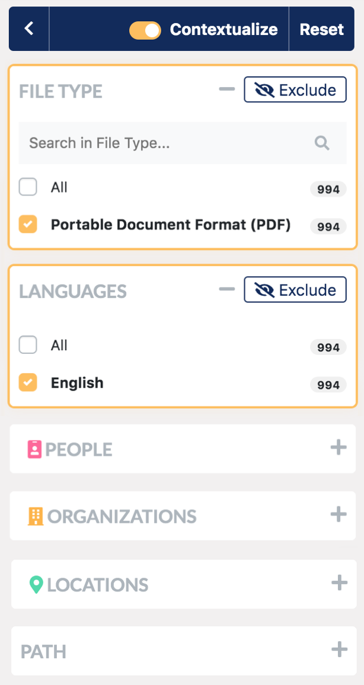
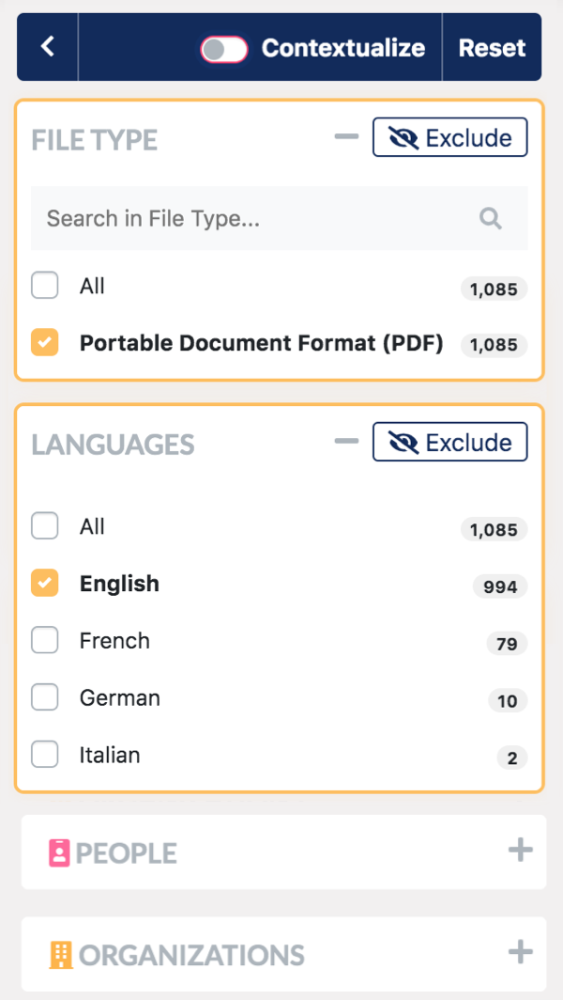
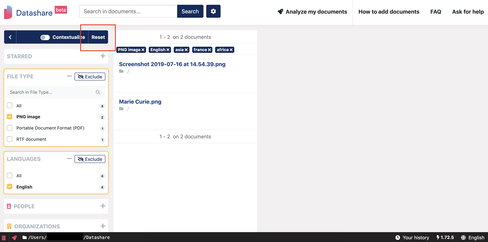

# Filter documents

## Apply filters

On the left, you can apply **filters** by ticking them, like 'PNG image' in File Types and 'English' in Languages in the example below:

A reminder of the currently applied filters, as well as your queried terms, are displayed at the top of the results' column. You can easily unselect these filters from there by clicking them:

* **Starred**: If you have starred documents, you can easily find them again.
* **File type**: This is the 'Content type' of the file \(Word, PDF, JEPG image, etc.\) as you can read it in a document's 'Tags & Details'.
* **Languages**: Datashare detects the main language of each document.
* **People / organizations / locations**: you can selected these named entities and search them.
* **Path**: This is the location of your documents as it is indicated in your original files \(ex: desktop/importantdocuments/mypictures\). You can find this in a document's 'Tags & Details'.
* **Indexing date**: This date corresponds to when you indexed the documents in Datashare.
* **Extraction level**: This regards embedded documents. The file on disk is level zero. If a document \(pictures, etc\) is attached or contained in a file on disk, extraction level is “1st”. If a document is attached or contained in a document itself contained in a file on disk, extraction level is “2nd”, etc.
* **Creation date**: This is when the document was created as it is noticed in their properties. You can find this in a document's 'Tags & Details'.

Filters can naturally be combined together and with some searches in order to refine results.

## Filter by named entities

 If you have asked Datashare to '**Find people, organizations and locations'**, you can see names of individuals, organizations and locations in the filters. These are the named entities **automatically detected by Datashare.** You can select one or multiple ones to find out the documents that mention them:

**Note**: To find named entities \(if you haven’t already performed this step\), click on '**Analyze documents'**, and click on '**Find people, organizations and locations'**.

Select '**CoreNLP'** if you want to use the option with the highest probability of working well in most of your documents:

## Use the 'Exclude' button

If you want to select all lines but one or multiple item\(s\), you can use the '**Exclude button'** after having clicked on the filter\(s\) you want to exclude. 

The 'Exclude' button appears once you have selected a filter. It allows you to search for all documents which do not correspond to the last active filter you selected, that is to say to the currently strikethrough filters. It allows to display all documents but the one\(s\) which correspond\(s\) to the currently strikethrough filters.

For example, the configuration below makes you see only 'PDF' and 'Word' documents.

Now if you click on 'Exclude', this configuration makes you see all documents but 'PDF' and 'Word' documents.

This 'Exclude' functionality can be used in multiple filters at the same time. 

## Contextualize filters

 You can also turn on the '**Contextualize'** functionality in order to **update the number of documents indicated in the filters according to your selection**. 

In the example below, the 'Contextualize' toggle button is turned **on**. The numbers indicate that there are 994 PDF documents in English in the user's corpus and the total in any filter is 994:

On the contrary, when the 'Contextualize' button is **off** as in the example below, the number of PDFs on the 'File Type' filter remains 1,085. It did not adapt to the 'English' selection:

## Reset filters

To reset all filters at the same time, click 'Reset':

