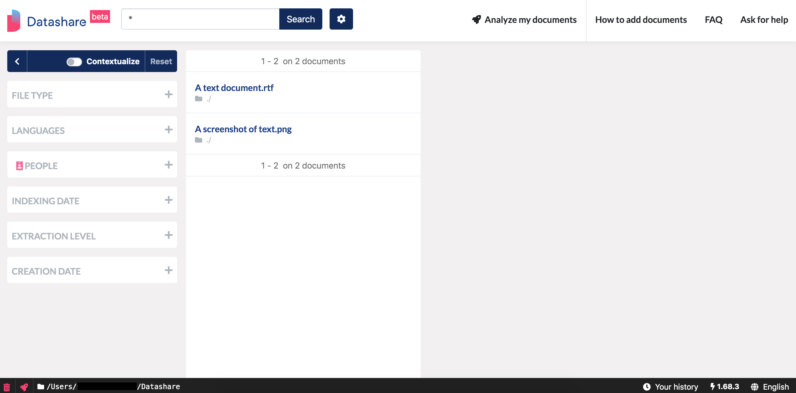
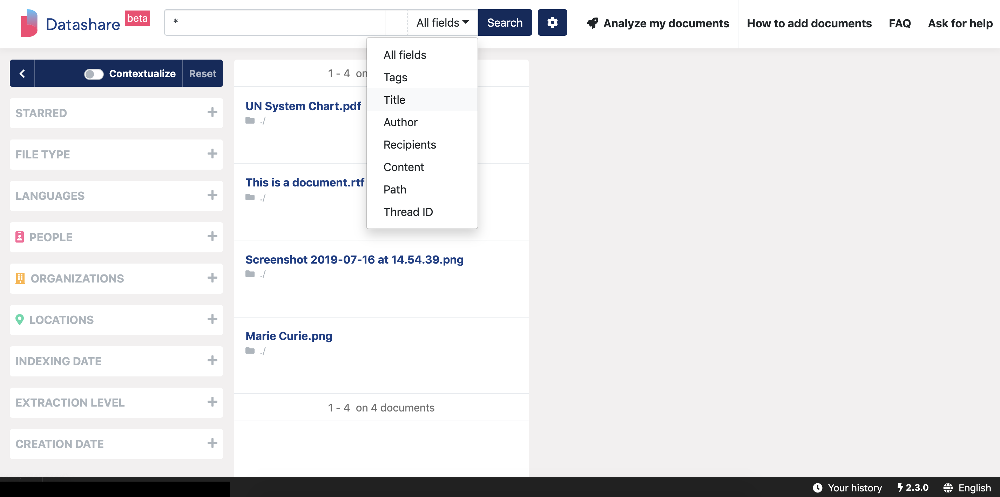
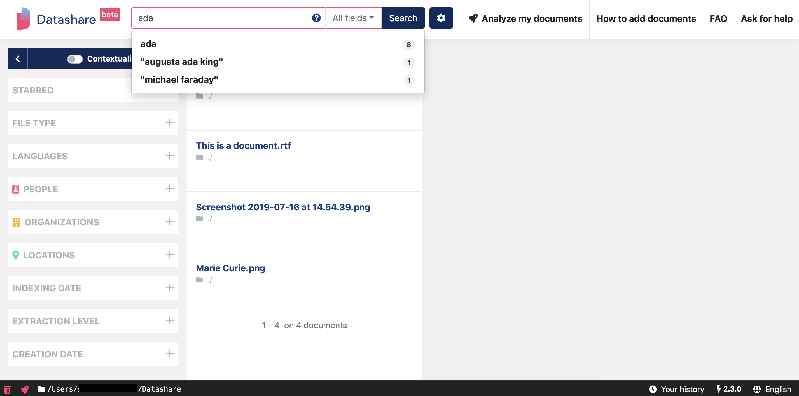
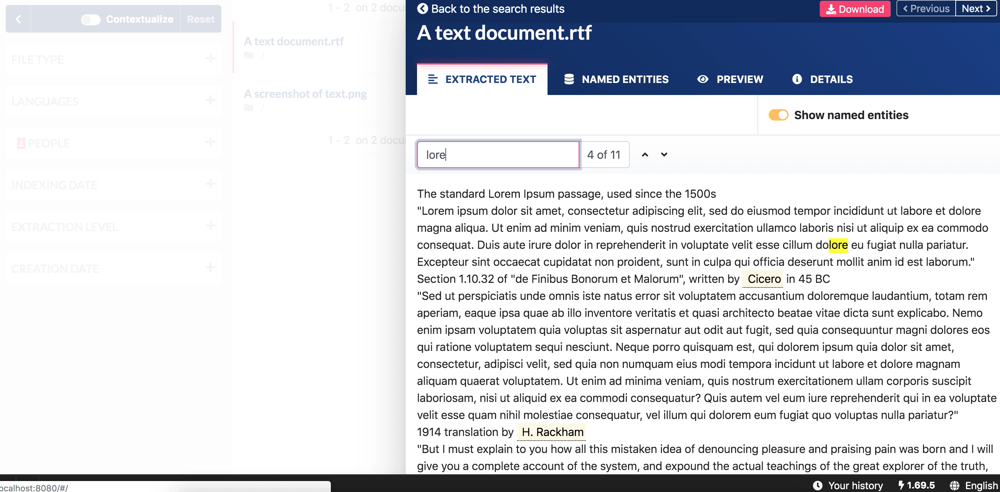

# Search documents

1. To see all your documents, empty the search bar or leave the asterisk and click '**Search'**:

2. You can search for specific documents by **typing terms** in the search bar. 

**Important: to make your searches more precise, you can** [**search with operators \(AND, OR, ....\)**](https://icij.gitbook.io/datashare/all/search-with-operators)

3. You can search **in specific fields** like tags, title, author, recipient, content, path or thread ID. Click 'All fields' and select your choice in the dropdown menu:

4. In the 'All fields' category, when you start typing terms, you can see suggestions of named entities \(name of people, organizations and locations in Datashare\) in a dropdown menu:

5. Once you opened a document, you can **search for terms in this document:**

* Press **Command\(⌘\) + F** \(on Mac\) or **Control + F** \(on Windows and Linux\) or click on the search bar above your Extracted Text
* Type what you search for
* Press **ENTER** to go from one occurrence to the **next** one
* Presse **SHIFT + ENTER** to go from one occurrence to the **previous** one

_To know all the shortcuts in Datashare, please read '_[_Use keyboard shortcuts_](https://icij.gitbook.io/datashare/all/use-keyboard-shortcuts)_'._

This also counts the number of occurrences of your searched terms in this document:

