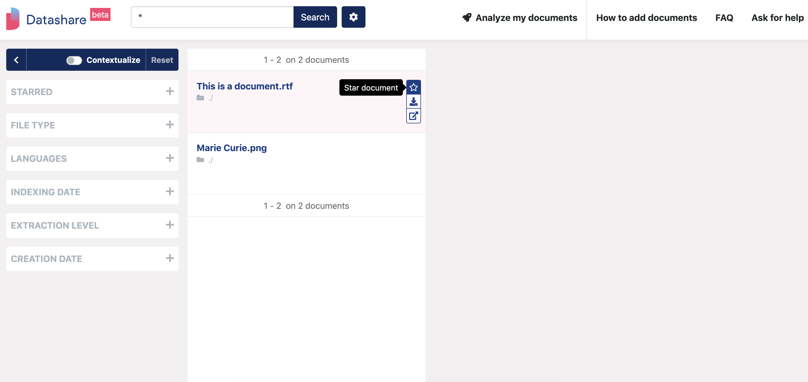
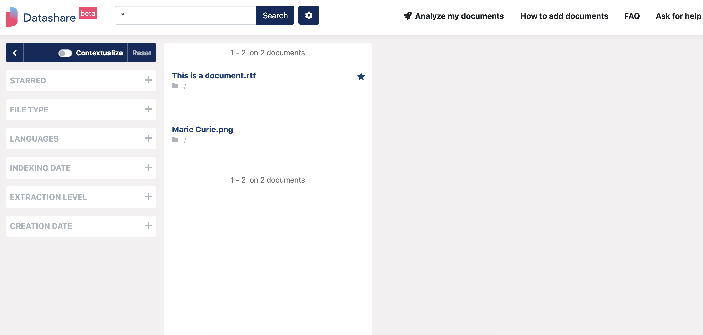
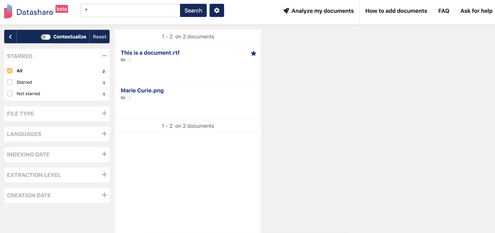
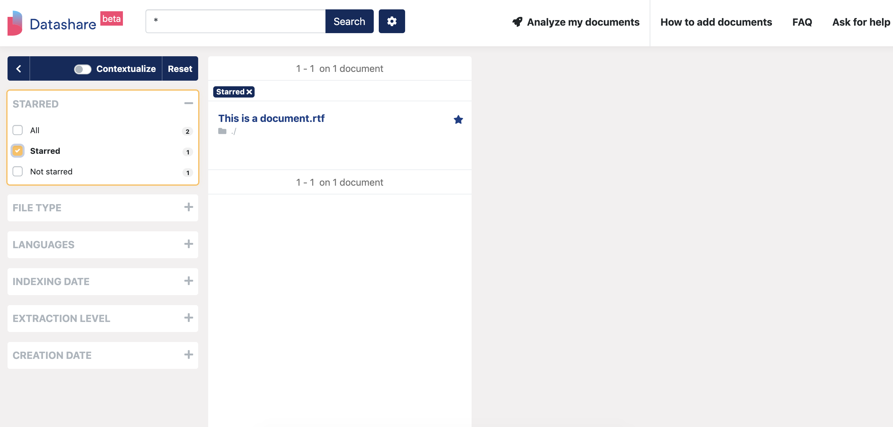

# Star documents

## Star a document

* Hover the document's title in the main column. A button with the labe 'Star document' appears. 
* Click it:

The starred document is now marked with a star icon:

## Unstar a document

Click again on its star icon. The document won't have a star anymore.

## Find your starred documents

* Open the 'Starred' filter on the left:

* Tick 'Starred' \(respectively 'Unstarred'\). 
* Only starred \(respectively unstarred\) documents will be displayed in the main column:

