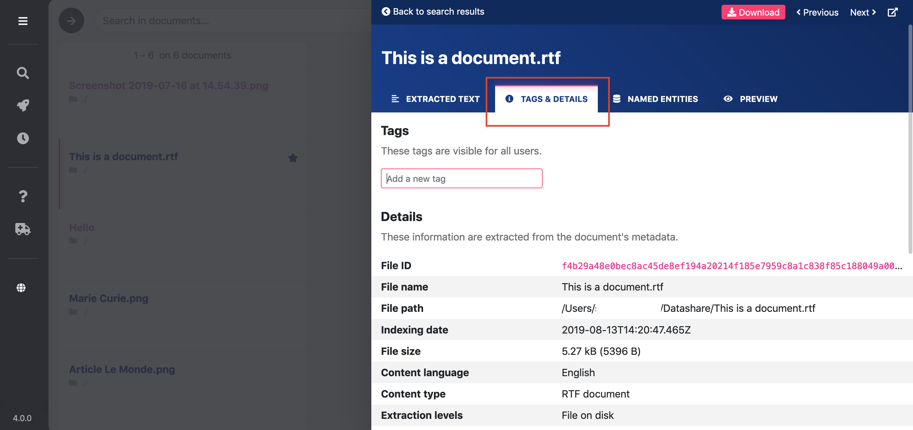
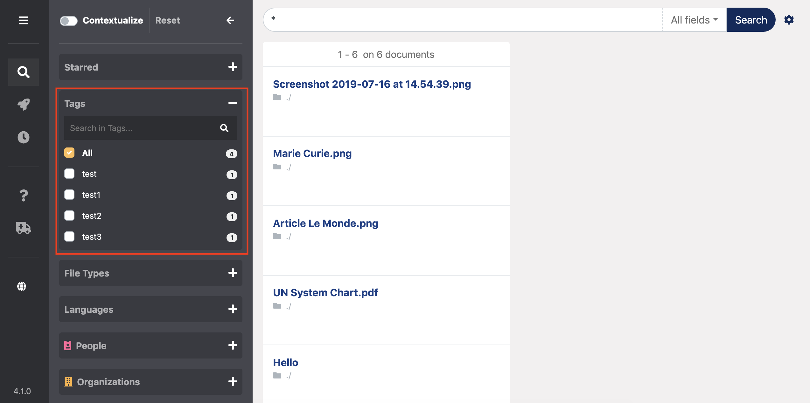
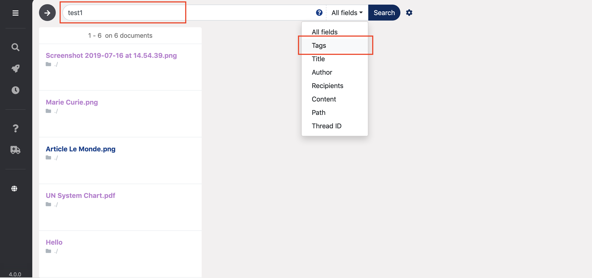

# Tag documents

## Tag a document

* **Open** the document by clicking on its title
* Click the second tab '**Tags & Details**'

* **Type** your tag
* Press '**Enter**'

**Tags can contain any character but cannot contain space.**

Your new tag is now displayed on this page. 

You can add several tags. 

## Search tags with tag filter

* Open the second filter untitled '**Tags**'
* You see the tags **by frequency** and the number of tagged documents
* You can **search** using the search bar
* You can **select one or multiple tags**

## Search tags with main search bar

To find all your documents tagged **with specific tag\(s\)**:

* **Type** the tag\(s\) in the main search bar
* Select '**Tags**' in the field dropdown menu

* Click '**Search**' or press '**Enter**'

The results are all the documents tagged with the tag\(s\) you typed in the search bar.

To find all your tagged documents, **whatever the tags**:

* Type **nothing** in the search bar 
* Select '**Tags**' in the field selector
* Click '**Search**'

The results are all the tagged documents.

## Delete a tag

Click the cross at the end of the tag that you want to delete.

