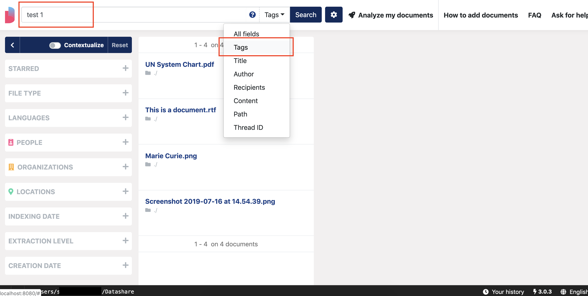

# Tag documents

## Tag a document

* Open the document by clicking on its title
* Click the second tab 'Tags & Details'

* Type your tag
* Press 'Enter'

Your new tag is now displayed on this page. 

You can add several tags.

## Search for tagged documents

To find all your documents tagged **with specific tag\(s\)**:

* Type the tag\(s\) in the main search bar
* Select 'Tags' in the field dropdown menu

* Click 'Search'

The results are all the documents tagged with the tag\(s\) you typed in the search bar.

To find all your tagged documents, **whatever the tags**:

* Type nothing in the search bar 
* Select 'Tags' in the field selector
* Click 'Search'

The results are all the tagged documents.

## Delete a tag

Click the cross at the end of the tag that you want to delete.

