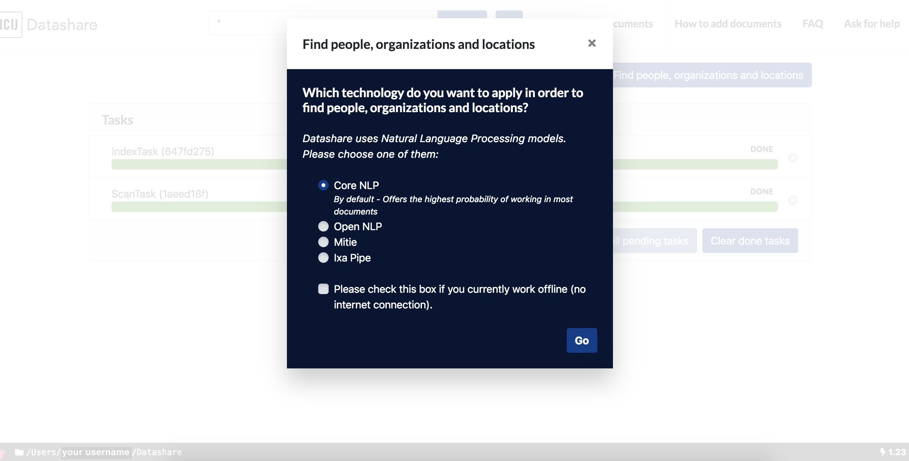

# What are NLP pipelines?

Pipelines of Natural Language Processing are tools that **automatically identify named entities** in your documents. You can only choose one at a time. 

Select '**CoreNLP'** if you want to use the one with the highest probability of working in most of your documents:

