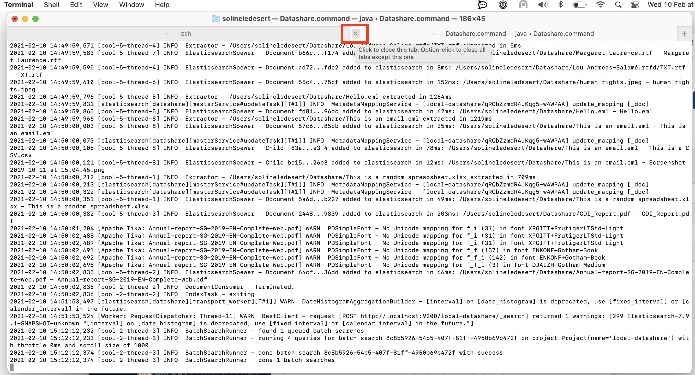
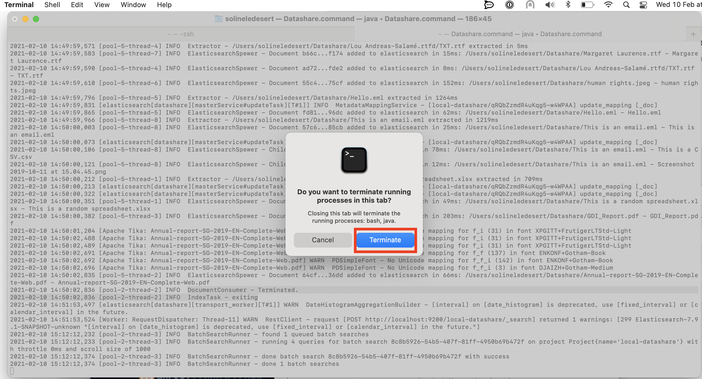
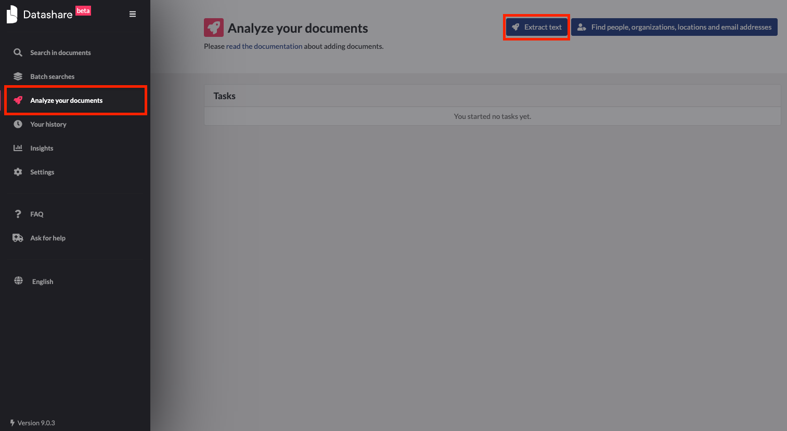

# I upgraded to version 9 of Datashare and it fails.

To fix the issue:

 1. Stop Datashare. If Datashare is running, **close the Terminal window** \(the window that opens when you start Datashare\):

Click **'Terminate**':

 2. Open your Terminal \(or a new window in your Terminal\) and copy and paste:

* If you're using Mac: `rm -Rf ~/Library/Datashare/index`
* If you're using Windows: `rd /s /q "%APPDATA%"\Datashare\index`
* If you're using Linux: `rm -Rf ~/.local/share/datashare/index`  

 3. Press **Enter**

 4. **Restart Datashare** \(here are the instructions [for Mac](https://icij.gitbook.io/datashare/mac/open-datashare-on-mac), [for Windows](https://icij.gitbook.io/datashare/windows/open-datashare-on-windows) and [for Linux](https://icij.gitbook.io/datashare/linux/open-datashare-on-linux)\)

 5. Index documents again: go to **'Analyse your documents**' and click '**Extract text**':  

