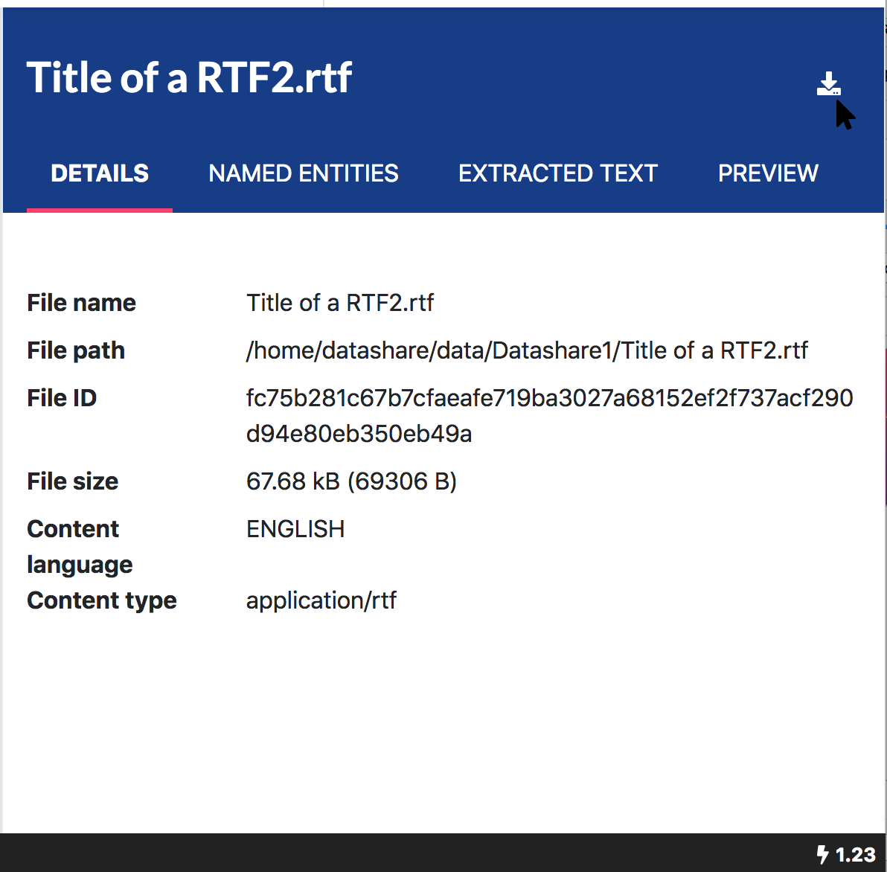

# Can I download a document from Datashare?

You can download a document by going to it on Datashare. **Click on the download icon** to the right of the screen on on the right of the document's title.

If you **can't download** a document, it means that Datashare has been badly initialized. Please **restart Datashare**. If you're an advanced user, you can capture the logs and create an issue on [Datashare's Github](https://github.com/ICIJ/datashare/issues).

