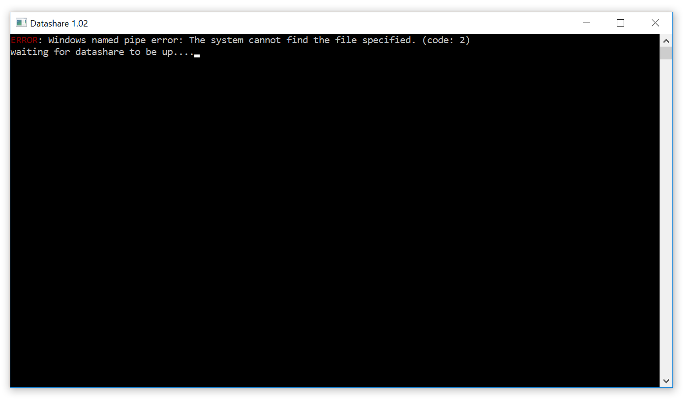

# What does 'Windows named pipe error' mean?

When a dark window called the Terminal displays a phrase beginning with "Windows named pipe error: The system cannot find the file specified," it means that Docker Desktop, one of the 3 components of Datashare, is not working. **Relaunching Docker Desktop should solve the problem.**

Find Docker Desktop in your Applications or the whale icon on the menu bar of your computer and click **'Restart'.**

