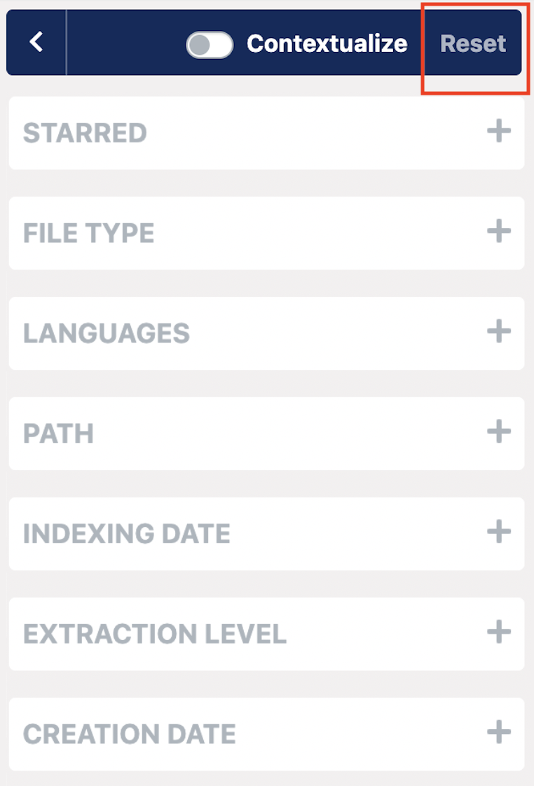

# What if Datashare says 'No documents found'?

* If you were able to see documents during your current session, you might have active filters that prevent Datashare from displaying documents, as no document might correspond to your current search. You can check in your URL if you see active filters and if you're **comfortable with the possibility of loosing your previously selected filters**, click '**Reset filters'**.

* You may not have added documents to Datashare yet. To add documents, see: 'Add documents to Datashare' for [Mac](https://icij.gitbook.io/datashare/mac/add-documents-to-datashare-on-mac), [Windows](https://icij.gitbook.io/datashare/windows/add-documents-to-datashare-on-windows) or [Linux](https://icij.gitbook.io/datashare/linux/add-documents-to-datashare-on-linux).

* In 'Analyzed documents', if some tasks are not marked as 'Done', **please wait for all tasks to be done**. Depending on the number of documents you analyzed, it can take multiple hours. 

