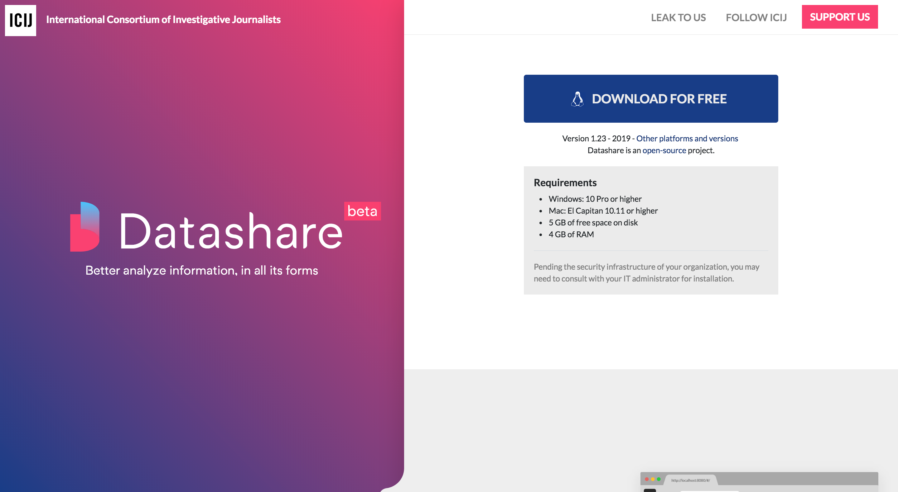
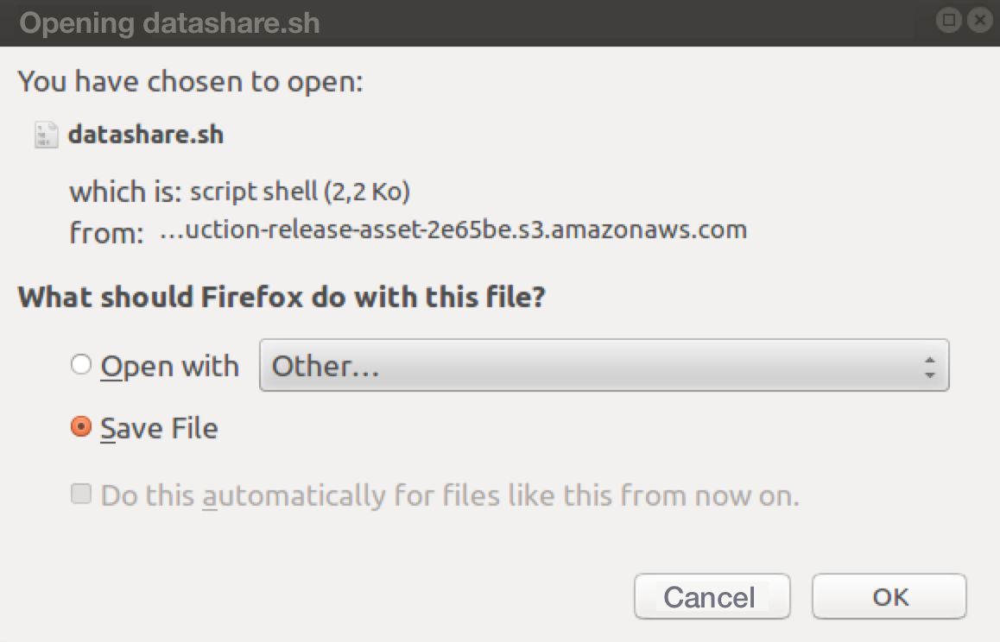
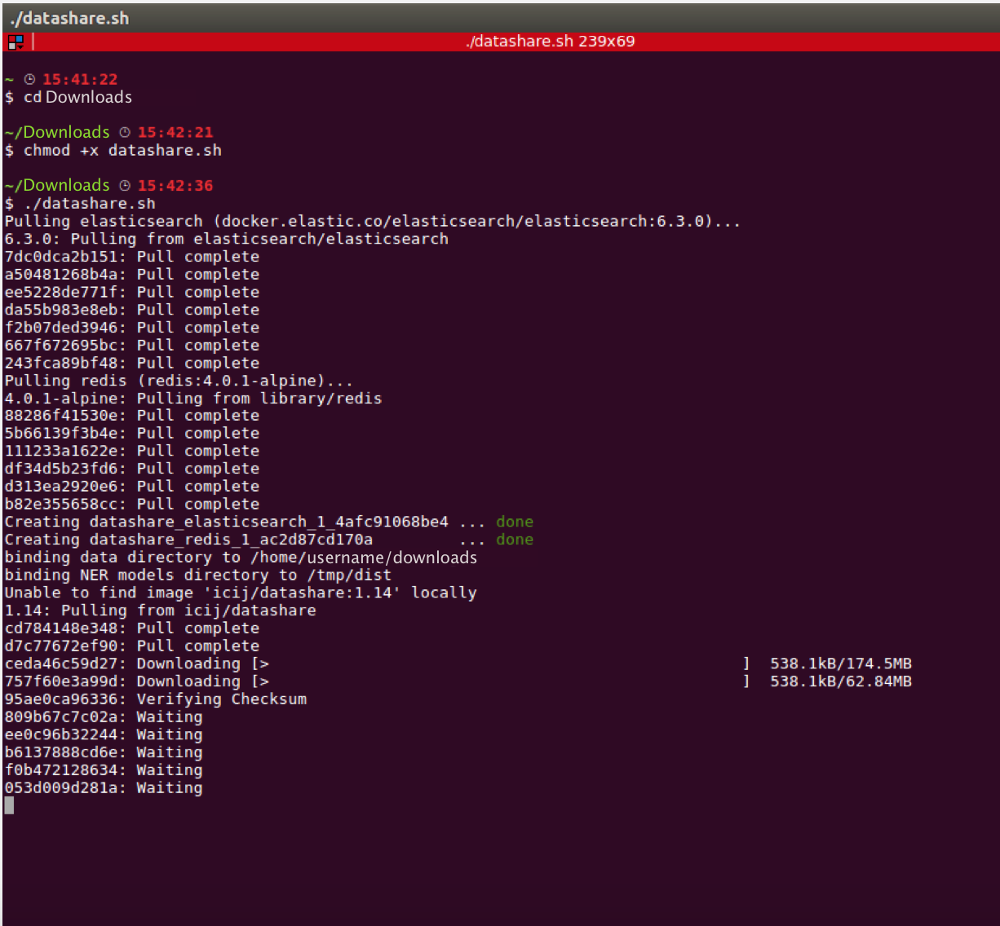
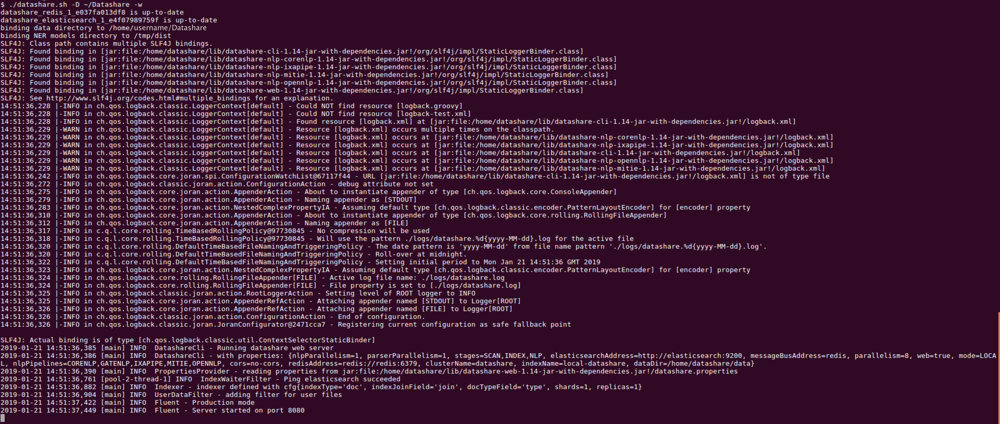

# Install Datashare on Linux

1. Install **Docker for Linux**:   
[ - **https://docs.docker.com/install/linux/docker-ce/centos/**](https://docs.docker.com/install/linux/docker-ce/centos/)\*\*\*\*

 **-** [**https://docs.docker.com/install/linux/docker-ce/debian/**](https://docs.docker.com/install/linux/docker-ce/debian/)\*\*\*\*

 **-** [**https://docs.docker.com/install/linux/docker-ce/fedora/**](https://docs.docker.com/install/linux/docker-ce/fedora/)\*\*\*\*

 **-** [**https://docs.docker.com/install/linux/docker-ce/ubuntu/**](https://docs.docker.com/install/linux/docker-ce/ubuntu/)\*\*\*\*

2. Don't forget \(if not done during the install process\) to **add your user to the docker group**:

```text
sudo usermod -aG docker your-user
```

if you do so, you'll have to close your session and open a new one \(**logout and login again**\). After having logged in again, you can check that it is effective with :

```text
docker ps
CONTAINER ID    IMAGE     COMMAND      CREATED     STATUS      PORTS          NAMES
```

3. Install **Docker Compose**: [**https://docs.docker.com/compose/install/**](https://docs.docker.com/compose/install/)\*\*\*\*

4. Go to the **Datashare's website:** [**https://datashare.icij.org/**](https://datashare.icij.org/).

5. Click the blue button '**DOWNLOAD FOR FREE'.**



6. On the next window, select '**Save File'** and click '**OK'**.



7. In your Terminal, you can **start installing Datashare**:



8. Once installation is done, **open your browser and use Datashare at** [http://localhost:8080/\#/](http://localhost:8080/#/):



9. It will :

* download [redis](https://redis.io), [elasticsearch](https://www.elastic.co/) and Datashare [docker](https://www.docker.com/docker-community) containers
* initialize an Elasticsearch index with Datashare mapping
* provide CLI to run Datashare extract, index, name finding tasks
* provide a WEB GUI to run Datashare extract, index, name finding tasks, and search in the documents

Let's [open Datashare now](https://icij.gitbook.io/datashare/linux/open-datashare-on-linux)!

