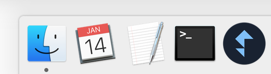
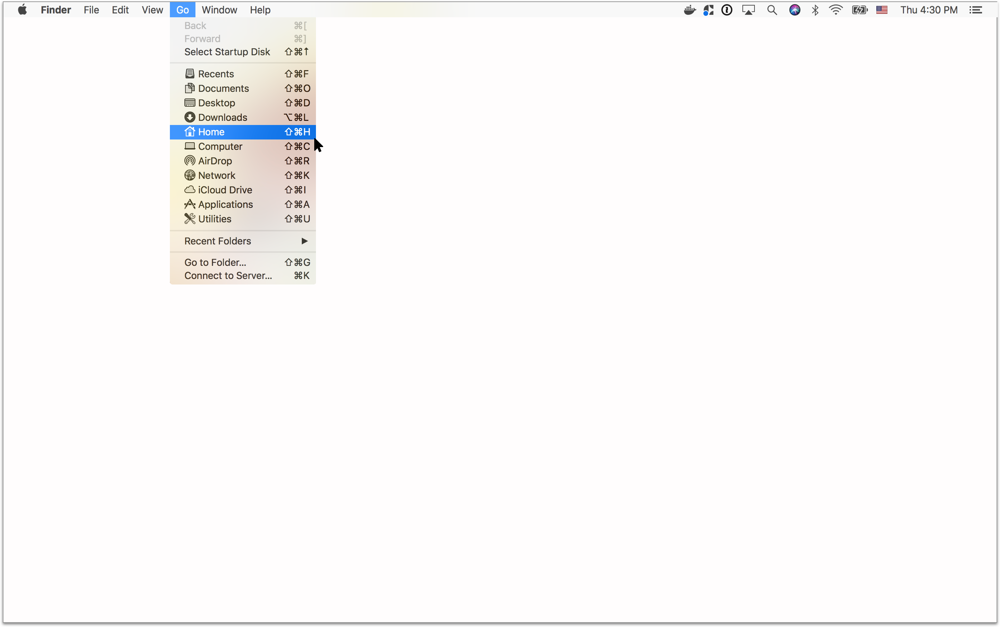
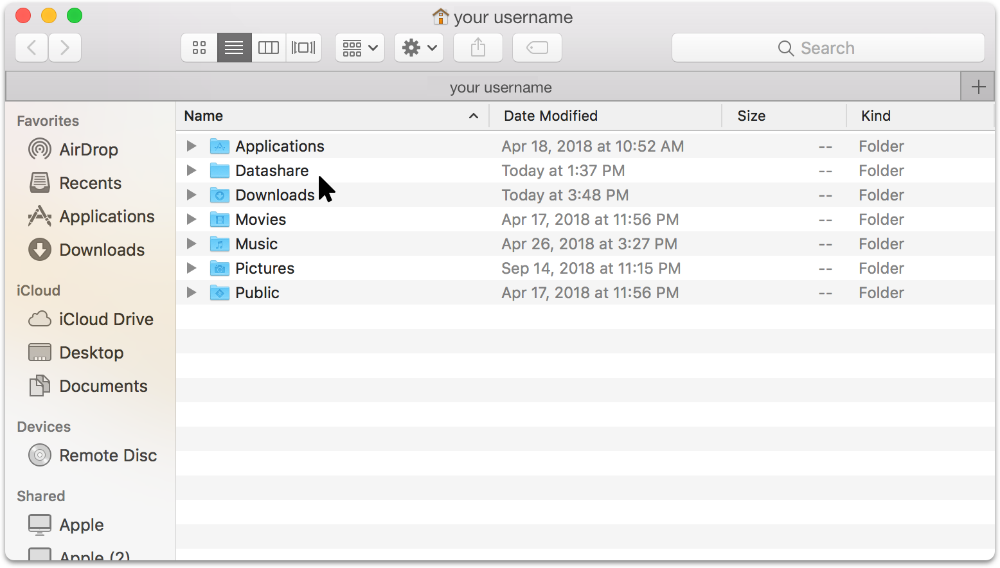
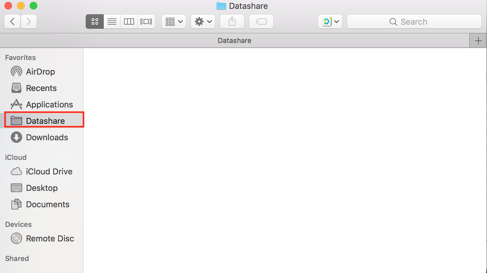
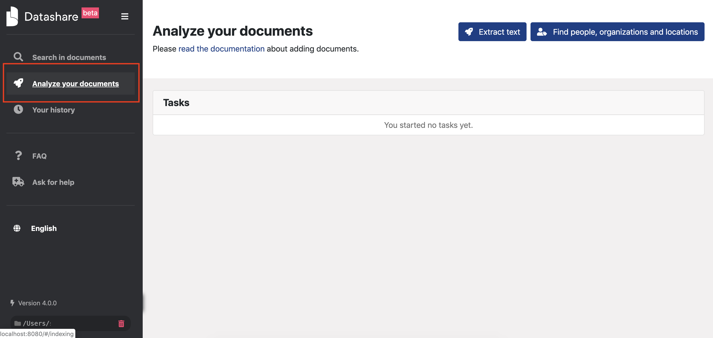

# Add documents to Datashare

  
1. Open your Mac's '**Finder'** by clicking on the blue smiling icon in your Mac's 'Dock':

2. On the menu bar at the top of your computer, click '**Go'**. Click on '**Home'** \(the house icon\).

3. You will see a folder called '**Datashare'**.

You can drag and drop it in 'Favorites' on the left of this window to allow quick access to it in the future.

4. **Store the documents you want to have in Datashare in this folder**. 

5. Once documents are copied in the Datashare folder, **open Datashare**, which you will find in Applications \(see directions above in '[Open Datashare](https://icij.gitbook.io/datashare/mac/open-datashare-on-mac)'\).

6. Datashare opens in your default internet browser. Click on '**Analyze documents'** on the top navigation bar in Datashare.

You're now ready to [analyze your documents in Datashare](https://icij.gitbook.io/datashare/all/analyze-documents). 

