# Install Datashare on Mac

You have **2 options:**

* the simplest, if you have **any Mac**, is to use the **standard** option which installs Datashare without Docker. [Make sure you install Homebrew before by following these steps.](https://icij.gitbook.io/datashare/mac/install-datashare-on-mac#standard-high-sierra-and-more-recent-versions)
* if you have **OS X El Capitan 10.11** or a more recent version: you can use the version which installs Datashare with Docker; it is a more powerful version.


### Standard \(High Sierra and more recent versions\)

1. Let's first install **Homebrew**, which is needed for installing Tesseract OCR. You can find Homebrew's instructions [here](https://brew.sh/) or follow the next steps. Open your **Finder**:


2. Search for '**Terminal**' in your applications and double click on '**Terminal.app**' to open it:

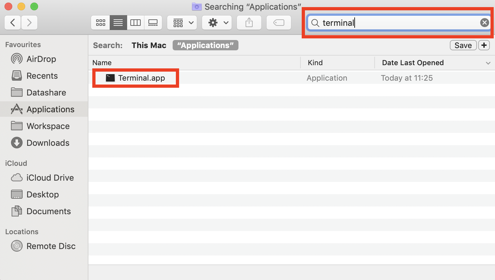

3. A Terminal window opens:

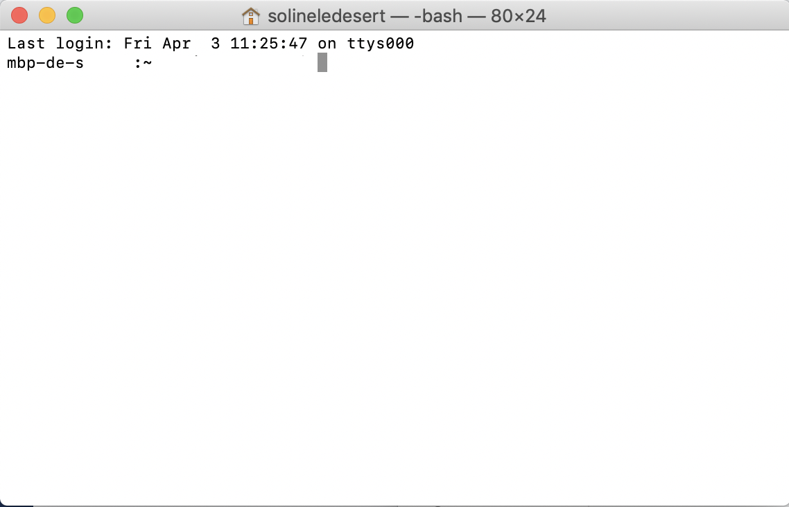

**Copy and paste** this and press **Enter**:

```text
/bin/bash -c "$(curl -fsSL https://raw.githubusercontent.com/Homebrew/install/master/install.sh)"
```

4. Press '**Enter**' when it displays this message:

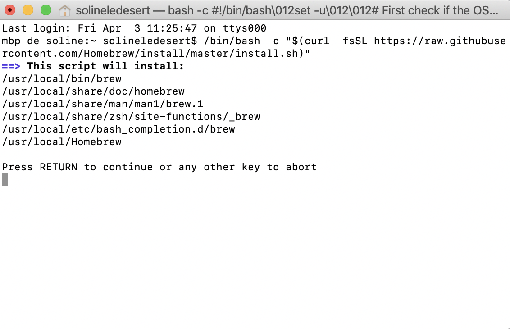

5. **Close the windows** when it displays this:

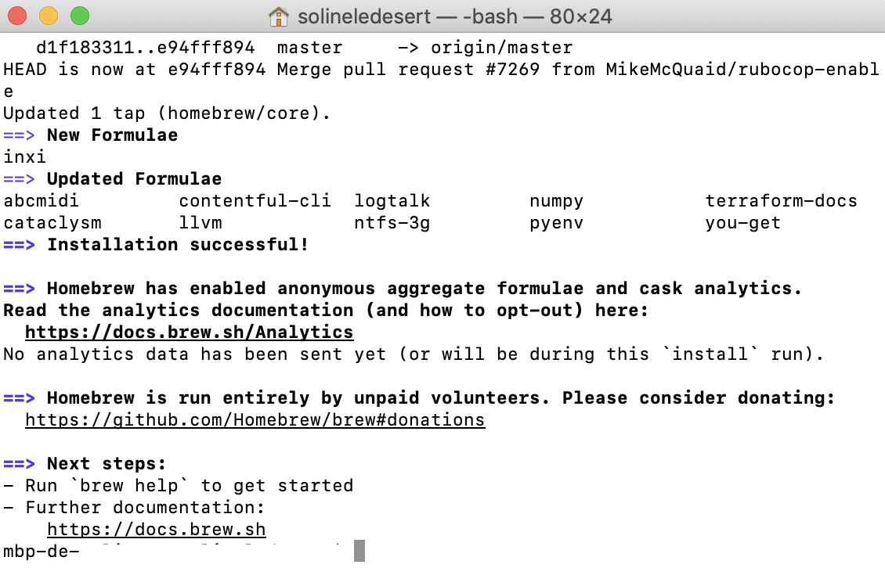

6. **Go to this page**: [datashare.icij.org](https://datashare.icij.org), scroll down and click '**Download for free**'.

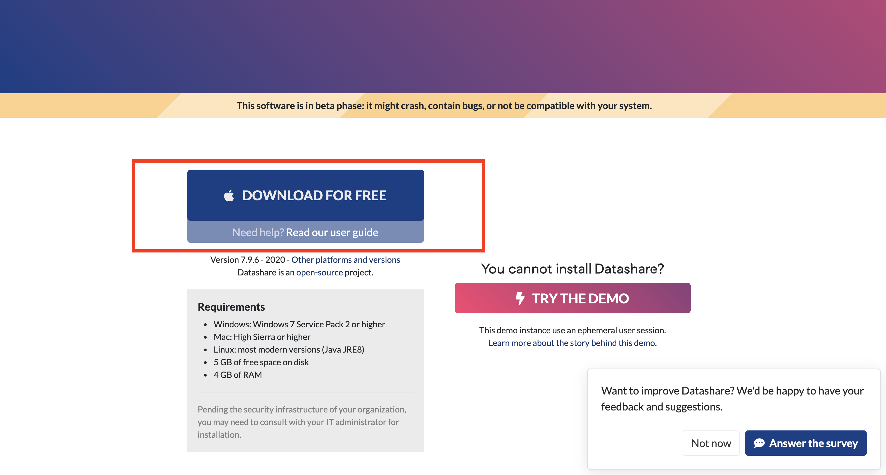

7. Go to your '**Downloads**' and double-click '**DatashareStandalone.pkg**':

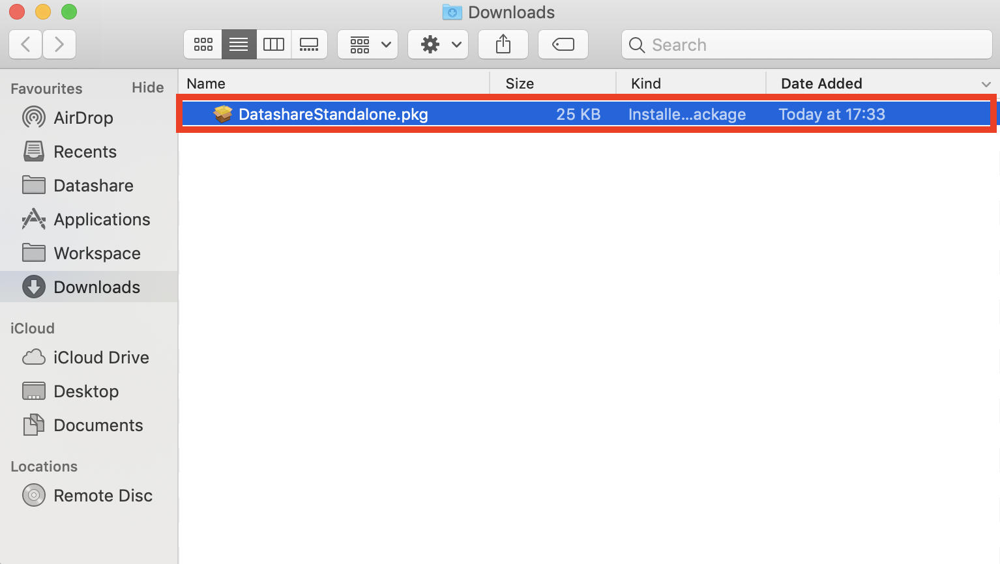

8. You might see this window which says '"DatashareStandalone.pkg” can’t be opened because it was not downloaded from the App Store.' Click '**OK**'.


9. Go to your Mac's **System Preferences**:


10. Open '**Security & Privacy**':

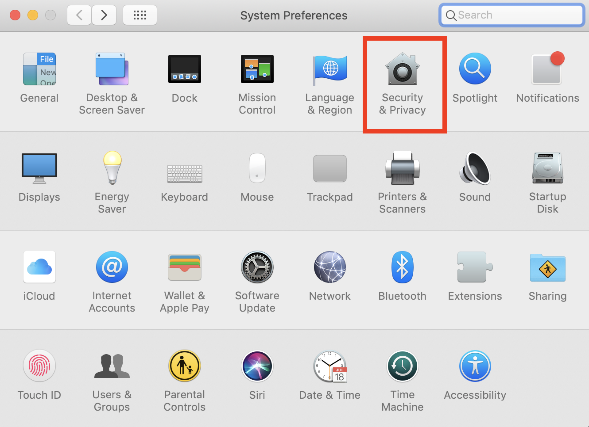

11. Click '**Open Anyway**':

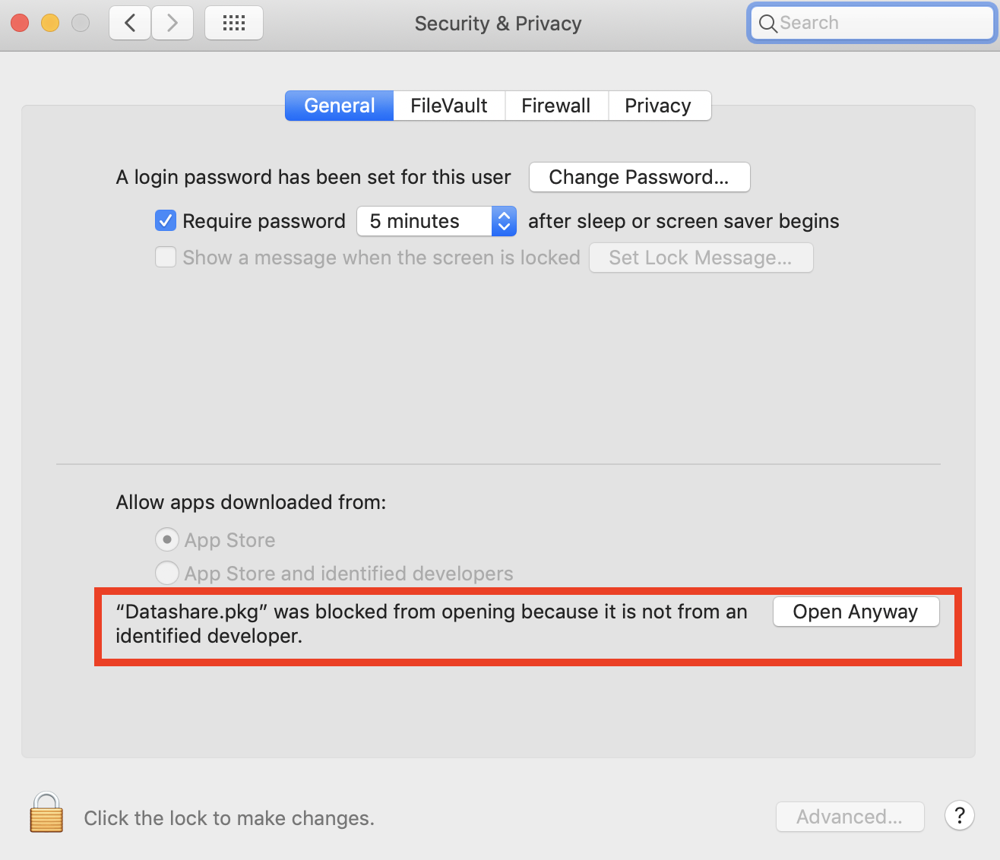

12. Click '**Open**':


13. Click '**Continue**', '**Install**', enter your password and '**Close**':

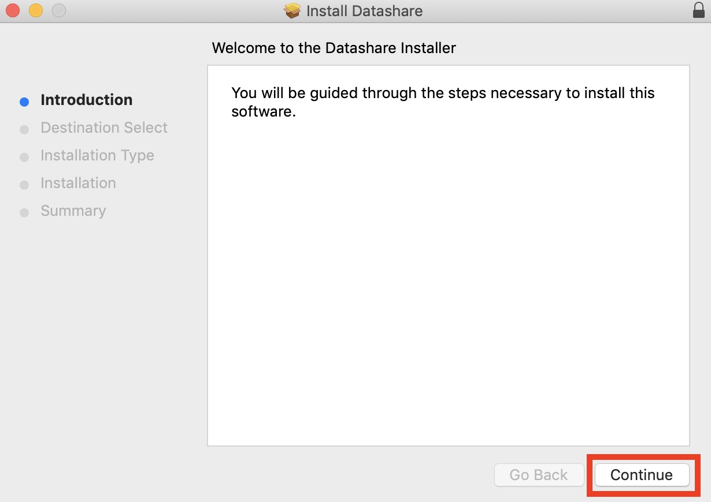

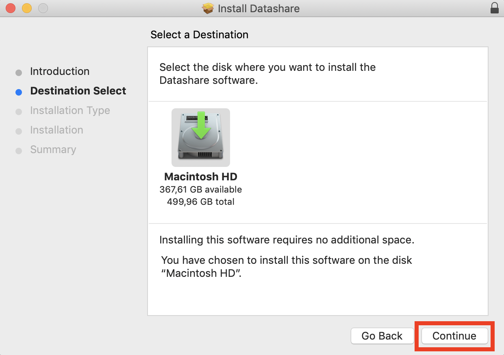

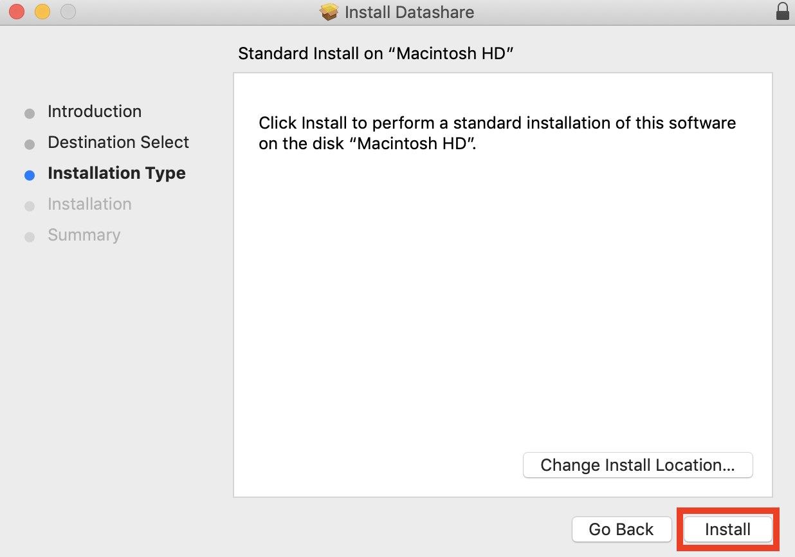

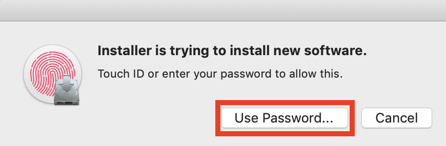

The installation begins. You see a progress bar. It stays a long time on "Running package scripts" because it is installing Tesseract OCR, Java Runtime Environment, Datashare backend and Datashare frontend.

You can see what it actually does by typing command+L, it will open a window which logs every action made.

In the end, you should see this screen:

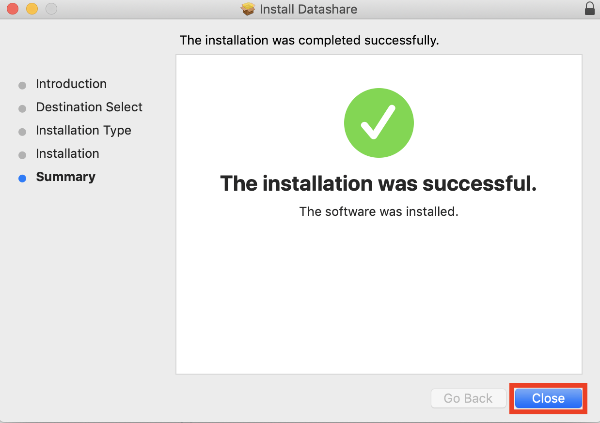

You can now [open Datashare](https://icij.gitbook.io/datashare/mac/open-datashare-on-mac).


### Version with Docker installer \(OS X El Capitan 10.11\)

You need **OS X El Capitan 10.11 or a more recent version.**

1. Go to Datashare's website: [**https://datashare.icij.org/**](https://datashare.icij.org/)\*\*\*\*

2. Click '**Other platforms and versions'**:

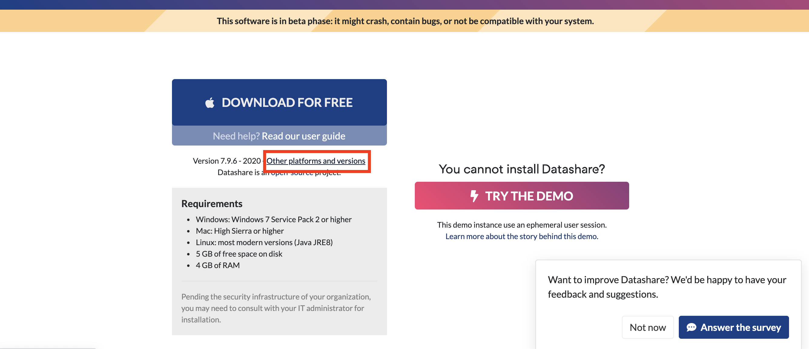

3. **Turn on** the toggle button '**Use Docker installer**':

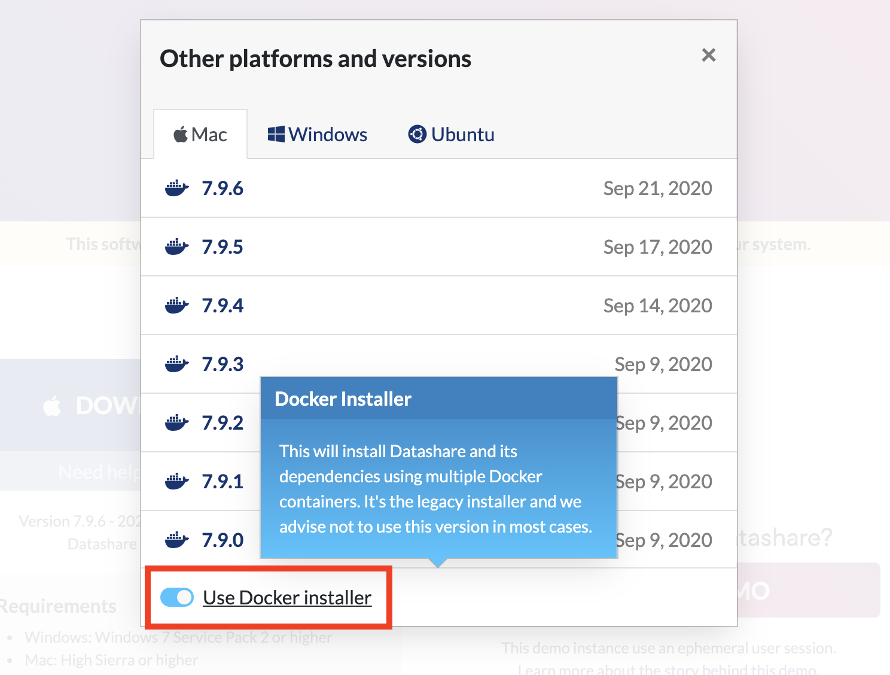

4. Click on the **latest version on top**:

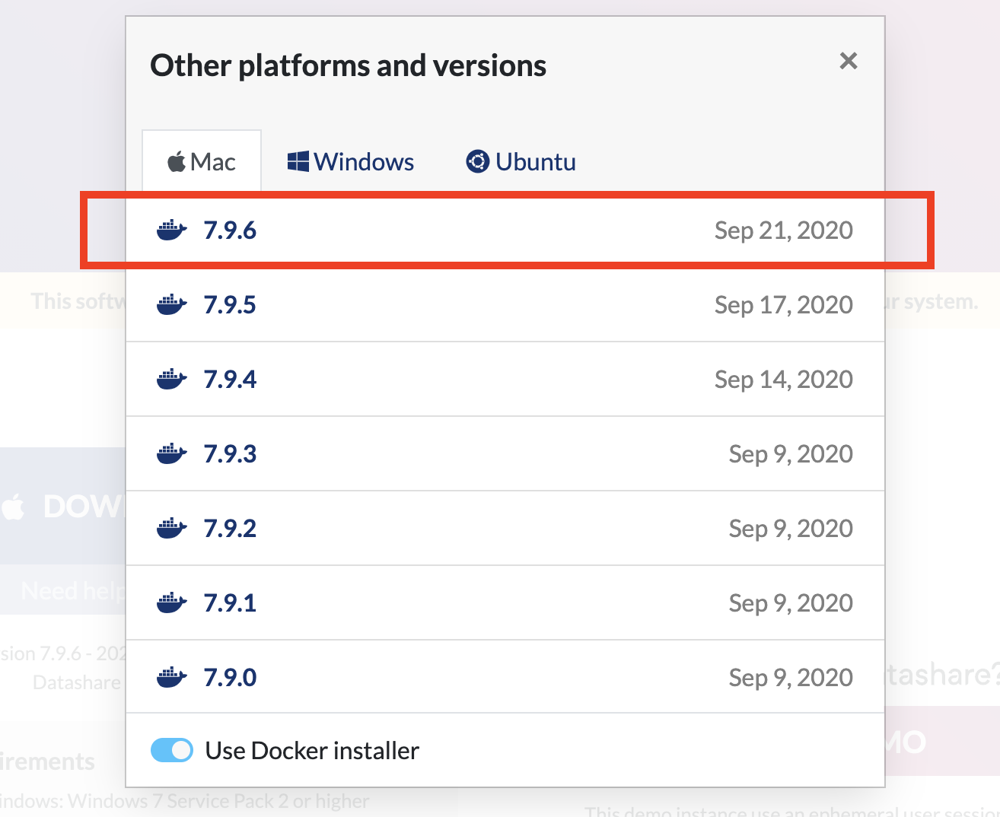

5. **Follow the steps** starting at point 7 [here](https://icij.gitbook.io/datashare/mac/install-datashare-on-mac#standard-high-sierra-and-more-recent-versions).

