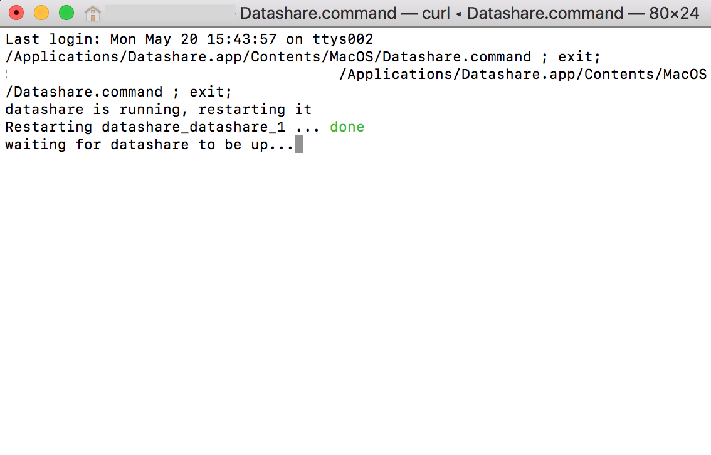
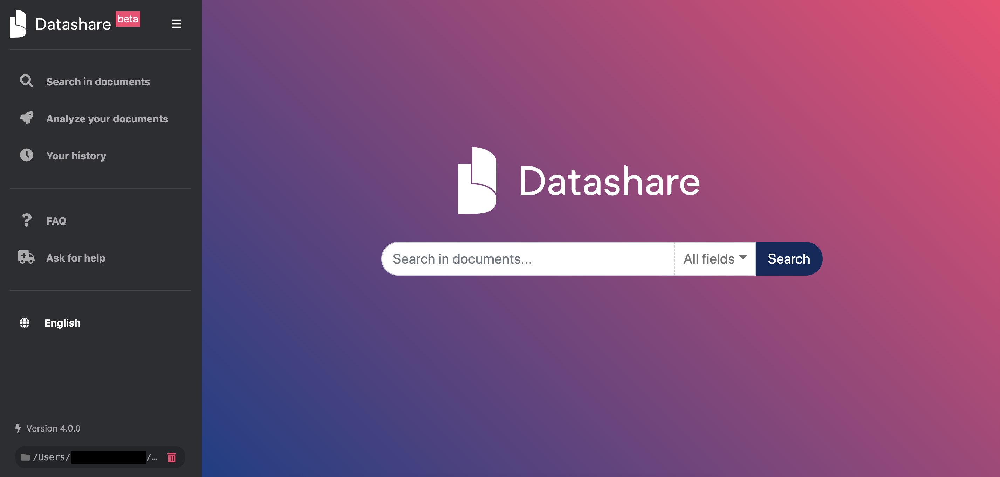
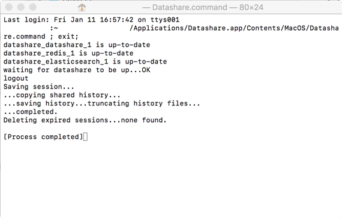

# Open Datashare

1. Once Datashare is installed, go to '**Finder**', then '**Applications'**, and double-click on '**Datashare.'**

2. A Terminal window called '**Datashare.command'** opens and describes the technical operations going on during the opening.

Keep this Terminal window open until Datashare opens. 

3. **Datashare should now automatically open in your default internet browser.**  
  
If it doesn’t, please type 'localhost:8080' in your browser.  
  
Datashare **runs in your internet browser**, even though it will work offline with no internet connection. \(See FAQ: [Can I use Datashare with no internet connection?](https://icij.gitbook.io/datashare/faq/can-i-use-datashare-with-no-internet-connection)\)

3. You can now safely close the Terminal window called '**Datashare.command'** which describes the technical operations going on during the opening. 

It's now time to [add documents to Datashare](https://icij.gitbook.io/datashare/mac/add-documents-to-datashare-on-mac).

