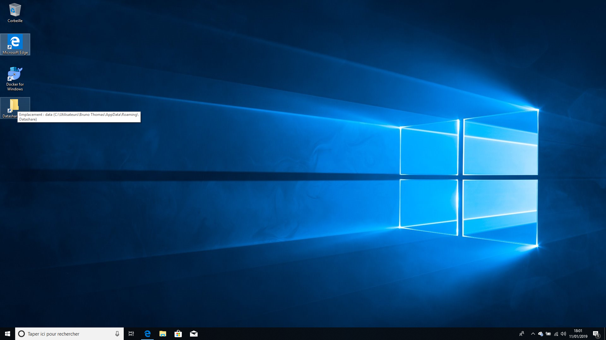
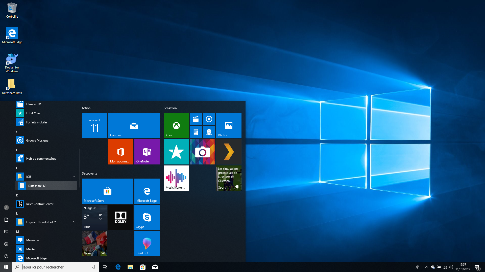

# Add documents to Datashare

1. When you open your desktop, you will see a folder called '**Datashare Data'.** **Move or copy and paste the documents you want to add to Datashare to this folder:**  

2. Now **open Datashare**, which you will find in your main menu \(see above: '[Open Datashare'](https://icij.gitbook.io/datashare/windows/open-datashare-on-windows)\)

3. Once Datashare has opened, click on 'Analyze documents' on the top navigation bar in Datashare:​

You're now ready to [analyze your documents in Datashare](https://icij.gitbook.io/datashare/all/analyze-documents). 

