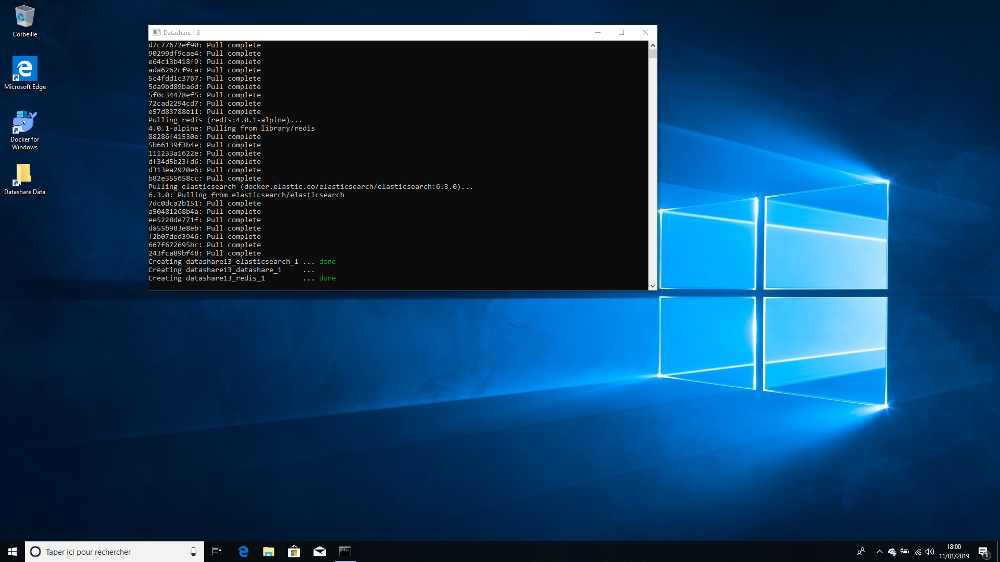

# Open Datashare

1. Open the Windows main menu at the left of the bar at the bottom of your computer screen and click on '**Datashare'**. \(The numbers after 'Datashare' just indicate which version of Datashare you installed.\)

2. A window called 'Terminal' will have opened, showing the progress of opening Datashare. **Please do not close it until Datashare opened in your browser**. You can then close it safely.

3. When it's done, **Datashare automatically opens in your default internet browser**. 

If it does not open automatically in your browser, type 'localhost:8080/\#/' in your internet browser.

Datashare **runs in your internet browser**, even though it will work offline with no internet connection. ****\(see FAQ: [Can I use Datashare with no internet connection?](https://icij.gitbook.io/datashare/faq/can-i-use-datashare-with-no-internet-connection)\)

Bravissimo! It's now time to [add documents to Datashare](https://icij.gitbook.io/datashare/windows/add-documents-to-datashare-on-windows)!

