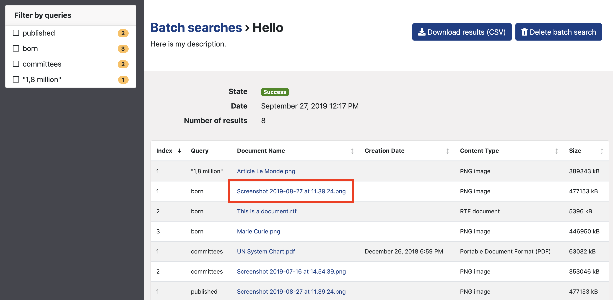
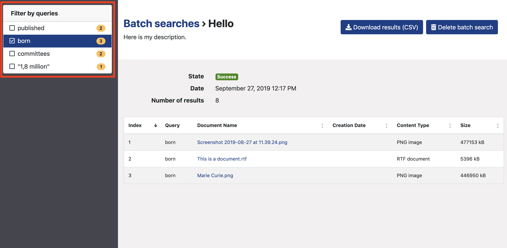
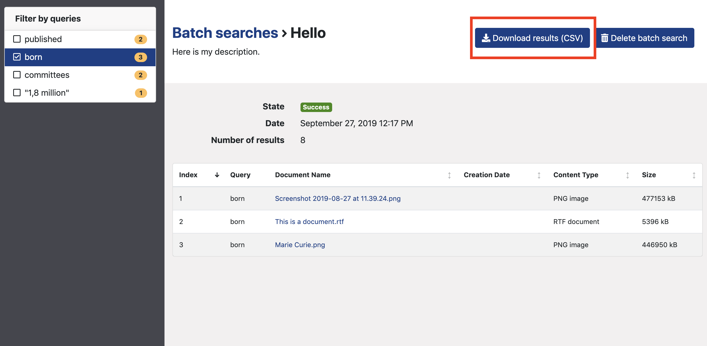

# Batch search documents

## Prepare your batch search

* Write your queries, one per line and per cell, in the first column of a spreadsheet \(Excel, Google Sheets, Numbers, Framacalc, etc.\). In the example below, there are 4 queries:

**Note:** [**Search operators**](https://icij.gitbook.io/datashare/all/search-with-operators) **do NOT work in batch searches**. Any space in your query is considered as a 'OR'. It means that if you write 'Hello world' in one cell, the search engine of batch searches will look for documents which contain either 'hello' or 'world' or the two words. If you write 'Hello AND world NOT car', it will look for documents which contain either 'hello' or 'and' or 'world' or 'not' or 'car'.

**Note:** Beware that, with some spreadsheet software, if you have **blank cells in your spreadsheet**, the CSV \(which stand for 'Comma-separated values'\) will keep these blank cells. It will separate them with commas. You will thus have commas in your batch search results \(see screenshot below\). To avoid that, you need to r**emove blank cells before exporting your queries as a CSV**.

**Note:** If there is a comma in one cell \(like in "1,8 million" in our example\), the CSV will formally put the content of the cell in double quotes. But Datashare will not treat it as double quotes though: it won't search for the exact phrase but for the regular query without double quotes.

* Export your spreadsheet in a CSV format:

### 

## Launch your batch search

* Open Datashare and click '**Batch searches**' in the left menu:

* Type a name for your batch search:

* Upload your CSV:

* Add a description \(optional\):

* Set the advanced filters \('Do phrase matches', 'Fuzziness' or 'Proximity searches', 'File types' and 'Path'\) according to your preferences:

### What is fuzziness?

When you run a [batch search](https://icij.gitbook.io/datashare/all/batch-search-documents), you can set the fuzziness to 0, 1 or 2. It is the same as explained above, it will apply to each word in a query and corresponds to the maximum number of operations \(insertions, deletions, substitutions and transpositions\) on **characters** needed to make one **term** match the other.

> kitten -&gt; sitten \(1 substitution \(k turned into s\) = fuzziness is 1\)

> kitten -&gt; sittin \(2 substitutions \(k turned into s and e turned into i\) = fuzziness is 2\)

If you search for similar terms \(**to catch typos for example**\), use fuzziness. Use the [tilde symbol](https://en.wikipedia.org/wiki/Tilde) at the end of the word to set the fuzziness to 1 or 2. 

"_The default edit distance is 2, but an edit distance of 1 should be sufficient to catch 80% of all human misspellings. It can be specified as: quikc~1_" \(source: [Elastic](https://www.elastic.co/guide/en/elasticsearch/reference/7.0/query-dsl-query-string-query.html#_fuzziness)\).

> Example: quikc~ brwn~ foks~ \(as the default edit distance is 2, this query will catch all quick, quack, quock, uqikc, etc. as well as brown, folks, etc.\)
>
> Example: Datashare~1 \(this query will catch Datasahre, Dqtashare, etc.\)

#### 

### What are proximity searches?

When you turn on 'Do phrase matches', you can set, in 'Proximity searches', the maximum number of operations \(insertions, deletions, substitutions and transpositions\) on **terms** needed to make one **phrase** match the other.

> “the cat is blue” -&gt; “the small cat is blue” \(1 insertion = fuzziness is 1\)

> “the cat is blue” -&gt; “the small is cat blue” \(1 insertion + 2 transpositions = fuzziness is 3\)

> Example: "fox quick"~5 \(this query will catch "quick brown fox", "quick brown car thin fox" or even "quick brown car thin blue tree fox"

* Click '**Add**'. Your batch search will appear in the table of batch searches.

### 

## Get your results

* Open your batch search by clicking its name:

* You see your results and you can sort them by clicking the column's name. 'Index' means the order by which each queries would be sorted out if run in Datashare's main search bar. They are thus sorted by relevance score.

You can click on a document's name and it will open it in a new tab:

* You can filter your results by query in the left panel and read how many documents there are for each query: 

* You can also download your results in a CSV format:

## I get a "failure". What does that mean?

Failures in batch searches can be due to some syntax error\(s\) in the way you wrote your queries or one of your queries in the CSV. 

Here are **the most common errors:**

* **Some of your queries start with AND** \(all uppercase\)

You cannot start a query neither in Datashare's main search bar nor in your CSV with AND all uppercase. [AND is reserved as a search operator](https://icij.gitbook.io/datashare/all/search-with-operators#and).

* **Some of your queries start with OR** \(all uppercase\)

You cannot start a query neither in Datashare's main search bar nor in your CSV with OR all uppercase. [OR is reserved as a search operator](https://icij.gitbook.io/datashare/all/search-with-operators#or-or-space).

* **Some of your queries start with or contain tilde** \(~\)

You cannot start a query neither in Datashare's main search bar nor in your CSV with tilde \(~\) or which contains tilde. Tilde is reserved as a search operator for [fuzziness](https://icij.gitbook.io/datashare/faq/what-is-fuzziness) or [proximity searches](https://icij.gitbook.io/datashare/faq/what-is-proximity-search).

* **Some of your queries start with or contain circumflex** \(^\)

You cannot start a query neither in Datashare's main search bar nor in your CSV with circumflex \(^\) or which contains circumflex. Circumflex is reserved as a boosting operator.

## Delete your batch search

Open your batch search and click 'Delete batch search'. 

Then click 'Yes'.

