# Batch search documents

If you want to search a list of queries in Datashare, instead of doing each of them one by one, you can upload the list directly in Datashare.   
To do so, you will:

* Create a list of terms that you want to search in the first column of a spreadsheet
* Export the spreadsheet as a CSV \(a special format available in any spreadsheet software\)
* Upload this CSV in the "new Batch Search" form in Datashare
* Get the results for each query in Datashare - or in a CSV. 

## Prepare your batch search

### **Write your queries in a spreadsheet**

* **Write your queries**, one per line and per cell, in the first column of a spreadsheet \(Excel, Google Sheets, Numbers, Framacalc, etc.\). In the example below, there are 4 queries:

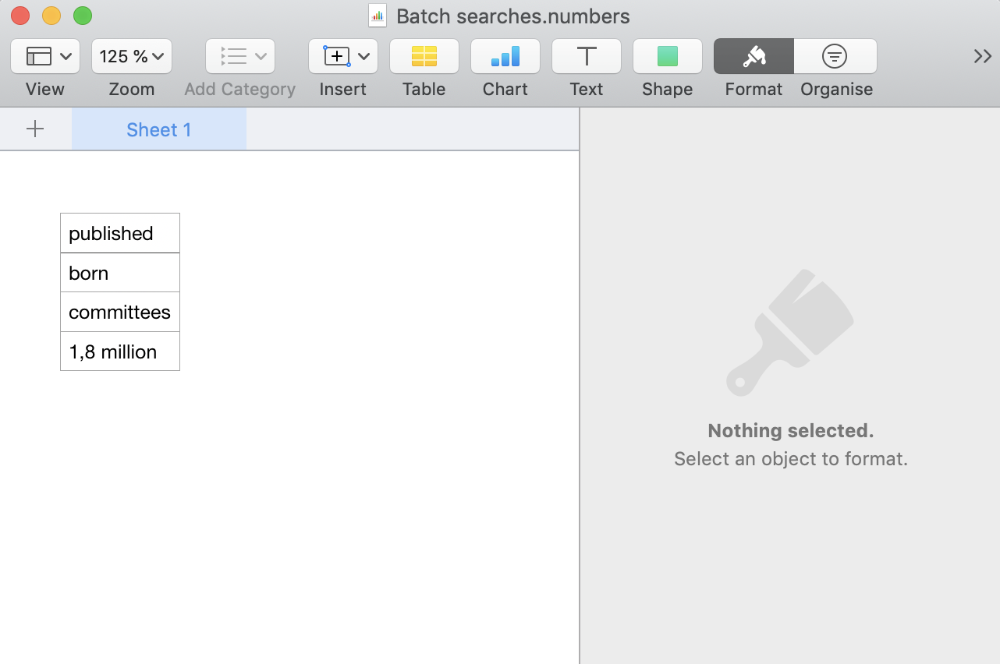

* **Do not put line break\(s\)** in any of your cells.

To delete line break\(s\) in your spreadsheet, you can use the "**Find and replace all**" functionality. Find all **"\n"** and replace them all by **nothing or a space**.

* Write **2 characters minimum in the cells**. If one cell contains one character but at least one other cell contains more than one, the cell containing one character will be ignored. If all cells contain only one character, the batch search will lead to 'failure'.

* If you have **blank cells in your spreadsheet...**

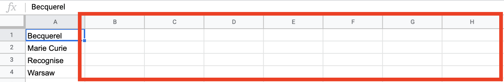

...the CSV \(which stand for 'Comma-separated values'\) will keep these blank cells. It will separate them with semicolons \(the 'commas'\). You will thus have semicolons in your batch search results _\(see screenshot below\)_. To avoid that, **you need to remove blank cells in your spreadsheet before exporting it as a CSV**.

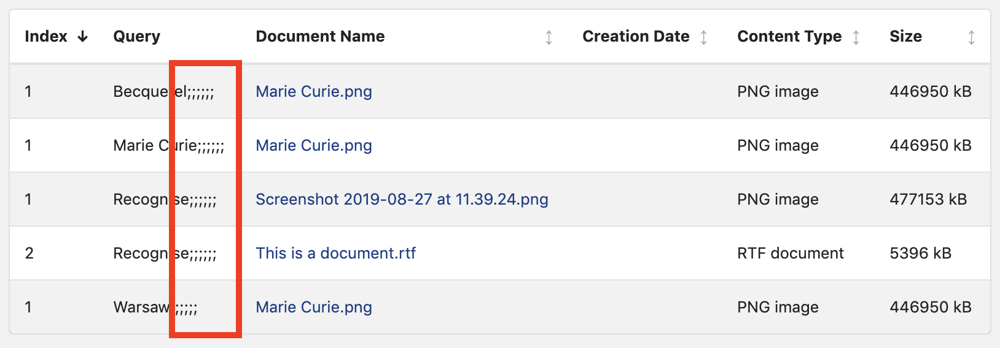

* **If there is a comma in one of your cells** \(like in "1,8 million" in our example above\), the CSV will formally put the content of the cell in double quotes in your results and search for the exact phrase in double quotes. 

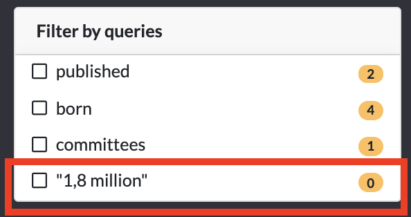

### Want to search only on some documents?

In the [new Batch Search's form &gt; Advanced Filters](https://icij.gitbook.io/datashare/all/batch-search-documents#launch-your-batch-search), you will be able to select some file types and some paths if you want to search only in some documents. 

But you can also use [fields directly in your queries in the CSV](https://icij.gitbook.io/datashare/all/search-with-operators#advanced-searches-using-metadata-fields). 

For instance, if you want to search only in some documents with certain tag\(s\), you can write your queries like this: "Paris AND \(tags:London OR tags:Madrid NOT tags:Cotonou\)". 

### Use operators in your CSV

[**The operators**](https://icij.gitbook.io/datashare/all/search-with-operators) ****AND NOT \* ? ! + - **do work in batch searches - as they do in the regular search bar.** 

**Please beware that OR doesn't work when 'do phrase matches' is turned on - in that case, Datashare will search for the term 'or' if OR is in your queries.**

Reserved characters, when misused, can lead to [**failures**](https://icij.gitbook.io/datashare/all/batch-search-documents#i-get-a-failure-what-does-that-mean) **because of syntax errors.**

* **When 'do phrase matches' is turned on**:
  * If you write operators in one of your query , the search engine will not apply neither 'do phrase matches', 'fuzziness' nor 'proximity searches' in this query only. It will apply in other operator-free queries though.

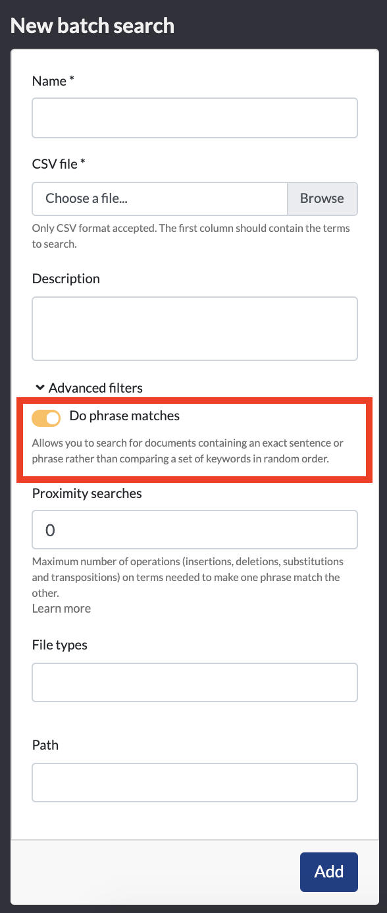

* **When 'do phrase matches' is turned off**:

  * By default, **any space in your query is considered as a 'OR'**. If you write 'Hello world' in one cell, the search engine will look for documents which contain either 'hello' or 'world' or the two words in the documents.
  * If you write 'Hello AND world NOT car' in one cell, the search engine will look for documents which contain 'hello' and 'world' but not 'car'.

* Searches are **not case sensitive**: if you search 'HeLlo', it will look for all occurrences of 'Hello', 'hello', 'hEllo', 'heLLo', etc. in the documents.

### Export your CSV encoded in UTF-8

Export your spreadsheet in a CSV format like this:

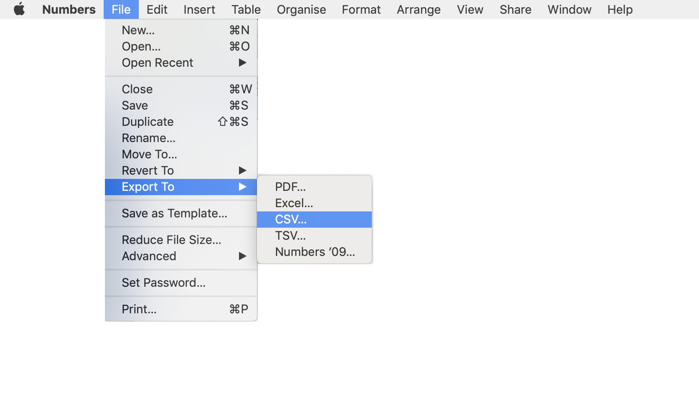

**Important: Use the** [**UTF-8 encoding**](https://en.wikipedia.org/wiki/UTF-8)**.**

* **LibreOffice Calc**: it uses UTF-8 by default. If not, go to LibreOffice menu &gt; Preferences &gt; Load/Save &gt; HTML Compatibility and make sur the character set is 'Unicode \(UTF-8\)':

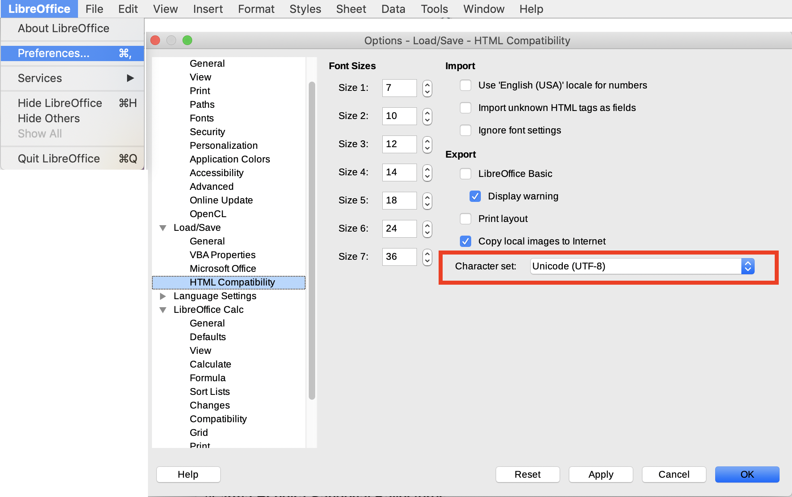

* **Microsoft Excel**: if it is not set by default, select "CSV UTF-8" as one of the formats, [as explained here](https://answers.microsoft.com/en-us/msoffice/forum/msoffice_excel-mso_win10-mso_365hp/save-as-csv-with-utf-8-encoding/ff94943c-db5b-42c3-8905-f86d3d8d52c2).
* **Google Sheets**: it uses UTF-8 by default. Just click "Export to" and "CSV".
* **Other spreadsheet softwares:** please refer to each software's user guide.

## Launch your batch search

* Open Datashare, click '**Batch searches**' in the left menu and click '**New batch search**' on the top right:

* Type a **name** for your batch search:

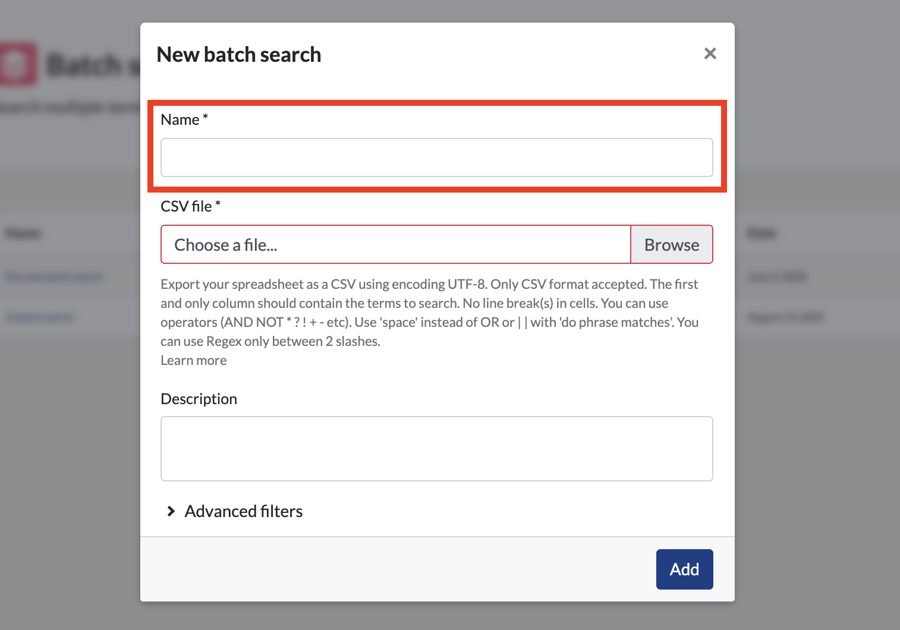

* Upload your **CSV**:

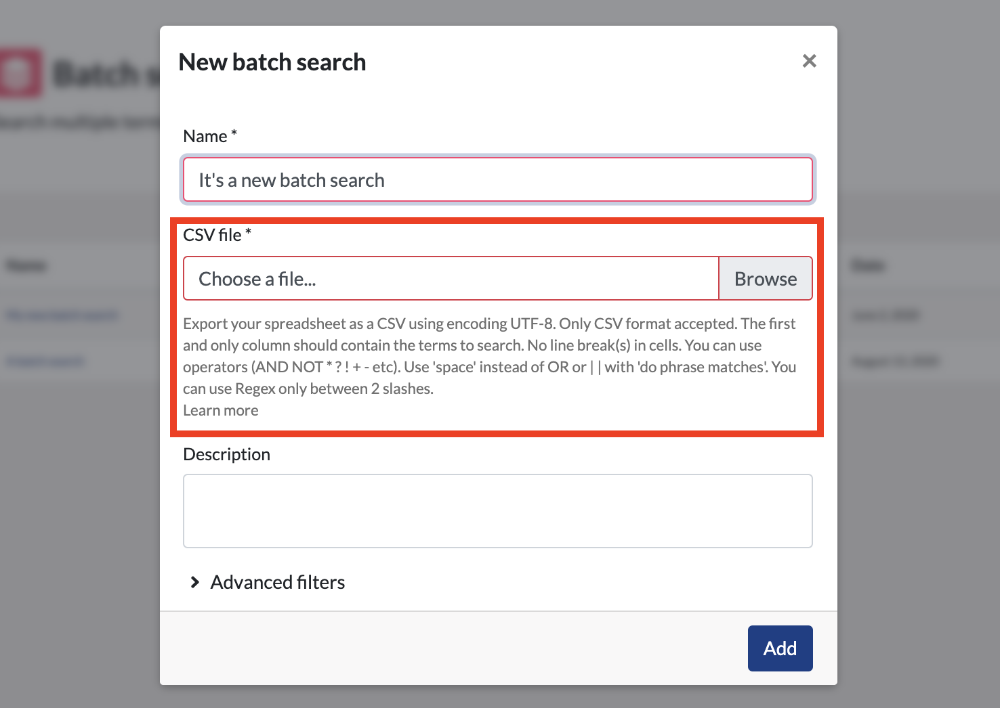

* Add a **description** \(optional\):

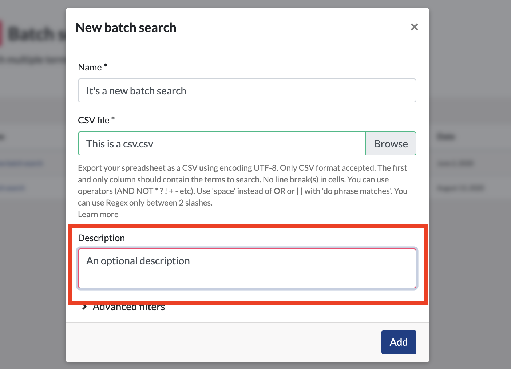

* Set the **advanced filters** \('Do phrase matches', 'Fuzziness' or 'Proximity searches', 'File types' and 'Path'\) according to your preferences:

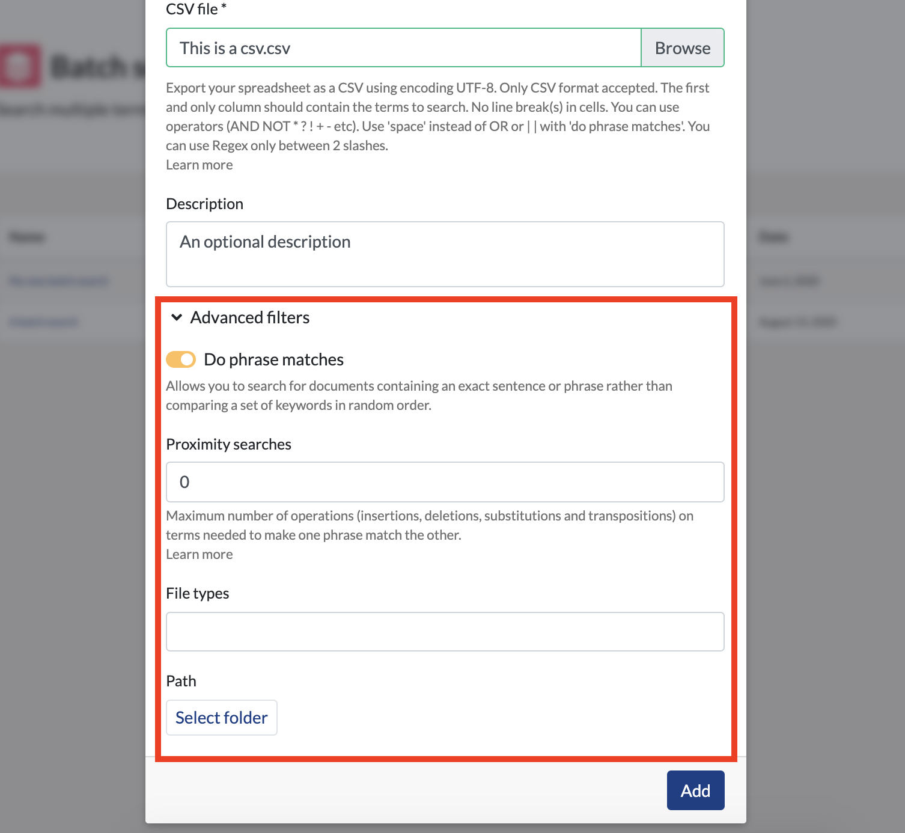

### What is 'Do phrase matches'?

'Do phrase matches' is the equivalent of double quotes: it looks for documents containing an **exact sentence or phrase** rather than looking for a set of words in random order. If you turn it on, all queries will be search for their exact mention in documents.

It is recommended, for usability purposes:

* to use “Do phrase match” if you know that **all of your queries** should be searched with phrase match. But note that if you use operators in one or several of your queries, the search engine will not apply neither 'do phrase matches', 'fuzziness' nor 'proximity searches' in this or these query\(ies\) only. 'Do phrase matches', 'fuzziness' and 'proximity searches' will still apply to your other operator-free queries.
* to use double quotes in the queries of the batch searches of which you want some queries to be found with phrase match but other without. In other words, in that case, you turn the “Do phrase match” button off but you write in double quotes, in your CSV, the specific queries that you want to search exactly. The rest will be search without phrase match.

### What is fuzziness?

When you run a [batch search](https://icij.gitbook.io/datashare/all/batch-search-documents), you can set the fuzziness to 0, 1 or 2. It will apply to each term in a query. It corresponds to **the maximum number of operations \(insertions, deletions, substitutions and transpositions\)** on _**characters**_ needed to make one _**term**_ match the other.

> kitten -&gt; sitten \(1 substitution \(k turned into s\) = fuzziness is 1\)

> kitten -&gt; sittin \(2 substitutions \(k turned into s and e turned into i\) = fuzziness is 2\)

If you search for similar terms \(**to catch typos for example**\), use fuzziness. 

"_The default edit distance is 2, but an edit distance of 1 should be sufficient to catch 80% of all human misspellings. It can be specified as: quikc~1_" \(source: [Elastic](https://www.elastic.co/guide/en/elasticsearch/reference/7.0/query-dsl-query-string-query.html#_fuzziness)\).

> Example: quikc~ brwn~ foks~ \(as the default edit distance is 2, this query will catch all quick, quack, quock, uqikc, etc. as well as brown, folks, etc.\)
>
> Example: Datashare~1 \(this query will catch Datasahre, Dqtashare, etc.\)

#### 

### What are proximity searches?

When you turn on 'Do phrase matches', you can set, in 'Proximity searches', the **maximum number of operations \(insertions, deletions, substitutions and transpositions\)** on _**terms**_ needed to make one _**phrase**_ match the other.

> “the cat is blue” -&gt; “the small cat is blue” \(1 insertion = fuzziness is 1\)

> “the cat is blue” -&gt; “the small is cat blue” \(1 insertion + 2 transpositions = fuzziness is 3\)

> Example: "fox quick"~5 \(this query will catch "quick brown fox", "quick brown car thin fox" or even "quick brown car thin blue tree fox"

* Click '**Add**'. Your batch search will appear in the table of batch searches.

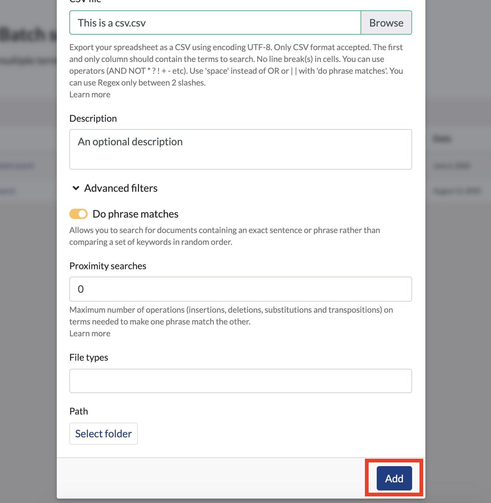

## Get your results

* Open your batch search by clicking its name:

* You see your results and you can **sort them** by clicking the column's name. 'Rank' means the order by which each queries would be sorted out if run in Datashare's main search bar. They are thus sorted by **relevance score by default**.

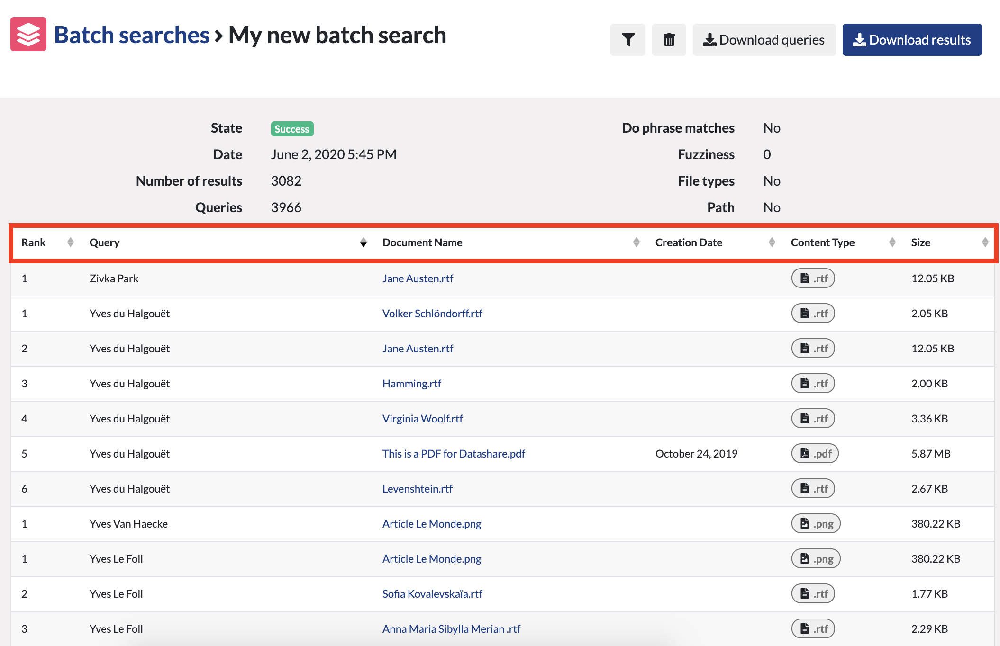

* You can **click on a document's name** and it will open it in a new tab:

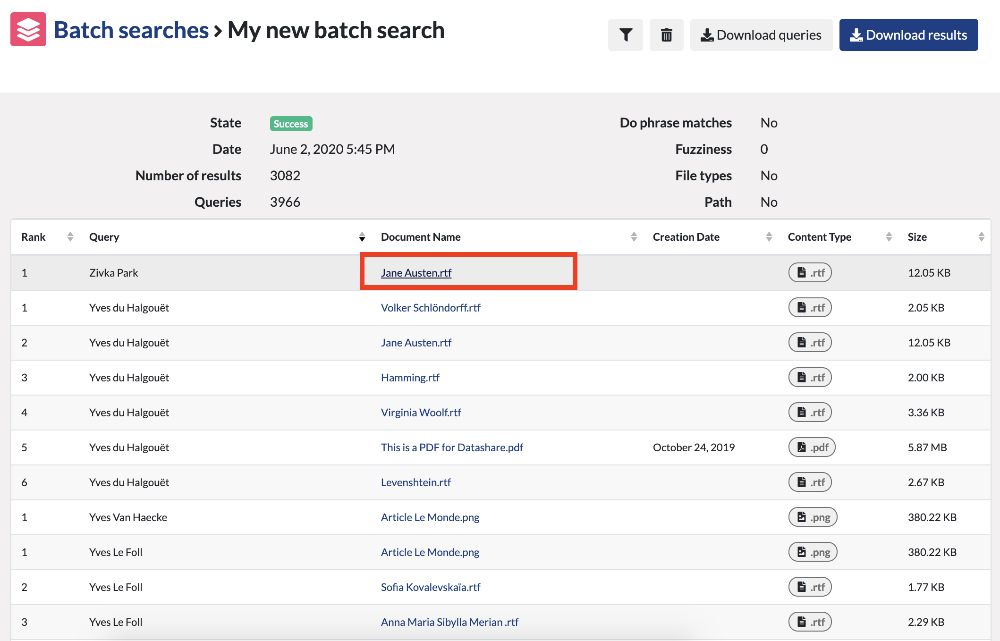

* You can **filter your results by query** and read how many documents there are for each query: 

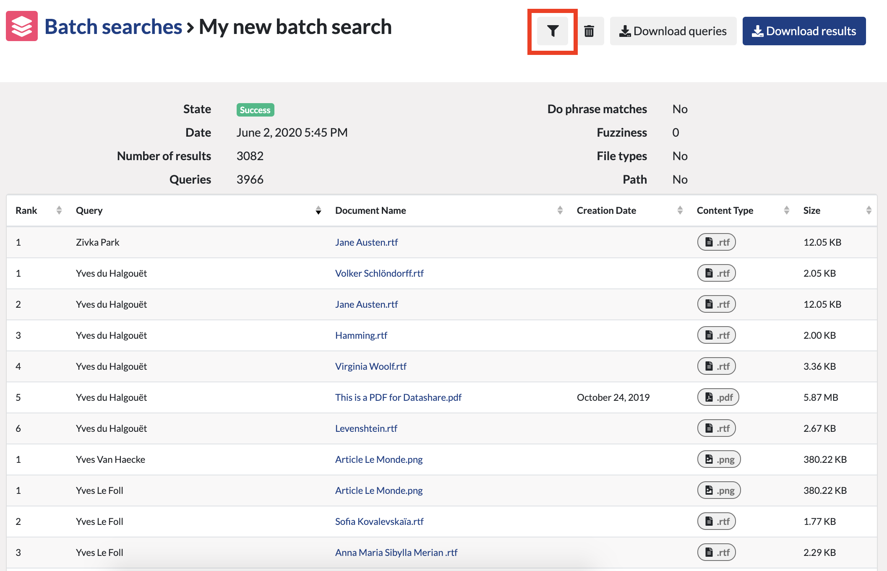

You can **search for specific queries**:

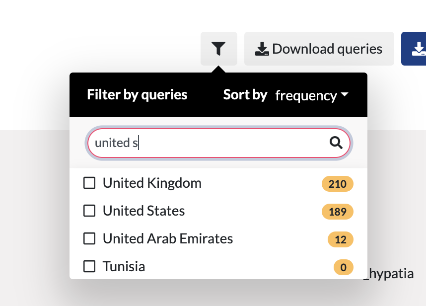

* You can also **download your results** in a CSV format:

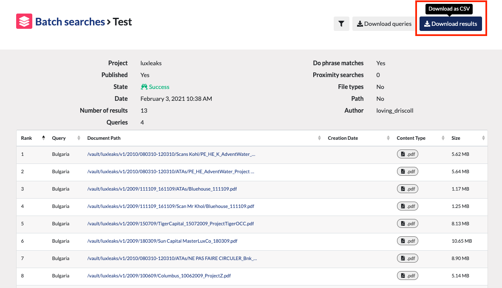

## Relaunch your batch search

If you add more and more files in Datashare, you might want to relaunch existing batch search on your new documents too. 

Notes: 

* In the server collaborative mode, you can only relaunch your own batch searches, not others'. 
* The relaunched batch search will apply to your whole corpus, newly indexed documents _and_ previously indexed documents \(not only the newly indexed ones\).

 1. To do so, open the batch search that you'd like to relaunch and click 'Relaunch':

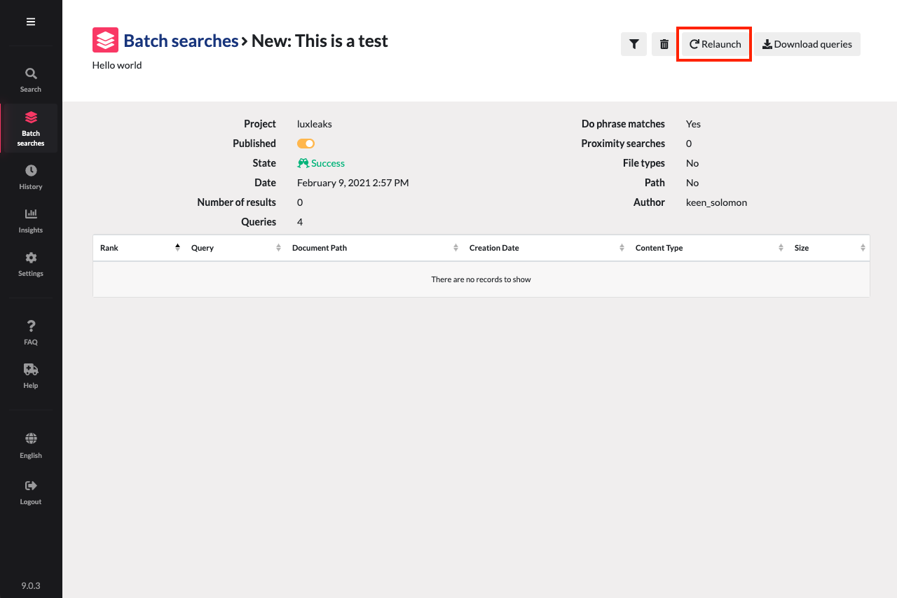

 2. Edit the name and the description of your batch search if needed:

 3. You can choose to delete the current batch search after relaunching it:

Note: if you're worried about losing your previous results because of an error, we recommend to keep your current batch search \(turn off this toggle button\) and delete it only after the relaunch is a success.

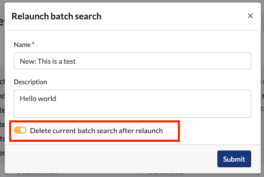

 4. Click 'Submit':

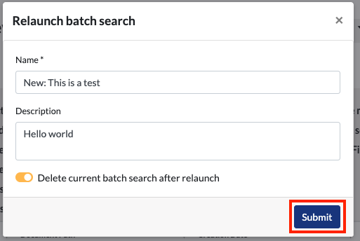

You can see your relaunched batch search running in the batch search's list:

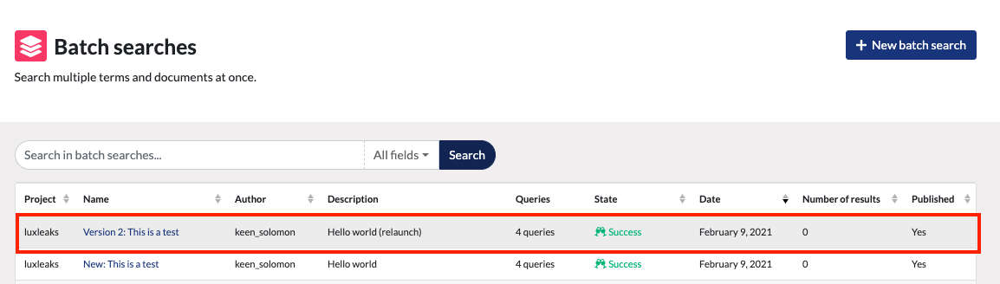

## I get a "failure". What does that mean?

Failures in batch searches can be due to several causes. 

Click the **'See error' button** to open the error window:

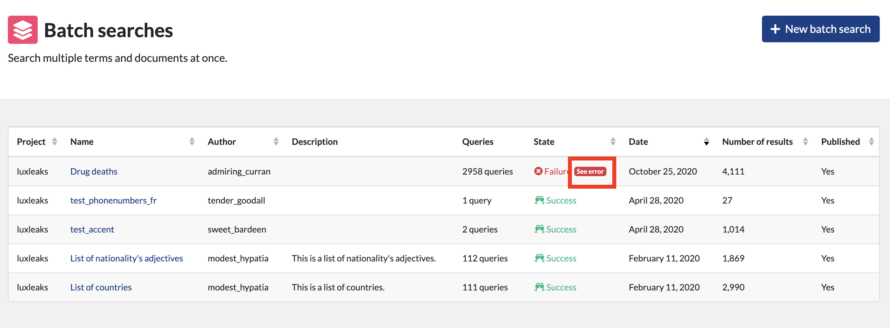

The **first query containing an error makes the batch search fail and stop.** 

Check this first failure-generating query in the error window:

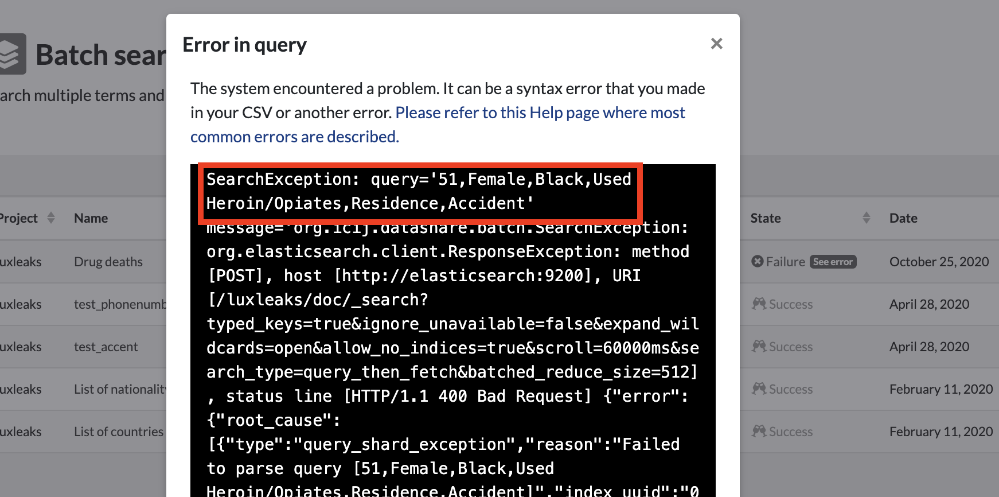

In the case above, the slash \(/\) used between 'Heroin' and 'Opiates' is a [reserved character that was not escaped by a backslash](https://icij.gitbook.io/datashare/all/batch-search-documents#the-query-uses-square-brackets) so Datashare interpreted this query as a syntax error, failed and didn't go further so the batch search stopped. 

We recommend to remove the slash, as well as any reserved characters, and re-run the batch search again.

### 'elasticsearch: Name does not resolve'

If you have a message which contain '_elasticsearch: Name does not resolve_', it means that Datashare can't make Elastic Search, its search engine, work. 

In that case, you need to **re-open Datashare**: ****here are the instructions for [Mac](https://icij.gitbook.io/datashare/mac/open-datashare-on-mac), [Windows](https://icij.gitbook.io/datashare/windows/open-datashare-on-windows) or [Linux](https://icij.gitbook.io/datashare/linux/open-datashare-on-linux). 

Example of a message regarding a problem with ElasticSearch:

_SearchException: query='lovelace' message='org.icij.datashare.batch.SearchException: java.io.IOException: elasticsearch: Name does not resolve'_

\_\_

### 'Data too large'

One of your queries can lead to a 'Data too large' error. 

It means that this query had too many results or in their results, some documents that were too big to process for Datashare. This makes the search engine fail. 

We recommend to **remove the query responsible for the error and re-start your batch search without the query which led to the 'Data too large' error.**

\*\*\*\*

### 'SearchException: query='AND ada' '

**One or several of your queries contains syntax errors**. 

It means that you wrote one or more of your queries the wrong way with some characters that are reserved as operators \(see below\).

**You need to correct the error\(s\) in your CSV** and re-launch your new batch search with a CSV that does not contain errors. [Click here to learn how to launch a batch search](https://icij.gitbook.io/datashare/all/batch-search-documents).

Datashare **stops at the first syntax error**. It reports only the first ​error. You might need to **check all your queries** as some errors can remain after correcting the first one.

They are more likely to happen **when 'do phrase matches' toggle button is turned off:**

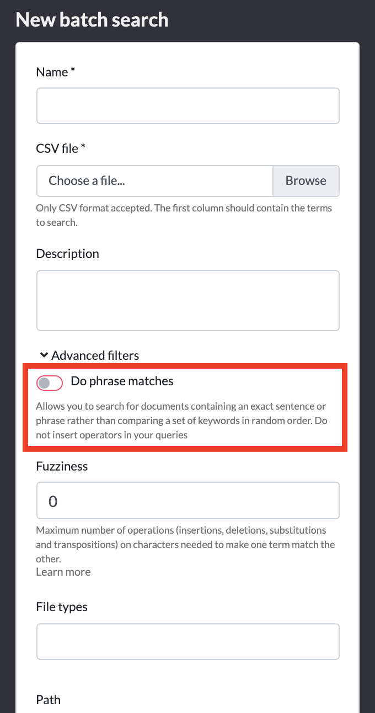

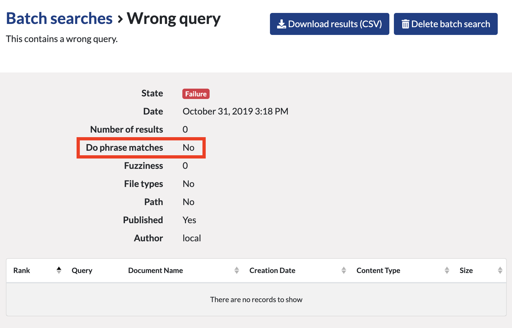

When 'Do phrase matches' is on, syntax error can still happen though:

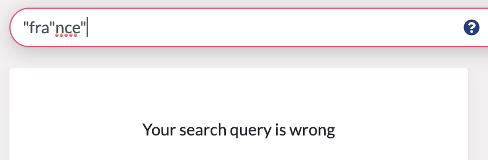

Here are **the most common errors:**

### **- A query starts with AND** \(all uppercase\)

You cannot start a query with AND all uppercase, neither in Datashare's main search bar nor in your CSV. [AND is reserved as a search operator](https://icij.gitbook.io/datashare/all/search-with-operators#and).

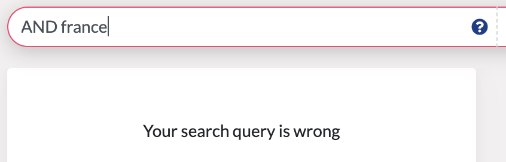

### **- A query starts with OR** \(all uppercase\)

You cannot start a query with OR all uppercase, neither in Datashare's main search bar nor in your CSV. [OR is reserved as a search operator](https://icij.gitbook.io/datashare/all/search-with-operators#or-or-space).

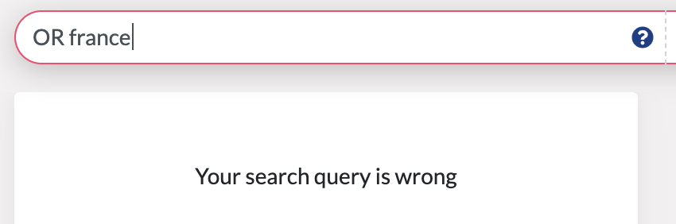

### **- A query contains only one double quote or a double quote in a word**

You cannot type a query with only one double quote, neither in Datashare's main search bar nor in your CSV. [Double quotes are reserved as a search operator](https://icij.gitbook.io/datashare/all/search-with-operators#exact-phrase).

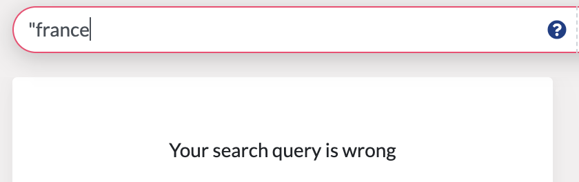

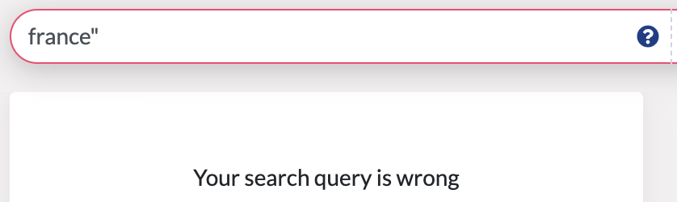

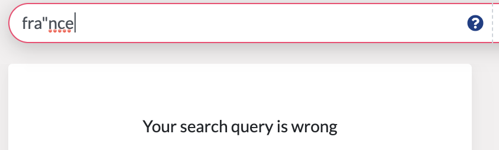

### **- A query starts with or contains tilde** \(~\) inside a term

You cannot start a query with tilde \(~\) or make one contain a tilde, neither in Datashare's main search bar nor in your CSV. Tilde is reserved as a search operator for [fuzziness](https://icij.gitbook.io/datashare/faq-definitions/what-is-fuzziness) or [proximity searches](https://icij.gitbook.io/datashare/faq-definitions/what-are-proximity-searches).

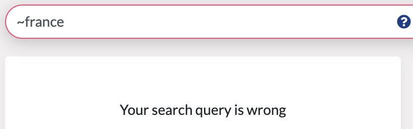

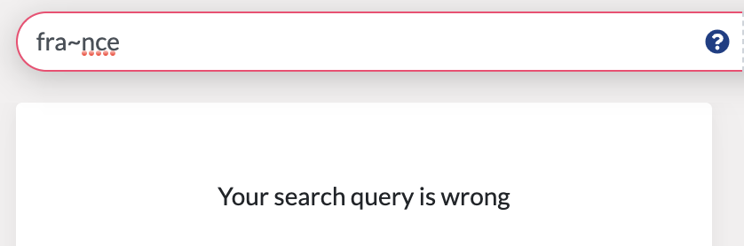

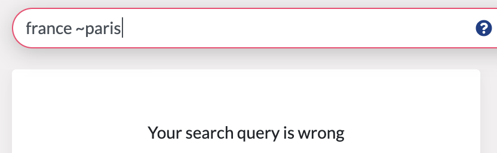

### **- A query starts with or contains a caret** \(^\)

You cannot start a query with caret \(^\) or make it contain a caret, neither in Datashare's main search bar nor in your CSV. [Caret is reserved as a boosting operator](https://icij.gitbook.io/datashare/all/search-with-operators#boosting-operators).

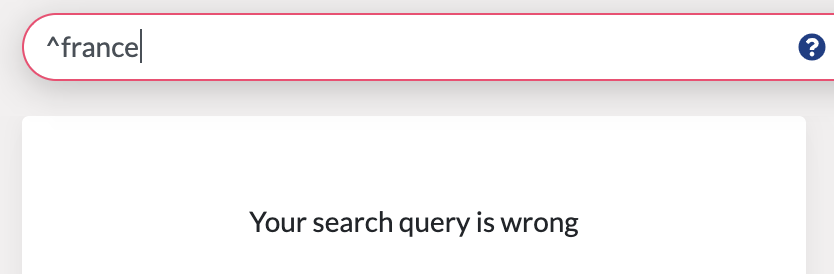

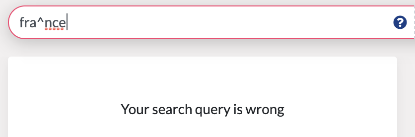

### - A query contains one slash \(/\) 

You cannot start a query with slash \(/\) or make it contain a slash, neither in Datashare's main search bar nor in your CSV. [Slash is a reserved character to open Regex \('regular expressions'\)](https://icij.gitbook.io/datashare/all/search-with-operators#regular-expressions-regex). Note that you can use Regex in batch searches.

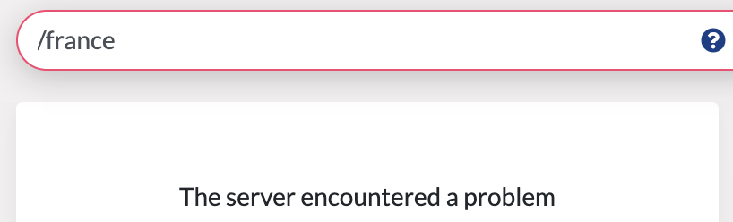

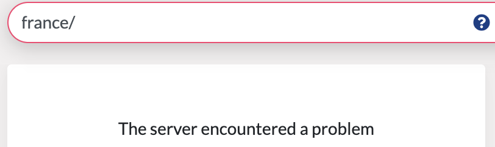

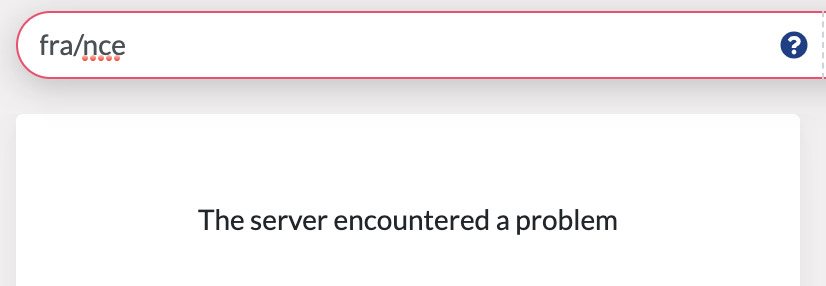

### - A query uses square brackets \(\[ \]\) 

You cannot use square brackets [except for searching for ranges](https://icij.gitbook.io/datashare/all/search-with-operators#advanced-searches-using-metadata-fields).

## Delete your batch search

Open your batch search and click the **trash icon**: 

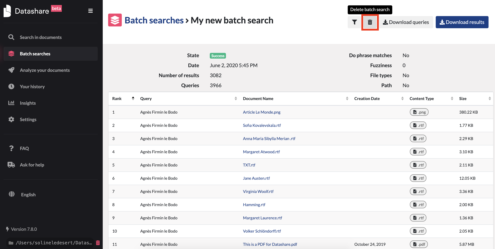

Then click **'Yes'**:

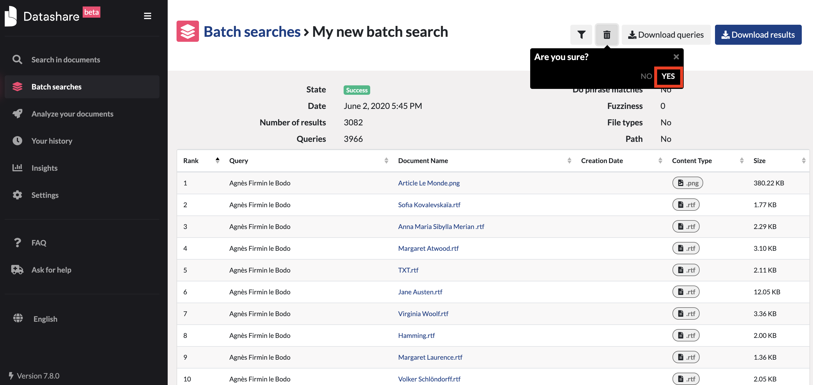

