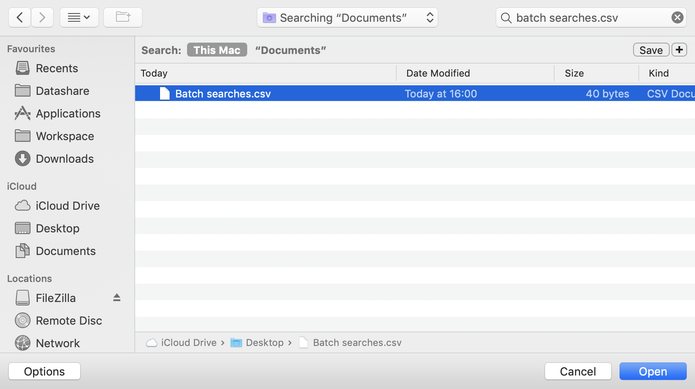
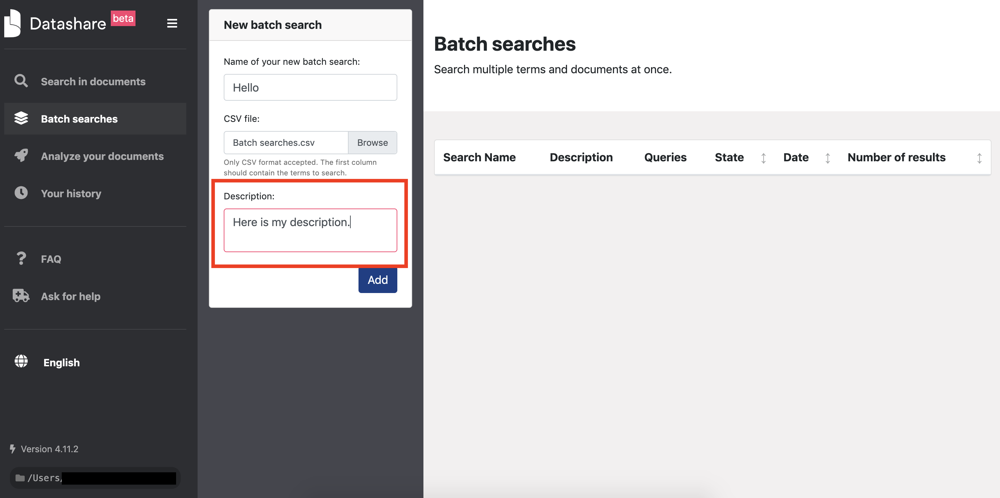

# Batch search documents

### Prepare your batch search

* Write your queries, one per line and per cell, in the first column of a spreadsheet \(Excel, Google Sheets, Numbers, Framacalc, etc.\). In the example below, there are 4 queries:

**Note:** [**Search operators**](https://icij.gitbook.io/datashare/all/search-with-operators) **do NOT work in batch searches**. Any space in your query is considered as a 'OR'. It means that if you write 'Hello world' in one cell, the search engine of batch searches will look for documents which contain either 'hello' or 'world' or the two words. If you write 'Hello AND world NOT car', it will look for documents which contain either 'hello' or 'and' or 'world' or 'not' or 'car'.

**Note:** Beware that, with some spreadsheet software, if you have **blank cells in your spreadsheet**, the CSV \(which stand for 'Comma-separated values'\) will keep these blank cells. It will separate them with commas. You will thus have commas in your batch search results \(see screenshot below\). To avoid that, you need to r**emove blank cells before exporting your queries as a CSV**.

**Note:** If there is a comma in one cell \(like in "1,8 million" in our example\), the CSV will put the content of the cell in double quotes. Datashare will not treat it as double quotes though: it won't search for the exact phrase but for the regular query without double quotes.

* Export your spreadsheet in a CSV format:

### 

### Launch your batch search

* Open Datashare and click '**Batch searches**' in the left menu:

* Type a name for your batch search:

* Upload your CSV:

* Add a description \(optionnal\):

* Click '**Add**'. Your batch search will appear in the table of batch searches.

### 

### Get your results

* Open your batch search by clicking its name:

* You see your results and you can sort them by clicking the column's name. 'Index' means the order by which each queries would be sorted out if run in Datashare's main search bar. They are thus sorted by relevance score.

You can click on a document's name and it will open it in a new tab:

* You can filter your results by query in the left panel and read how many documents there are for each query: 

* You can also download your results in a CSV format:

### Delete your batch search

Open your batch search and click 'Delete batch search'. 

Then click 'Yes'.

