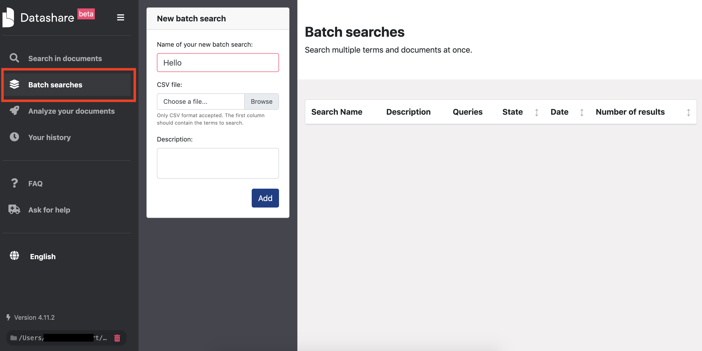
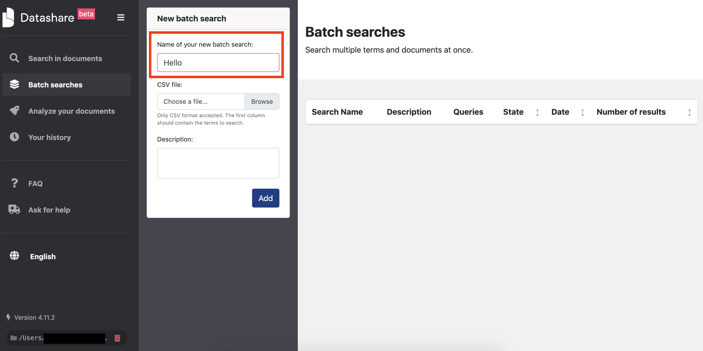
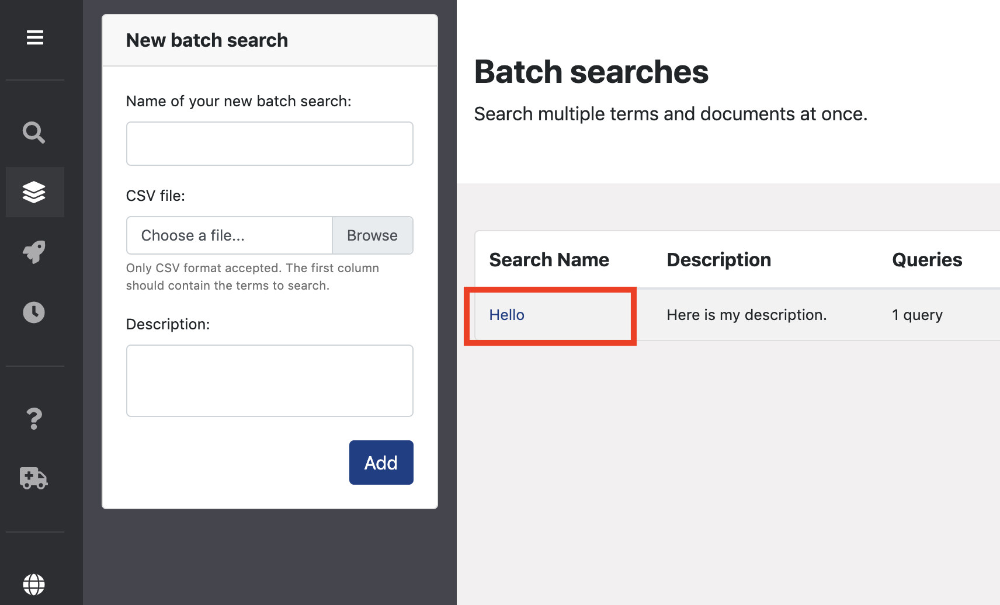
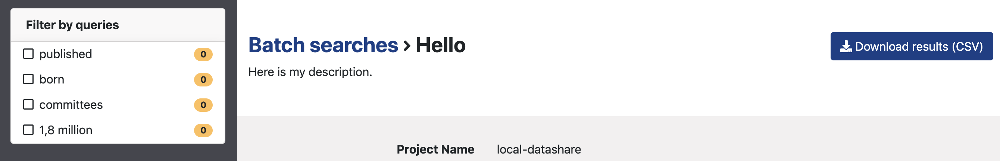

# Batch search documents

### Prepare your batch search

* Write your queries, one per line, in the first column of a spreadsheet \(Excel, Google Sheets, Numbers, etc.\). In the example below, there are 4 queries:

* Export your spreadsheet in a CSV format:

### Launch your batch search

* Open Datashare and click '**Batch searches**' in the left menu:

* Type a name for your batch search:

* Upload your CSV:

* Add a description:

* Click '**Add**'

### Get your results

* Open your batch search by clicking on its name:

* You see your results, you can filter your results by query and download your results in a CSV format.

