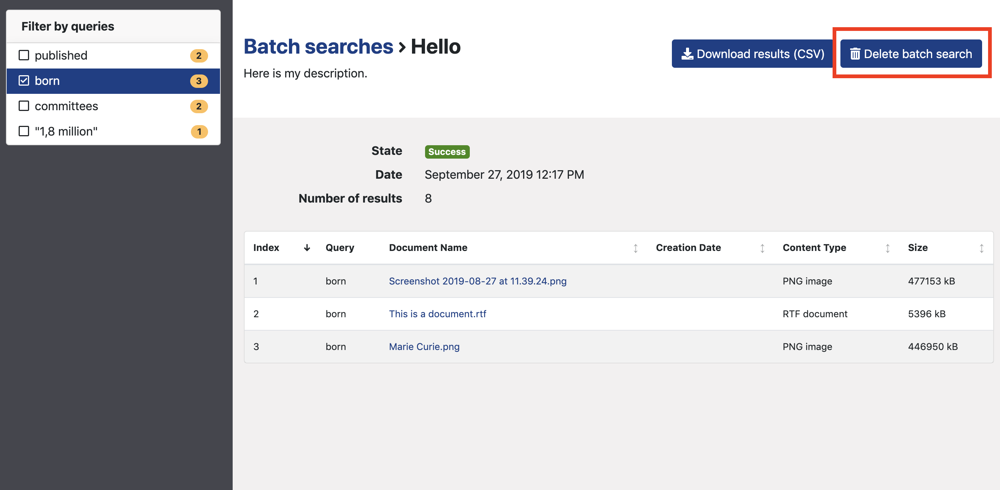

# Batch search documents

If you want to search a list of queries in Datashare, instead of doing each of them one by one, you can upload the list directly in Datashare.   
To do so, you will:

* create a list of terms that you want to search in the first column of a spreadsheet
* export the spreadsheet as a CSV \(a special format available in any spreadsheet software\)
* upload this CSV in the Batch Search form in Datashare
* see the results for each query in Datashare - or in a CSV. 

## Prepare your batch search

### **Write your queries in a spreadsheet**

* **Write your queries**, one per line and per cell, in the first column of a spreadsheet \(Excel, Google Sheets, Numbers, Framacalc, etc.\). In the example below, there are 4 queries:

* **Do not put line break\(s\)** in any of your cells.

To delete line break\(s\) in your spreadsheet, you can use the "**Find and replace all**" functionality. Find all **"\n"** and replace them all by **nothing or a space**.

* If you have **blank cells in your spreadsheet...**

...the CSV \(which stand for 'Comma-separated values'\) will keep these blank cells. It will separate them with semicolons. You will thus have semicolons in your batch search results \(_see screenshot below_\). To avoid that, **you need to remove blank cells in your spreadsheet before exporting it as a CSV**.

* **If there is a comma in one of your cells** \(like in "1,8 million" in our example above\), the CSV will formally put the content of the cell in double quotes in your results and search for the exact phrase in double quotes. 

### Beware of errors in your CSV

[**Search operators**](https://icij.gitbook.io/datashare/all/search-with-operators) ****AND NOT \* ? ! + - etc. **work in batch searches. Please beware that OR doesn't work when 'do phrase matches' is turned on.** 

Reserved characters, when misused, can lead to [**failures**](https://icij.gitbook.io/datashare/all/batch-search-documents#i-get-a-failure-what-does-that-mean) **because of syntax errors.**

* **When 'do phrase matches' is turned on**:
  * If you write operators in one of your query , the search engine will not apply neither 'do phrase matches', 'fuzziness' nor 'proximity searches' in this query only. It will apply in other operator-free queries though.

* **When 'do phrase matches' is turned off**:

  * By default, **any space in your query is considered as a 'OR'**. If you write 'Hello world' in one cell, the search engine will look for documents which contain either 'hello' or 'world' or the two words.
  * If you write 'Hello AND world NOT car' in one cell, the search engine will look for documents which contain 'hello' and 'world' but not 'car'.

* Searches are **not case sensitive**: if you search 'HeLlo', it will look for all occurrences of 'Hello', 'hello', 'hEllo', 'heLLo', etc. in the documents.

### Export your CSV encoded in UTF-8

Export your spreadsheet in a CSV format:

**Important: Use the UTF-8 encoding.**

* **Microsoft Excel**: if it is not set by default, select "CSV UTF-8" as one of the formats, [as explained here](https://answers.microsoft.com/en-us/msoffice/forum/msoffice_excel-mso_win10-mso_365hp/save-as-csv-with-utf-8-encoding/ff94943c-db5b-42c3-8905-f86d3d8d52c2).
* **Google Sheets**: it uses UTF-8 by default. Just click "Export to" and "CSV".
* **LibreOffice Calc**

## Launch your batch search

* Open Datashare and click '**Batch searches**' in the left menu:

* Type a name for your batch search:

* Upload your CSV:

* Add a description \(optional\):

* Set the advanced filters \('Do phrase matches', 'Fuzziness' or 'Proximity searches', 'File types' and 'Path'\) according to your preferences:

### What is fuzziness?

When you run a [batch search](https://icij.gitbook.io/datashare/all/batch-search-documents), you can set the fuzziness to 0, 1 or 2. It will apply to each term in a query. It corresponds to **the maximum number of operations \(insertions, deletions, substitutions and transpositions\)** on _**characters**_ needed to make one _**term**_ match the other.

> kitten -&gt; sitten \(1 substitution \(k turned into s\) = fuzziness is 1\)

> kitten -&gt; sittin \(2 substitutions \(k turned into s and e turned into i\) = fuzziness is 2\)

If you search for similar terms \(**to catch typos for example**\), use fuzziness. 

"_The default edit distance is 2, but an edit distance of 1 should be sufficient to catch 80% of all human misspellings. It can be specified as: quikc~1_" \(source: [Elastic](https://www.elastic.co/guide/en/elasticsearch/reference/7.0/query-dsl-query-string-query.html#_fuzziness)\).

> Example: quikc~ brwn~ foks~ \(as the default edit distance is 2, this query will catch all quick, quack, quock, uqikc, etc. as well as brown, folks, etc.\)
>
> Example: Datashare~1 \(this query will catch Datasahre, Dqtashare, etc.\)

#### 

### What are proximity searches?

When you turn on 'Do phrase matches', you can set, in 'Proximity searches', the **maximum number of operations \(insertions, deletions, substitutions and transpositions\)** on _**terms**_ needed to make one _**phrase**_ match the other.

> “the cat is blue” -&gt; “the small cat is blue” \(1 insertion = fuzziness is 1\)

> “the cat is blue” -&gt; “the small is cat blue” \(1 insertion + 2 transpositions = fuzziness is 3\)

> Example: "fox quick"~5 \(this query will catch "quick brown fox", "quick brown car thin fox" or even "quick brown car thin blue tree fox"

* Click '**Add**'. Your batch search will appear in the table of batch searches.

### 

## Get your results

* Open your batch search by clicking its name:

* You see your results and you can sort them by clicking the column's name. 'Rank' means the order by which each queries would be sorted out if run in Datashare's main search bar. They are thus sorted by relevance score.

You can click on a document's name and it will open it in a new tab:

* You can filter your results by query in the left panel and read how many documents there are for each query: 

* You can also download your results in a CSV format:

## I get a "failure". What does that mean?

Failures in batch searches can be due to several causes. Click the 'Failure' label and you will see an error window. 

### elasticsearch: Name does not resolve

If you have a message which contain '_elasticsearch: Name does not resolve_', it means that Datashare can't make Elastic Search, its search engine, work. 

In that case, you need to **re-open Datashare**: ****here are the instructions for [Mac](https://icij.gitbook.io/datashare/mac/open-datashare-on-mac), [Windows](https://icij.gitbook.io/datashare/windows/open-datashare-on-windows) or [Linux](https://icij.gitbook.io/datashare/linux/open-datashare-on-linux). 

Example of a message regarding a problem with ElasticSearch:

_SearchException: query='lovelace' message='org.icij.datashare.batch.SearchException: java.io.IOException: elasticsearch: Name does not resolve'_

### SearchException: query='AND ada' 

**One or several of your queries contains syntax errors**. 

It means that you wrote one or more of your queries the wrong way with some characters that are reserved as operators \(see below\).

**You need to correct the error\(s\) in your CSV** and re-launch your new batch search with a CSV that does not contain errors. [Click here to learn how to launch a batch search](https://icij.gitbook.io/datashare/all/batch-search-documents).

Datashare **stops at the first syntax error**. It reports only the first ​error. You might need to **check all your queries** as some errors can remain after correcting the first one.

They are more likely to happen **when 'do phrase matches' toggle button is turned off:**

When 'Do phrase matches' is on, syntax error can still happen though:

Here are **the most common errors:**

### **- Querie\(s\) start\(s\) with AND** \(all uppercase\)

You cannot start a query with AND all uppercase, neither in Datashare's main search bar nor in your CSV. [AND is reserved as a search operator](https://icij.gitbook.io/datashare/all/search-with-operators#and).

### **- Querie\(s\) start\(s\) with OR** \(all uppercase\)

You cannot start a query with OR all uppercase, neither in Datashare's main search bar nor in your CSV. [OR is reserved as a search operator](https://icij.gitbook.io/datashare/all/search-with-operators#or-or-space).

### **- Querie\(s\) contain\(s\) only one double quote or a double quote in a word**

You cannot type a query with only one double quote, neither in Datashare's main search bar nor in your CSV. [Double quotes are reserved as a search operator](https://icij.gitbook.io/datashare/all/search-with-operators#exact-phrase).

### **- Querie\(s\) start\(s\) with or contain tilde** \(~\) inside a term

You cannot start a query with tilde \(~\) or make one contain a tilde, neither in Datashare's main search bar nor in your CSV. Tilde is reserved as a search operator for [fuzziness](https://icij.gitbook.io/datashare/faq/what-is-fuzziness) or [proximity searches](https://icij.gitbook.io/datashare/faq/what-is-proximity-search).

### **- Querie\(s\) start\(s\) with or contain caret** \(^\)

You cannot start a query with caret \(^\) or make it contain a caret, neither in Datashare's main search bar nor in your CSV. [Caret is reserved as a boosting operator](https://icij.gitbook.io/datashare/all/search-with-operators#boosting-operators).

### - Querie\(s\) uses square brackets \(\[ \]\) 

You cannot use square brackets [except for searching for ranges](https://icij.gitbook.io/datashare/all/search-with-operators#advanced-searches-using-metadata-fields).

## Delete your batch search

Open your batch search and click 'Delete batch search'. 

Then click 'Yes'.

