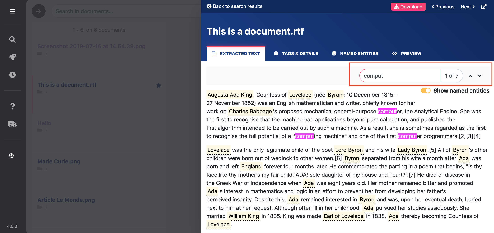
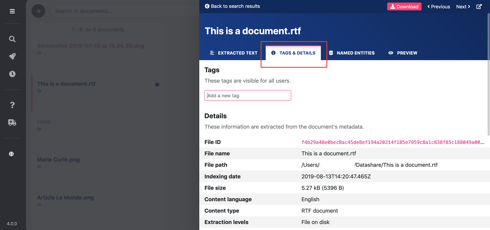
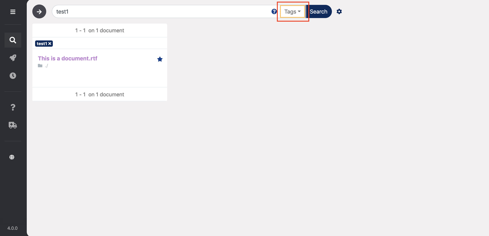
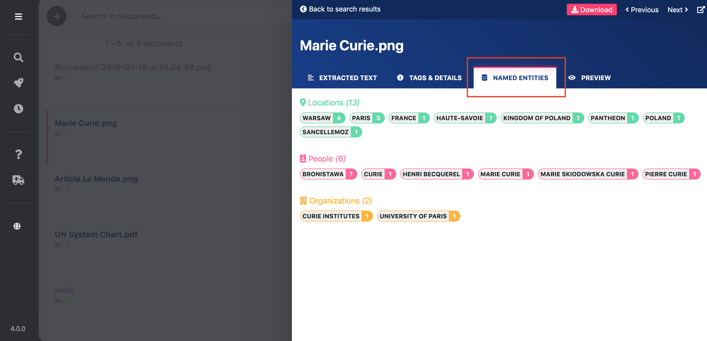
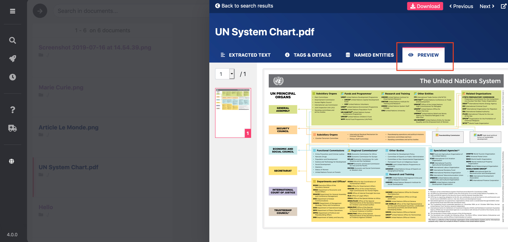

# Explore a document

## Extracted text

In 'Extracted Text', you can read the text of a document as extracted by Datashare:

Please beware that Datashare show named entities by default. **This can overwrite some original text with wrong named entities.** It is thus important to **always verify original text** by deactivating named entity overwriting. To do so, please: 

* **Turn off** the toggle button ‘**Show named entities**’ and read the extracted text
* Check the ‘**Preview’** of original document if available
* Check the original document at its original location or by clicking the pink button ‘**Download**’

**Search for terms within this document:**

* Press **Command\(⌘\) + F** \(on Mac\) or **Control + F** \(on Windows and Linux\) or click on the search bar above your Extracted Text
* Type what you search for
* Press **ENTER** to go from one occurrence to the **next** one
* Presse **SHIFT + ENTER** to go from one occurrence to the **previous** one

_To know all the shortcuts in Datashare, please read '_[_Use keyboard shortcuts_](https://icij.gitbook.io/datashare/all/use-keyboard-shortcuts)_'._

This also counts the number of occurrences of your searched terms in this document:

## **Tags & Details**

In 'Tags & Details', you can read the document's details. It's all the metadata as they appear in the original file. Please click '**Show more details**' to get all metadata:

You can also read the tags you previously wrote for this document, like 'test1', 'test2' and 'test3' in the example below:

You can then search for the documents you tagged:

* **Type the tag\(s\)** in the main search bar 
* Click '**All fields**' and select '**Tags**'
* Click '**Search**' or press '**Enter**'

To learn more about tags, please read '[Tag a document](https://icij.gitbook.io/datashare/all/tag-documents)'.

## **Named Entities**

In 'Named Entities', you can read the name of people, organizations and locations as well as the number of their occurrences in the document:

Please beware that there can still be some errors due to the technology of Named Entity Extraction \(NER\) on which Datashare relies.

## **Preview**

In 'Preview', you can read the original document. 

'Preview' is available for some formats only.

