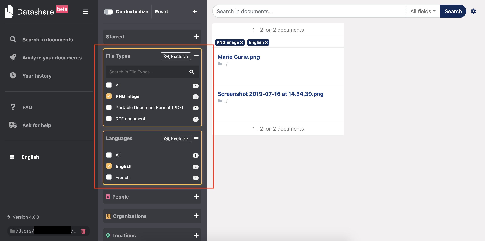
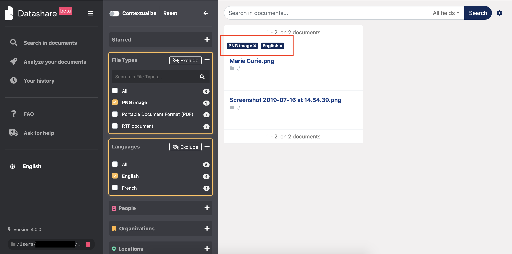
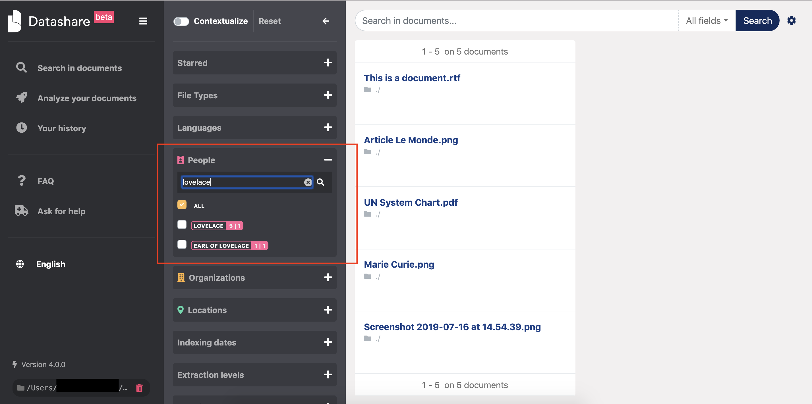
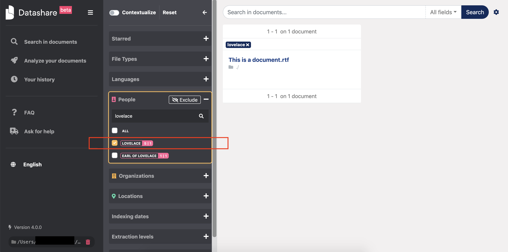
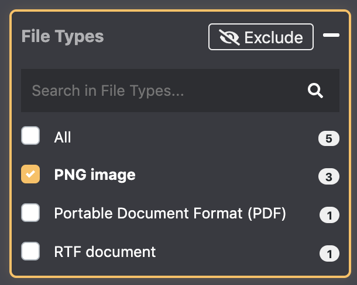
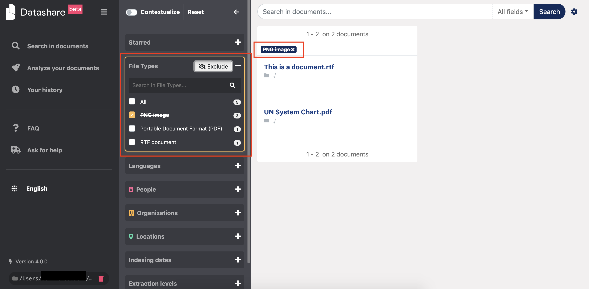
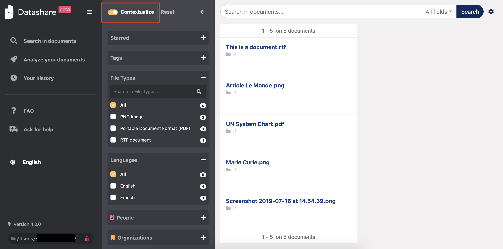
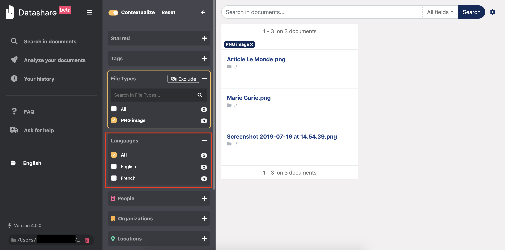

# Filter documents

## Apply filters

On the left column, you can apply **filters** by ticking them, like 'PNG image' in File Types and 'English' in Languages in the example below:

A reminder of the currently applied filters, as well as your queried terms, are displayed at the top of the results' column. You can easily unselect these filters from there by clicking them:

The currently available filters are:

* **Starred**: If you have starred documents, you can easily find them again.
* **File type**: This is the 'Content type' of the file \(Word, PDF, JEPG image, etc.\) as you can read it in a document's 'Tags & Details'.
* **Languages**: Datashare detects the main language of each document.
* **People / organizations / locations**: you can selected these named entities and search them.
* **Path**: This is the location of your documents as it is indicated in your original files \(ex: desktop/importantdocuments/mypictures\). You can find this in a document's 'Tags & Details'.
* **Indexing date**: This date corresponds to when you indexed the documents in Datashare.
* **Extraction level**: This regards embedded documents. The file on disk is level zero. If a document \(pictures, etc\) is attached or contained in a file on disk, extraction level is “1st”. If a document is attached or contained in a document itself contained in a file on disk, extraction level is “2nd”, etc.
* **Creation date**: This is when the document was created as it is noticed in their properties. You can find this in a document's 'Tags & Details'.

Filters can be combined together and combined with searches in order to refine results.

## Filter by named entities

If you have asked Datashare to '**Find people, organizations and locations'**, you can see names of individuals, organizations and locations in the filters. These are the named entities **automatically detected by Datashare.** 

Search for named entities in the search bar:

Select one or multiple ones to filter the documents that mention them:

## Use the 'Exclude' button

If you want to select all lines but one or multiple item\(s\), you can use the '**Exclude button'** after having clicked on the filter\(s\) you want to exclude. 

The 'Exclude' button appears once you have selected a filter. It allows you to search for all documents which do not correspond to the last active filter you selected, that is to say to the currently strikethrough filters. It allows to display all documents but the one\(s\) which correspond\(s\) to the currently strikethrough filters.

For example, the configuration below makes you see only documents which format is 'PNG image':

Now if you click on 'Exclude', this configuration makes you see **all documents but 'PNG images'**:

This 'Exclude' functionality can be used in multiple filters at the same time. 

## Contextualize filters

 You can also turn on the '**Contextualize'** functionality in order to **update the number of documents indicated in the filters according to your selection**. 

In the example below, the 'Contextualize' toggle button is turned **off**. 

Click it to turn it on:

There are 5 documents in total. In File Types, we see that there are **3 PNG images**. In Languages, the total is 5 documents: 4 documents in English and 1 in French.

Now, if one tick PNG image, as the Contextualize button is on, the Languages filters is updated according to the search results and counts only PNG images. The total is thus 3, with 2 PNG images in English and 1 in French:

## Reset filters

To reset all filters at the same time, click 'Reset':

