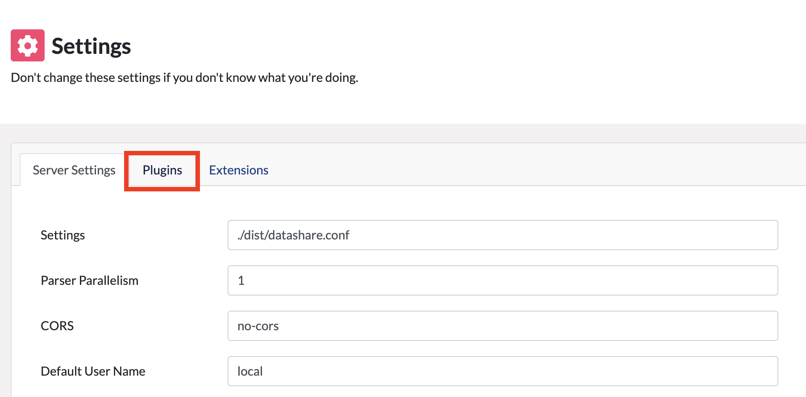
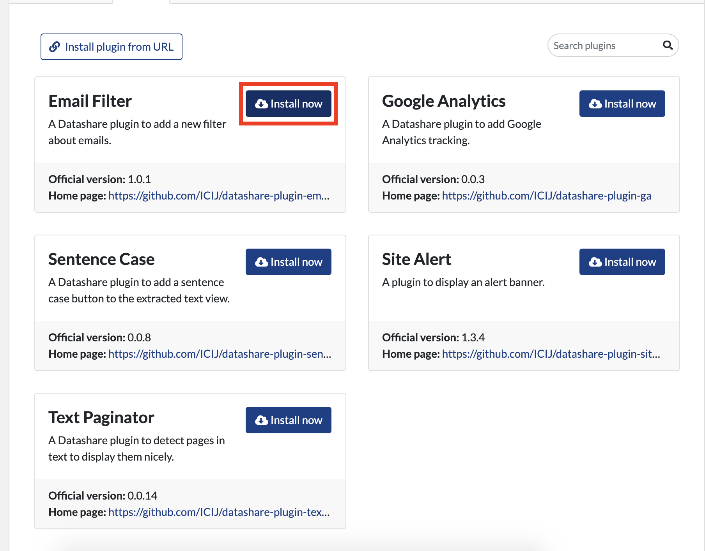
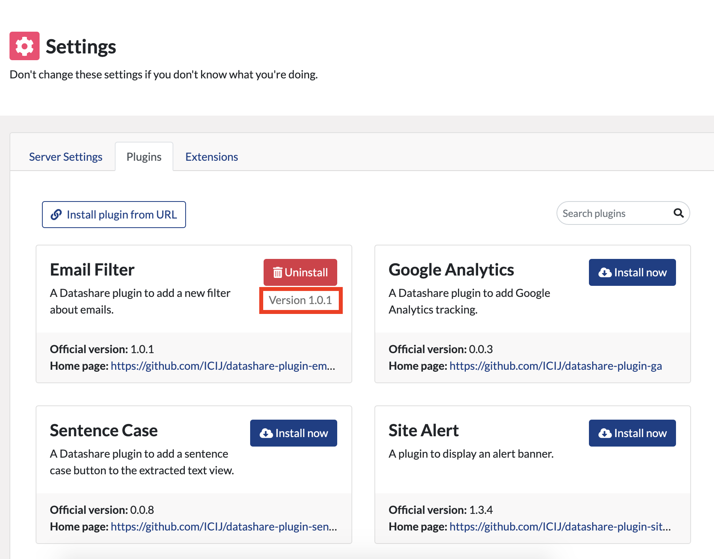
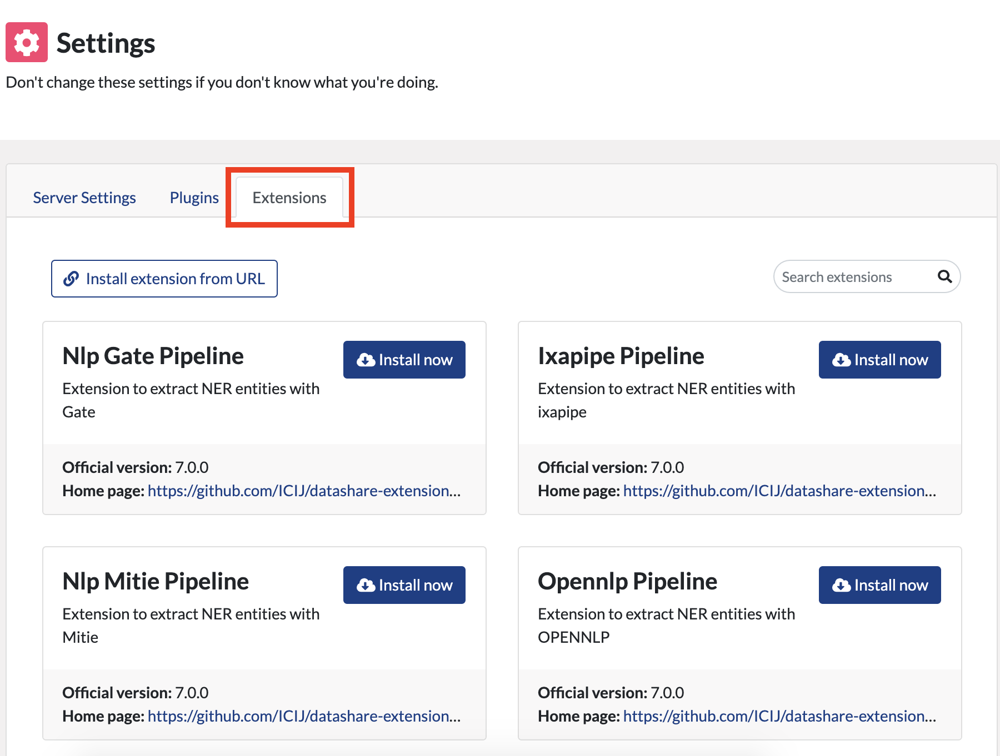
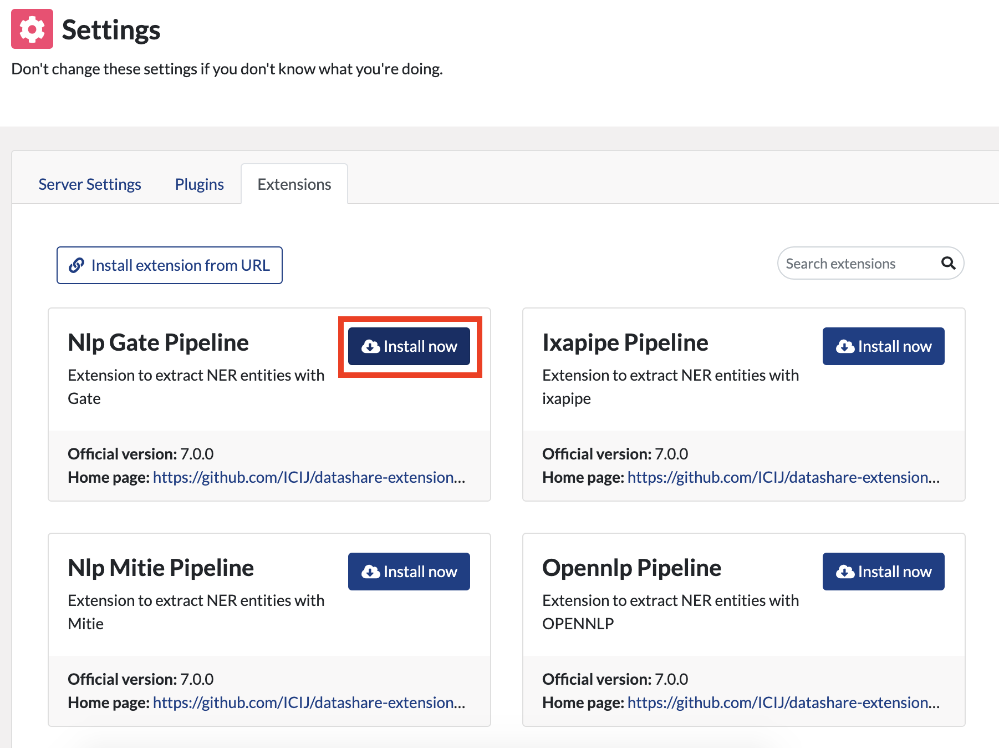
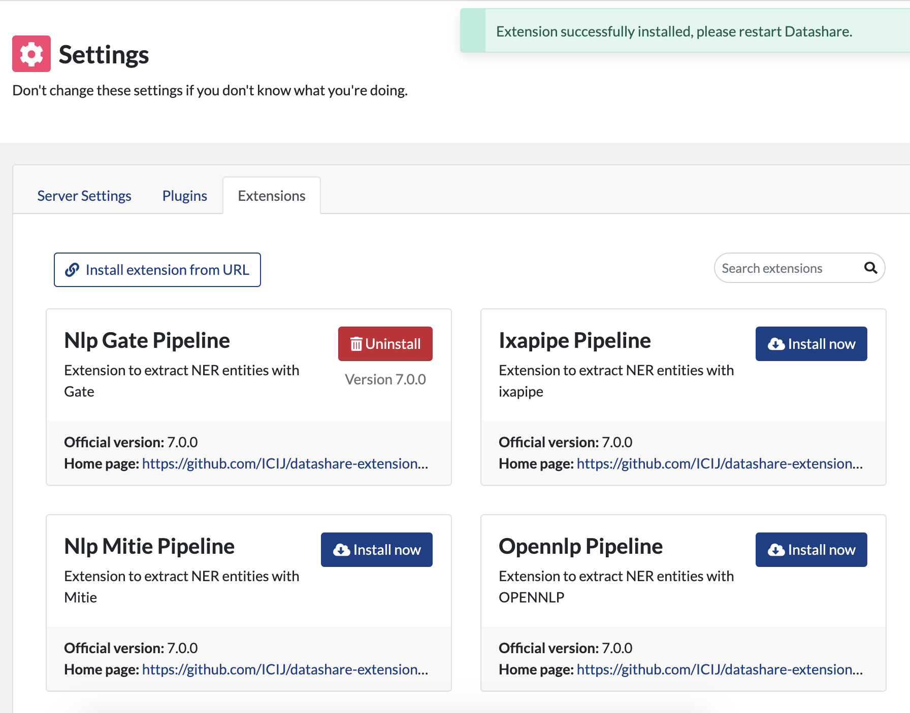

# Add plugins and extensions

**Plugins** are small programs that you can add to Datashare's **front-end** to get new features \(the front-end is the interface, "_the part of the software with which the user interacts directly_" - [source](https://languages.oup.com/)\).

**Extensions** are small programs that you can add to Datashare's **back-end** to add new features \(the back-end is "_the part of the software that is not directly accessed by the user, typically responsible for storing and manipulating data_" - [source](https://languages.oup.com/)\).

## Add plugins to Datashare \(front-end\)

 1. Go to "**Settings**":

 2. Click "**Plugins**":

 3. Choose the plugin you want to add and click "**Install now**":

If you want to install a plugin from an URL, click "Install plugin from URL".

  4. Your plugin is installed. 

**Refresh your page to see your new plugin activated in Datashare.**

## Add **extensions** to Datashare \(back-end\)

1. Go to "**Settings**":

 2. Click "**Extensions**":

 3. Choose the extension you want to add and click "**Install now**":

If you want to install an extension from an URL, click "Install extension from URL".

  4. Your extension is installed. 

**Restart Datashare to see your new extension activated in Datashare.**

## Update plugin or extension with latest version

When a newer version of a plugin or extension is available, you can click on the "**Update**" button to get the latest version. 

After that, if it is a plugin, **refresh** your page to activate the latest version. 

If it is an extension, **restart** Datashare to activate the latest version.

## Create your own plugin or extension

People who code can create their own plugins and extensions by following these steps:

* **Plugins**: [https://github.com/ICIJ/datashare/wiki/Client-%E2%80%BA-Plugins](https://github.com/ICIJ/datashare/wiki/Client-%E2%80%BA-Plugins)
* **Extensions**: [https://github.com/ICIJ/datashare/wiki/Backend-%E2%80%BA-Extensions](https://github.com/ICIJ/datashare/wiki/Backend-%E2%80%BA-Extensions)

