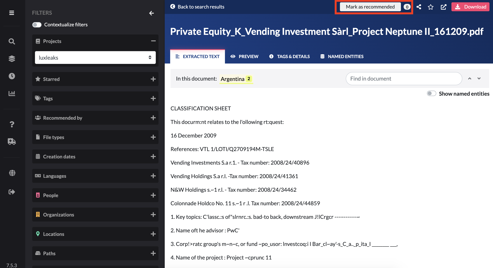
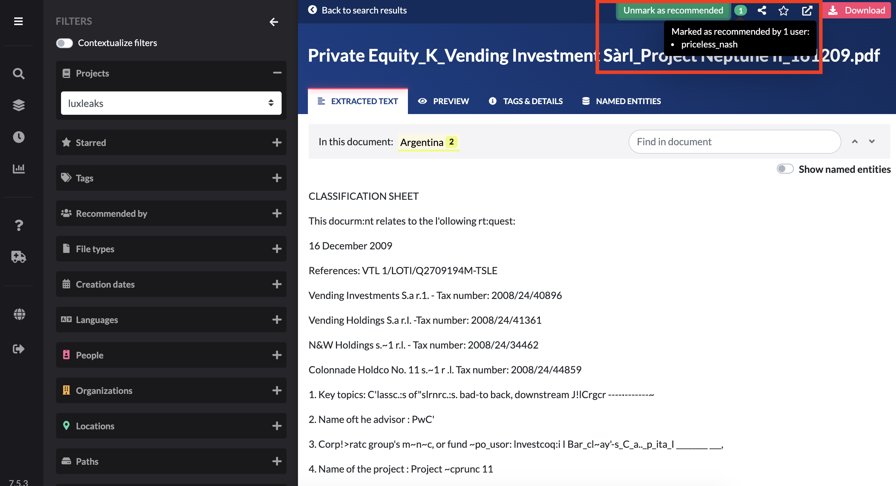
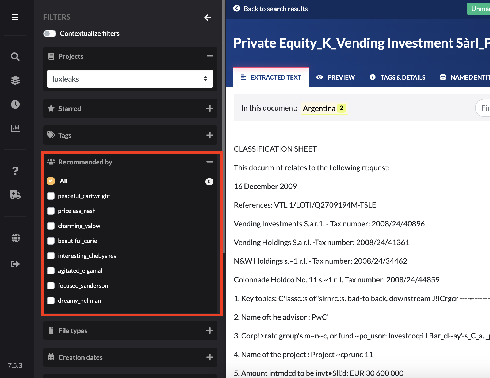

# Recommend documents

## Recommend a document

This functionality was designed for the [**server \(collaborative\) mode**](https://icij.gitbook.io/datashare/faq-general/how-can-we-use-datashare-on-a-collaborative-mode-on-a-server). It exists in the local mode too but might be less useful.

**Open** the document by clicking on its title

* Click the button '**Mark as recommended**':

Your recommendation is now displayed on this page and in the left 'Recommended by' filter.

## Search recommended documents with the filter

Open the filter untitled '**Recommended by**'

## Unmark a document as recommended

Open the document and click on "Unmark as recommended".

