# Search documents

### Search in documents

1. To see all your documents \(you need to have [added documents](https://icij.gitbook.io/datashare/mac/add-documents-to-datashare-on-mac) to Datashare and[ have analyzed](https://icij.gitbook.io/datashare/all/analyze-documents) them before\), click '**Search in documents'**:

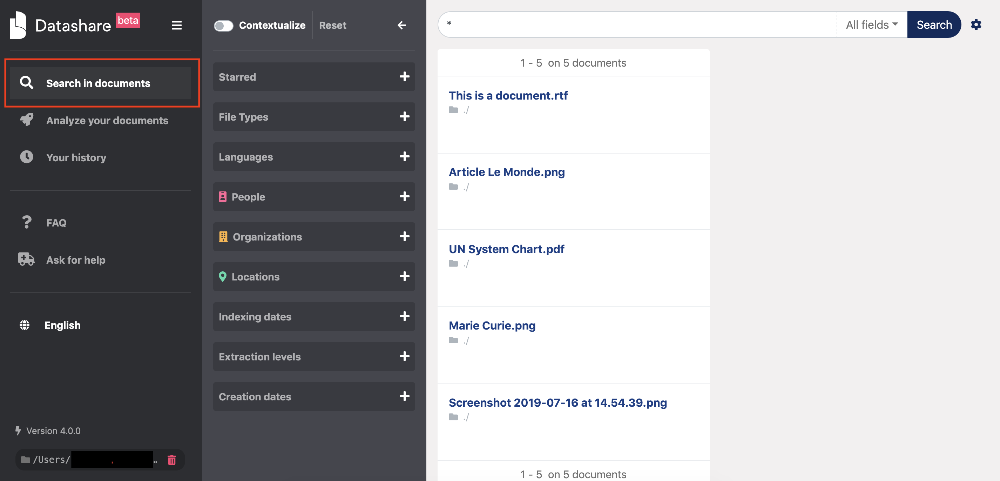

To collapse the left menu, **click the 'hamburger menu'** :

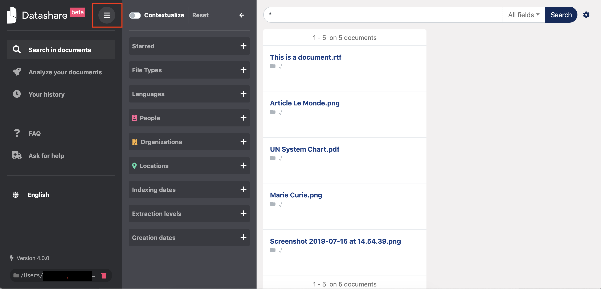

You will gain room to better explore your documents:

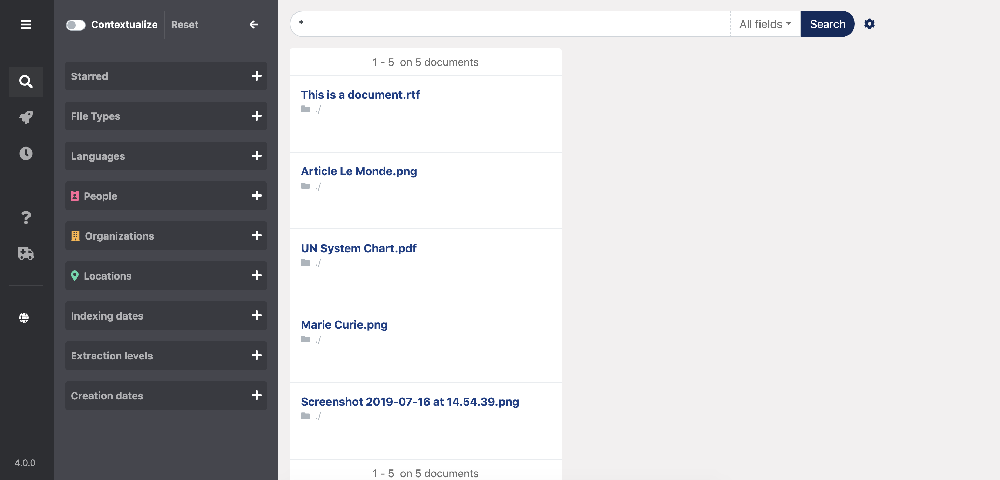

2. Search for specific documents. **Type terms** in the search bar, **press Enter** or **click 'Search'**:

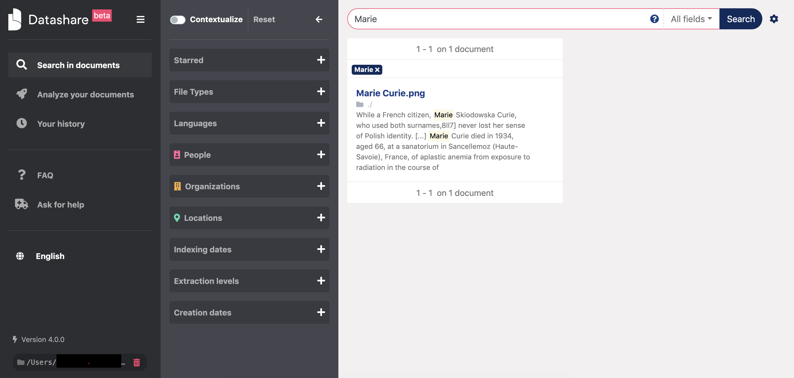

**IMPORTANT:** 

* **To make your searches more precise, you can search with operators \(AND, OR, ....\).** [**Read more here**](https://icij.gitbook.io/datashare/all/search-with-operators)**.**

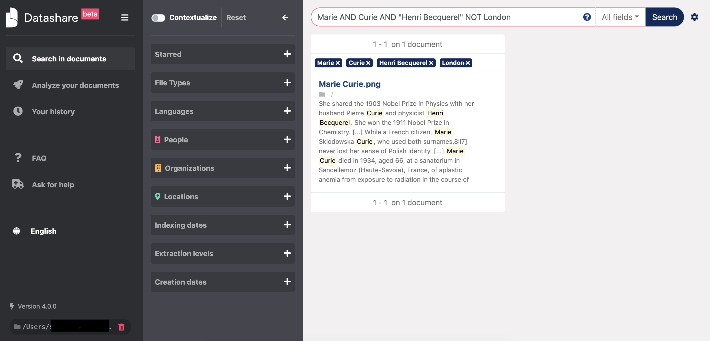

* **If you get a message "Your search query is wrong",  it is probably because you are misusing one or some reserved characters \(like ^ " ? \( \[ \* OR AND etc\).** [**Please refer to this page**](https://icij.gitbook.io/datashare/faq-errors/your-search-query-is-wrong)**.**

3. You can search **in specific fields** like tags, title, author, recipient, content, path or thread ID. Click **'All fields**' and **select your choice** in the dropdown menu:

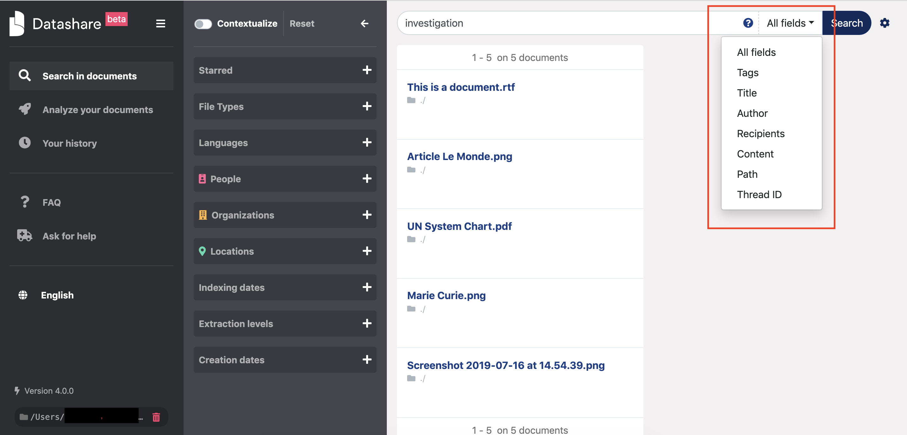

4. In the 'All fields' category, when you start typing terms, you can see suggestions of named entities \(name of people, organizations and locations in Datashare\) in a dropdown menu, with **their number of occurrences in all your documents** \(here, "marie curie" appears 1 time in the documents and "marie skiodowska curie" 1 time as well\):

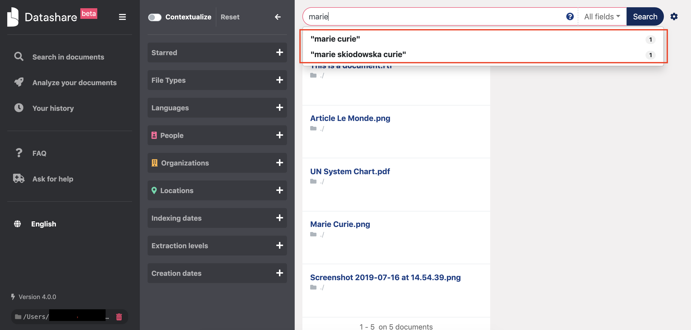

If you run [email extraction](https://icij.gitbook.io/datashare/all/analyze-documents#extract-email-addresses), email addresses will also be suggested:

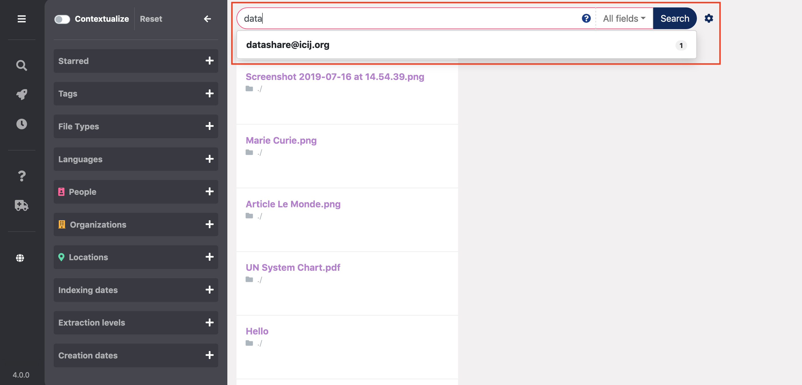

### Choose between views \(list, grid, table\)

Select the view on the top right. 

View in list:

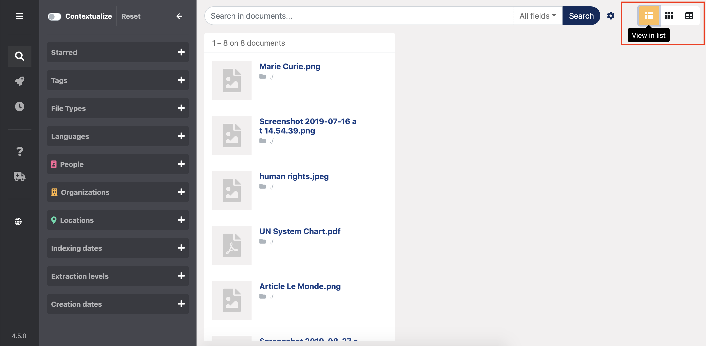

View in grid:

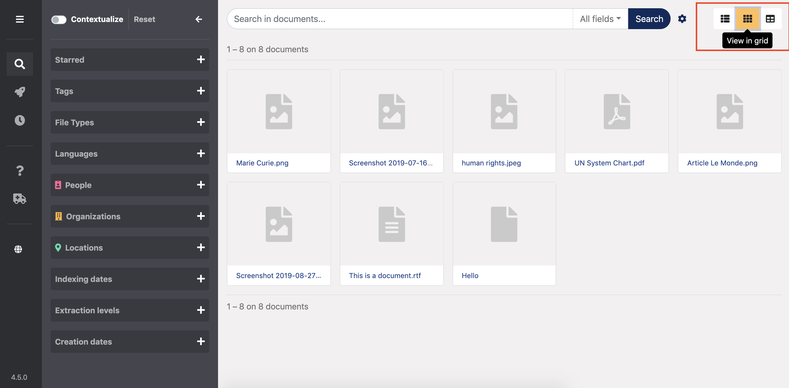

View in table:

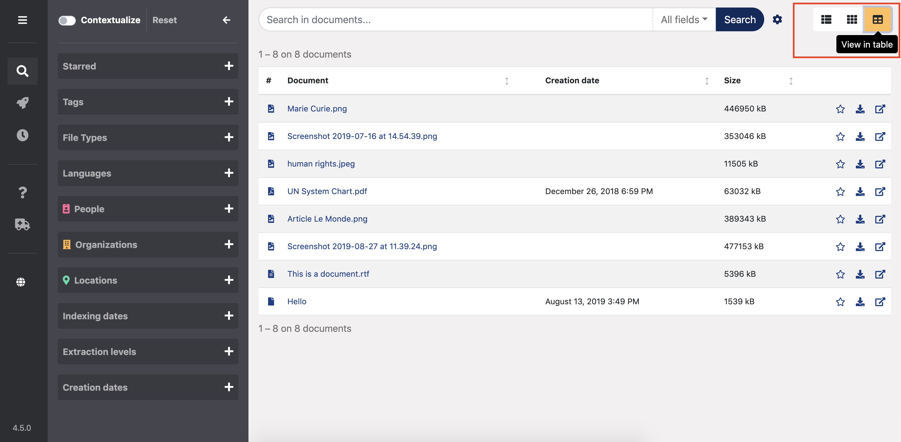

### Search within a document 

Once a document is opened, you can **search for terms in this document:**

* Press **Command \(⌘\) + F** \(on Mac\) or **Control + F** \(on Windows and Linux\) or click on the search bar above your Extracted Text
* Type what you search for
* Press **ENTER** to go from one occurrence to the **next** one
* Presse **SHIFT + ENTER** to go from one occurrence to the **previous** one

_\(To know all the shortcuts in Datashare, please read '_[_Use keyboard shortcuts_](https://icij.gitbook.io/datashare/all/use-keyboard-shortcuts)_'.\)_

This also counts the number of occurrences of your searched terms in this document:

If you run [email extraction](https://icij.gitbook.io/datashare/all/analyze-documents#extract-email-addresses) and searched for one or several email addresses, if the email adresses are in the email's metadata \(recipient, sender or other field\), there will be a '**in metadata**' label attached to the email addresses:

