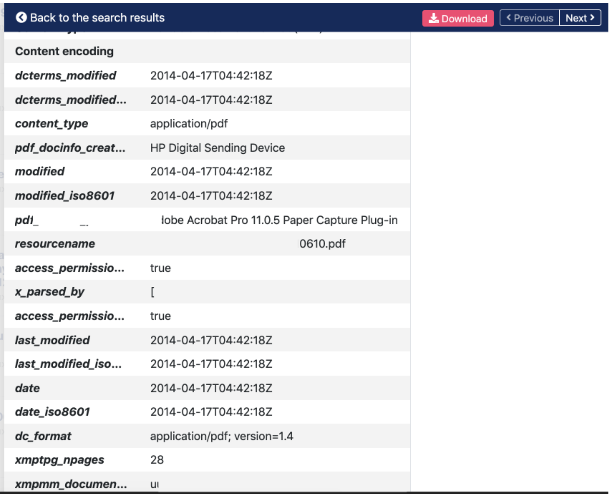
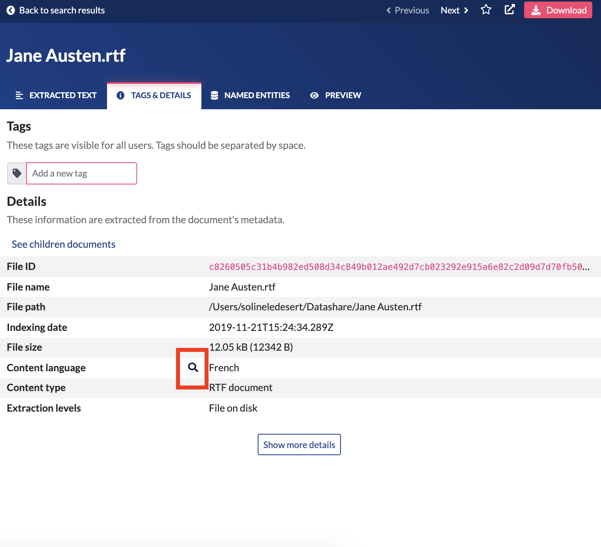
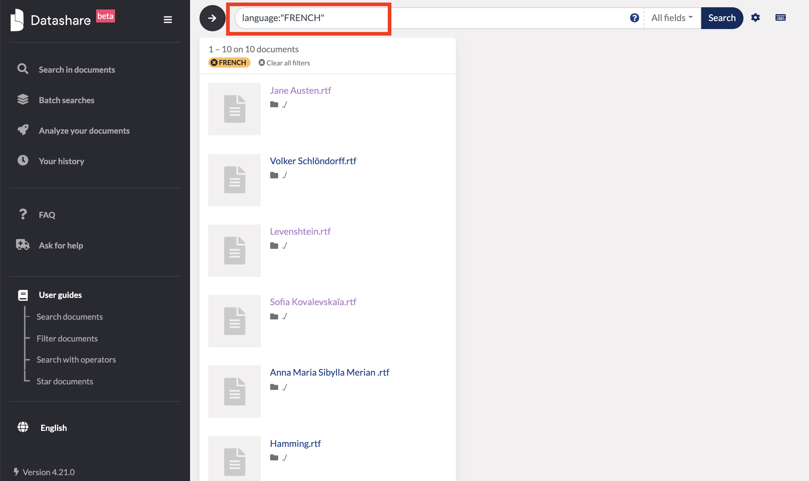
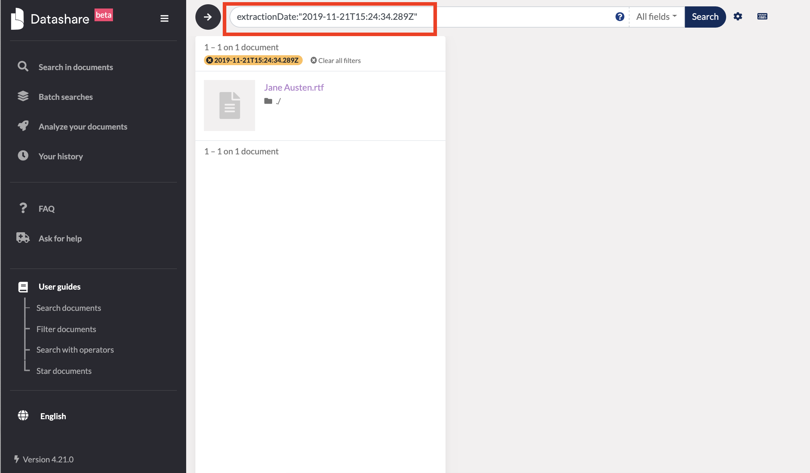

# Search with operators and Regex

### Double quotes for e**xact phrase**

To have all documents mentioning an exact phrase, you can use double quotes.

> Example: “Alicia Martinez’s bank account in Portugal”

### **OR \(or space\)**

To have all documents mentioning all or one of the queried terms, you can use a simple space between your queries or 'OR'. You need to write 'OR' with **all letters uppercase**.

> Example: Alicia Martinez
>
> Same search: Alicia OR Martinez

### **AND \(or +\)**

To have all documents mentioning all the queried terms, you can use 'AND' between your queried words. You need to write 'AND' with **all letters uppercase**.

> Example: Alicia AND Martinez
>
> Same search: +Alicia +Martinez

### **NOT \(or ! or -\)**

To have all documents NOT mentioning some queried terms, you can use 'NOT' before each word you don't want. You need to write 'NOT' with **all letters uppercase**.

> Example: NOT Martinez
>
> Same search: !Martinez
>
> Same search: -Martinez

### **Please note that you can combine operators**

Parentheses should be used whenever multiple operators are used together and you want to give priority to some. 

> Example: \(\(Alicia AND Martinez\) OR \(Delaware AND Pekin\) OR Grey\) AND NOT "parking lot""

You can also combine these with 'regular expressions' Regex between two slashes \([see below](https://icij.gitbook.io/datashare/all/search-with-operators#regular-expressions-regex)\).

### **Wildcards**

If you search faithf?l, the search engine will look for all words with all possible single character between the second f and the l in this word. It also works with \* to replace multiple characters.

> Example: Alicia Martin?z
>
> Example: Alicia Mar\*z

### **Fuzziness**

You can set fuzziness to 1 or 2. It corresponds to the maximum number of operations \(insertions, deletions, substitutions and transpositions\) on **characters** needed to make one **term** match the other.

> kitten -&gt; sitten \(1 substitution \(k turned into s\) = fuzziness is 1\)

> kitten -&gt; sittin \(2 substitutions \(k turned into s and e turned into i\) = fuzziness is 2\)

If you search for similar terms \(**to catch typos for example**\), you can use fuzziness. Use the [tilde symbol](https://en.wikipedia.org/wiki/Tilde) at the end of the word to set the fuzziness to 1 or 2. 

"_The default edit distance is 2, but an edit distance of 1 should be sufficient to catch 80% of all human misspellings. It can be specified as: quikc~1_" \(source: [Elastic](https://www.elastic.co/guide/en/elasticsearch/reference/7.0/query-dsl-query-string-query.html#_fuzziness)\).

> Example: quikc~ brwn~ foks~ \(as the default edit distance is 2, this query will catch all quick, quack, quock, uqikc, etc. as well as brown, folks, etc.\)
>
> Example: Datashare~1 \(this query will catch Datasahre, Dqtashare, etc.\)

### \*\*\*\*

### **Proximity searches**

When you type an exact phrase \(in double quotes\) and use fuzziness, then the meaning of the fuzziness changes. Now, the fuzziness means the maximum number of operations \(insertions, deletions, substitutions and transpositions\) on **terms** needed to make one **phrase** match the other.

Examples:

> “the cat is blue” -&gt; “the small cat is blue” \(1 insertion = fuzziness is 1\)

> “the cat is blue” -&gt; “the small is cat blue” \(1 insertion + 2 transpositions = fuzziness is 3\)

"_While a phrase query \(eg "john smith"\) expects all of the terms in exactly the same order, a proximity query allows the specified words to be further apart or in a different order. A proximity search allows us to specify a maximum edit distance of words in a phrase._" \(source: [Elastic](https://www.elastic.co/guide/en/elasticsearch/reference/7.0/query-dsl-query-string-query.html#_fuzziness)\).

> Example: "fox quick"~5 \(this query will catch "quick brown fox", "quick brown car thin fox" or even "quick brown car thin blue tree fox"

The closer the text in a field is to the original order specified in the query string, the more relevant that document is considered to be. When compared to the above example query, the phrase `"quick fox"` would be considered more relevant than `"quick brown fox"`\(source: [Elastic](https://www.elastic.co/guide/en/elasticsearch/reference/7.0/query-dsl-query-string-query.html#_fuzziness)\).

### \*\*\*\*

### **Boosting operators**

Use the _boost_ operator `^` to make one term more relevant than another. For instance, if we want to find all documents about foxes, but we are especially interested in quick foxes:

> Example: quick^2 fox

The default boost value is 1, but can be any positive floating point number. Boosts between 0 and 1 reduce relevance. Boosts can also be applied to phrases or to groups:

> Example: "john smith"^2   \(foo bar\)^4

\(source: [Elastic](https://www.elastic.co/guide/en/elasticsearch/reference/7.0/query-dsl-query-string-query.html#_fuzziness)\)

### **Regular expressions \(Regex\)**

‌"A regular expression \(shortened as regex or regexp\) is a sequence of characters that define a search pattern." \([Wikipedia](https://en.wikipedia.org/wiki/Regular_expression)\).

 ****1. ****You can use Regex in Datashare. Regular expressions \(Regex\) in Datashare need to be **written between 2 slashes.**

> Example: /.\*\..\*\@.\*\..\*/

The example above will search for any expression which is **structured like an email address** with a dot between two expressions before the @ and a dot between two expressions after the @ like in 'first.lastname@email.com' for instance.

 2. ****Regex can be combined with standard queries in Datashare :

> Example: \("Ada Lovelace" OR "Ado Lavelace"\) AND paris AND /.\*\..\*\@.\*\..\*/

\*\*\*\*

 ****3. **You need to escape the following characters by typing a backslash just before them \(without space\):‌ \# @ & &lt; &gt; ~**

> Example: /.\*\..\*\@.\*\..\*/ \(the @ was escaped by a backslash \ just before it\)

\*\*\*\*

 ****4. ****Important: **Datashare relies on Elastic's Regex syntax** as explained[ here](https://www.elastic.co/guide/en/elasticsearch/reference/current/regexp-syntax.html). Datashare uses [the Standard tokenizer](https://www.elastic.co/guide/en/elasticsearch/reference/current/analysis-standard-tokenizer.html). A consequence of this is that **spaces cannot be searched as such in Regex**. 

We encourage you to **use the AND operator** to work around this limitation and make sure you can make your search. 

If you're looking for French International Bank Account Number \(IBAN\) that can or cannot contain space and contain FR followed by numbers and/or letters \(it could be FR7630001007941234567890185 ou FR76 3000 4000 0312 3456 7890 H43 for example\), you can then search for:

> /FR\[0-9\]{2}./ AND /\[0-9\]{4}./ AND /\[0-9a-zA-Z\]{11}.\*/

 5. Here are a few examples of useful Regex:

* You can search for **/Dimitr\[iyu\]/** instead of searching for **Dimitri OR Dimitry OR Dimitru**. It will find all the Dimitri, Dimitry or Dimitru.

* You can search for **/Dimitr\[^yu\]/** if you want to search all the words which begin with Dimitr and **do not end with either y nor u.**

* You can search for **/Dimitri&lt;1-5&gt;/** if you want to search **Dimitri1, Dimitri2, Dimitri3, Dimitri4 or Dimitri5**.

### **\(Advanced\) Searches using metadata fields**

To find the list of existing metadata fields, **go to a document's 'Tags and details' tab, click 'Show more details'.**

**When you hover the lines, you see a magnifying glass on each line. Click on it and Datashare will look for this field.** Here is the one for content language:

Here is the one for 'indexing date' \(also called extraction date here\) for instance:

So for example, if you are looking for documents that:

*  contains term1, term2 and term3
*  and were created after 2010

you can use the 'Date' filter or type in the search bar:

> term1 AND term2 AND term3 AND metadata.tika\_metadata\_creation\_date:&gt;=2010-01-01

Explanations:

* 'metadata.tika\_metadata\_creation\_date:' means that we filter with creation date
* '&gt;="'means 'since January 1st included'
* '2010-01-01' stands for January 2010 and the search will include January 2010

For other searches:

* '&lt;' will mean 'strictly after \(with January 1st excluded\)'
* nothing will mean 'at this exact date'

You can search for numbers in a range. Ranges can be specified for **date**, **numeric** or **string fields amont the ones** you can find by clicking the magnifying glass when you hover the fields in a document's tab 'Tags and Details'. 

Inclusive ranges are specified with square brackets \[min TO max\] and exclusive ranges with curly brackets {min TO max}. For more details, please refer to [Elastic's page on ranges](https://www.elastic.co/guide/en/elasticsearch/reference/current/query-dsl-query-string-query.html#_ranges).

