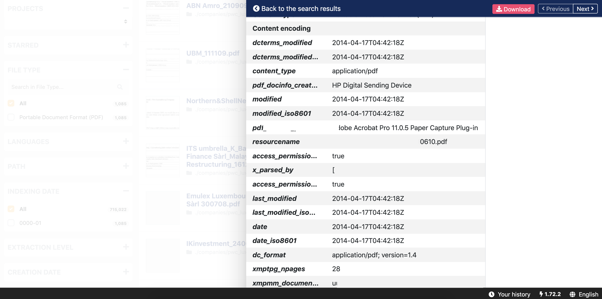

# Search with operators

* **Exact phrase**

To have all documents mentioning an exact phrase, you can use double quotes.

> Example: “Alicia Martinez’s bank account in Portugal”

\*\*\*\*

* **OR or space**

To have all documents mentioning all or one of the queried terms, you can use a simple space between your queries or 'OR'. You need to write 'OR' with **all letters uppercase**.

> Example: Alicia Martinez

> Same search: Alicia OR Martinez

\*\*\*\*

* **AND**

To have all documents mentioning all the queried terms, you can use 'AND' between your queried words. You need to write 'AND' with **all letters uppercase**.

> Example: Alicia AND Martinez

\*\*\*\*

* **NOT**

To have all documents NOT mentioning some queried terms, you can use 'NOT' before each word you don't want. You need to write 'NOT' with **all letters uppercase**.

> Example: NOT Martinez

\*\*\*\*

* **Please note that you can combine operators**

Parentheses should be used whenever multiple operators are used together. 

> Example: \(\(Alicia AND Martinez\) OR \(Delaware AND Pekin\) OR Grey\) AND NOT parking lot

\*\*\*\*

* **Wildcards**

If you search faithf?l, the search engine will look for all words with all possible single character between the second f and the l in this word. It also works with \* to replace multiple characters.

> Example: Alicia Martin?z
>
> Example: Alicia Mar\*z

\*\*\*\*

* **Fuzziness**

If you search for similar terms \(to catch typos for example\), you can use ~. "_The default edit distance is 2, but an edit distance of 1 should be sufficient to catch 80% of all human misspellings. It can be specified as: quikc~1_" \(source: [Elastic](https://www.elastic.co/guide/en/elasticsearch/reference/7.0/query-dsl-query-string-query.html#_fuzziness)\).

> Example: quikc~ brwn~ foks~
>
> Example: Datashare~1

\*\*\*\*

* **Proximity searches**

"_While a phrase query \(eg "john smith"\) expects all of the terms in exactly the same order, a proximity query allows the specified words to be further apart or in a different order. In the same way that fuzzy queries can specify a maximum edit distance for characters in a word, a proximity search allows us to specify a maximum edit distance of words in a phrase._" \(source: [Elastic](https://www.elastic.co/guide/en/elasticsearch/reference/7.0/query-dsl-query-string-query.html#_fuzziness)\).

> Example: "fox quick"~5

\*\*\*\*

* **Boosting operators**

"_While a phrase query \(eg "john smith"\) expects all of the terms in exactly the same order, a proximity query allows the specified words to be further apart or in a different order. In the same way that fuzzy queries can specify a maximum edit distance for characters in a word, a proximity search allows us to specify a maximum edit distance of words in a phrase._" \(source: [Elastic](https://www.elastic.co/guide/en/elasticsearch/reference/7.0/query-dsl-query-string-query.html#_fuzziness)\).

> Example: "fox quick"~5

\*\*\*\*

* **Date range and searches using metadata fields**

If you are looking for documents that:

*  contains term1, term2 and term3
*  and were created after 2010

you can type in the search bar:

> term1 AND term2 AND term3 AND metadata.tika\_metadata\_creation\_date:&gt;=2010-01-01

_Explanations:_

* _'metadata.tika\_metadata\_creation\_date:' means that we filter with creation date_
* _'&gt;="'means 'since January 1st included'_
* _'2010-01-01' stands for January 2010 and the search will include January 2010_

For other searches:

* '&lt;' will mean 'strictly after \(with January 1st excluded\)'
* nothing will mean 'at this exact date'

You can use **other metadata fields using the following model: metadata.tika\_metadata\_**_**\[and copying the field's name here\]**_**.** 

To find the list of existing metadata fields, **go to a document's 'Tags and details' tab, click 'Show more details' and refer to this list:**

