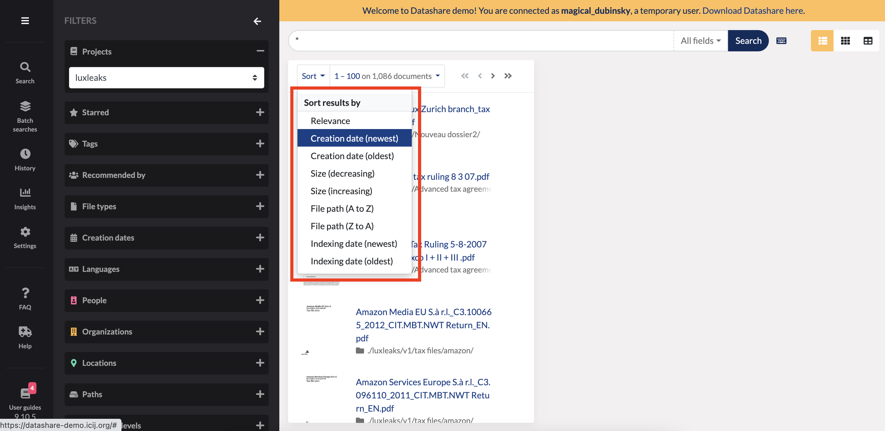
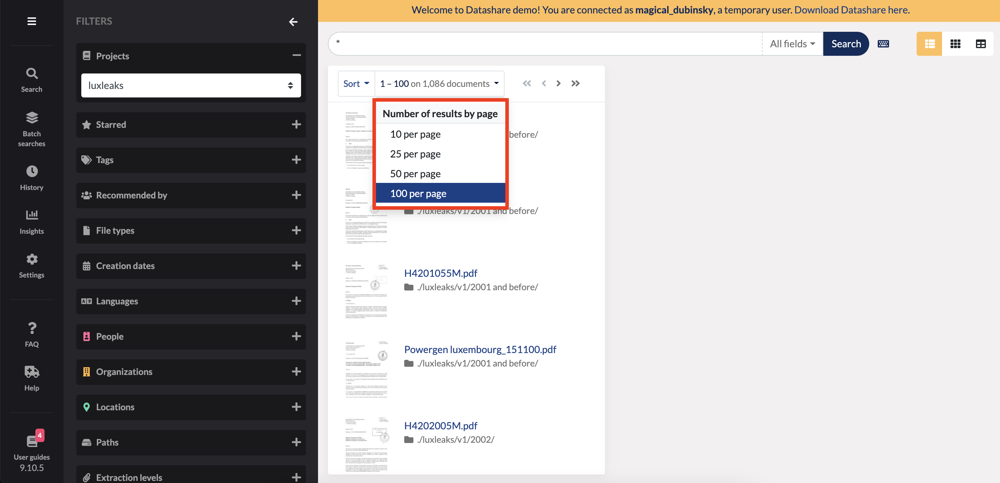
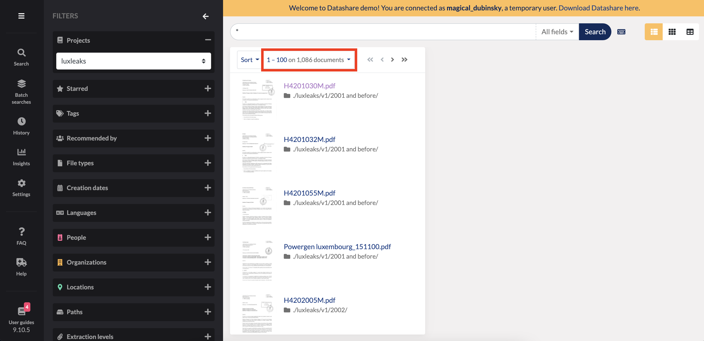

# Sort documents by dates, relevance, etc.

You can sort documents by:

* **relevance** \(by default\): it is a score calculated by the search engine
* **indexing date**: when you analyzed the document, the day and time you 'put' them in Datashare
* **creation date**: the day and time the document was created, as it is written in the document's metadata
* **size** of the documents
* **path** of the documents

You can also decide **the number of documents displayed by page** \(10, 25, 50 or 100\):

