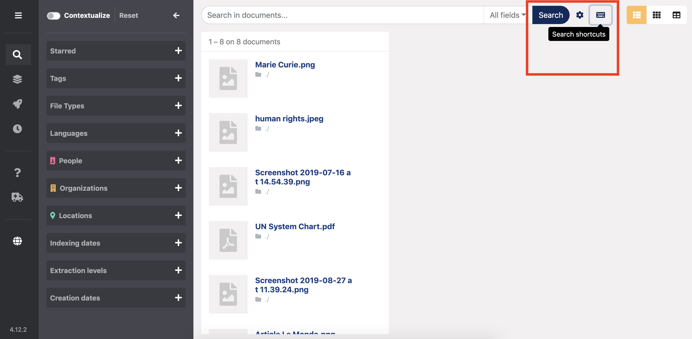
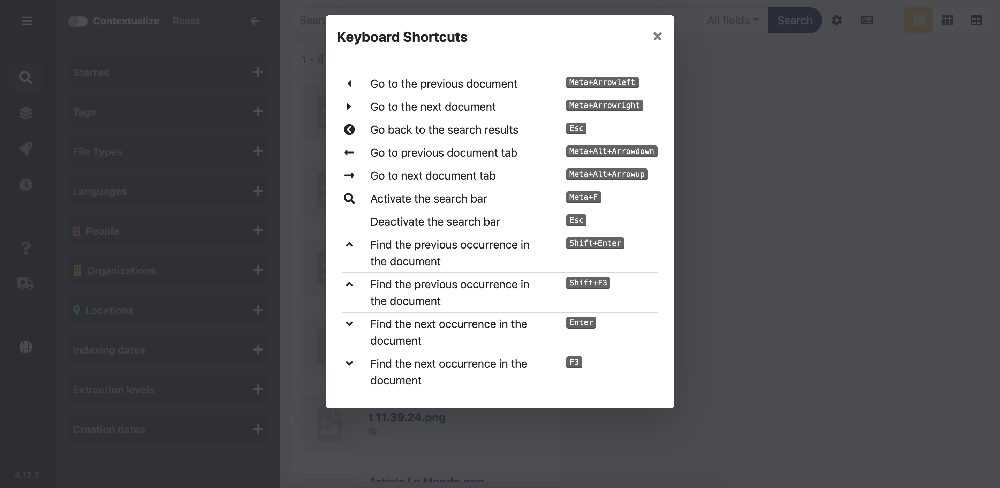

# Use keyboard shortcuts

### F**ind these shortcuts in Datashare here:**

It will open a window which recalls the shortcuts:

### **Go to the next / previous document**

* Windows / Linux

> Control + → 
>
> Control + ←

* Mac

> Command \(⌘\) + → 
>
> Command \(⌘\) + ←

### **Find in document...**

* Windows / Linux

> Control + F

* Mac

> Command \(⌘\) + F

**... and go from one occurrence to the next / previous occurrence**

* Go to next occurrence

> Enter
>
> or
>
> F3

* Go to previous occurrence

> Shift + Enter
>
> or
>
> Shift + F3

### Navigate a document's tabs

* Windows / Linux

> Control \(ctrl\) + alt + ⇞ \(pageup\) 
>
> Control \(ctrl\) + alt + ⇟ \(pagedown\)

*  Mac

> Command \(⌘\) + option \(⌥\) + ↑ \(arrow up\)
>
> Command \(⌘\) + option \(⌥\) + ↓ \(arrow down\)

### Go back to search results

Once you opened a document, go back to search results:

> Esc

