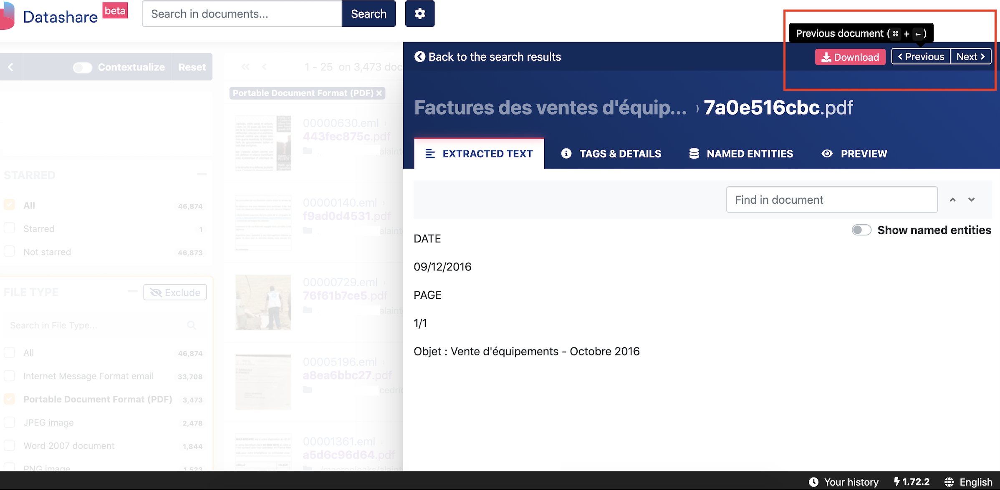
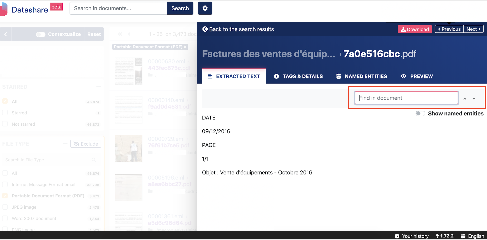
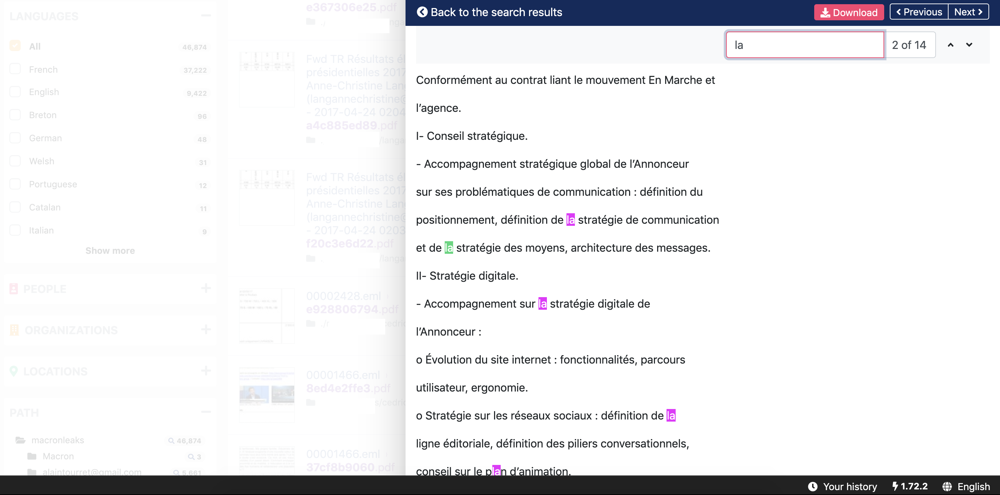
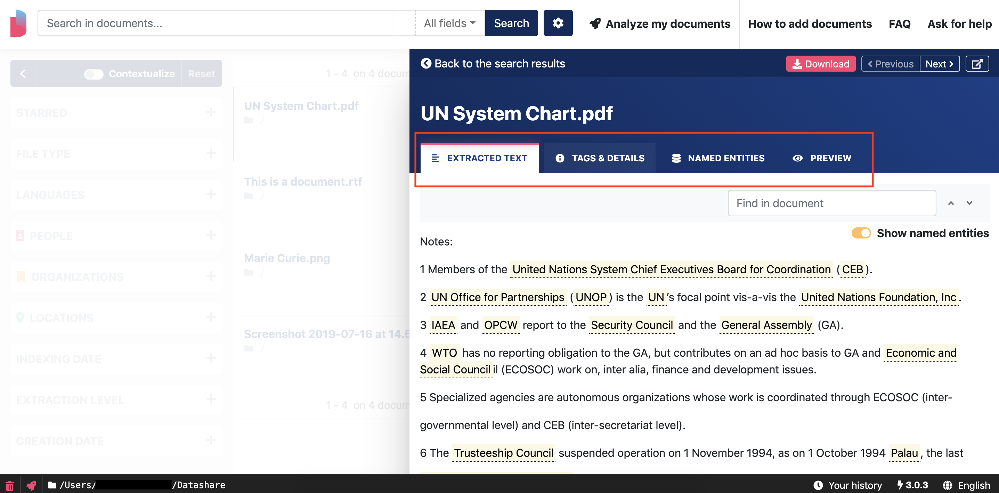
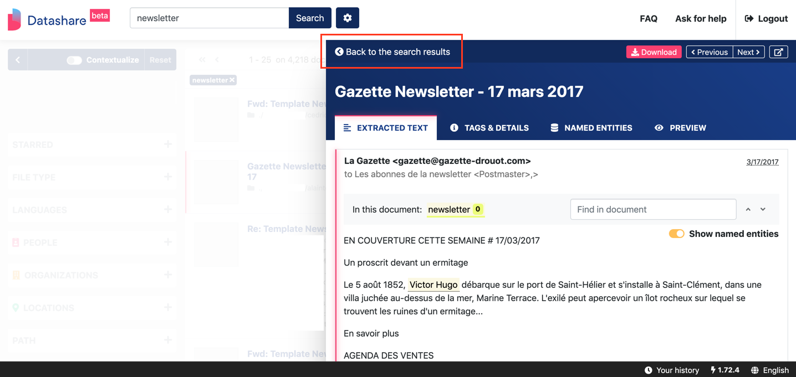

# Use keyboard shortcuts

### **Go to the next / previous document**

* Windows / Linux:

```text
Control + → 
Control + ←
```

* Mac:

```text
Command (⌘) + → 
Command (⌘) + ←
```



### \*\*\*\*

### **Find in document...**

* Windows / Linux:

```text
Control + F
```

* Mac:

```text
Command (⌘) + F
```



**... and go from one occurrence to the next / previous occurrence**

Go to next occurrence:

```text
Enter
```

Go to previous occurrence:

```text
Shift + Enter
```



### 

### Navigate a document's tabs

* Windows / Linux:

```text
Control (ctrl) + alt + ⇞ (pageup) 
Control (ctrl) + alt + ⇟ (pagedown)
```

*  Mac:

```
Command (⌘) + option (⌥) + ↑ (arrow up)
Command (⌘) + option (⌥) + ↓ (arrow down)
```



### Go back to search results

Once you opened a document, go back to search results:

```text
Esc
```



