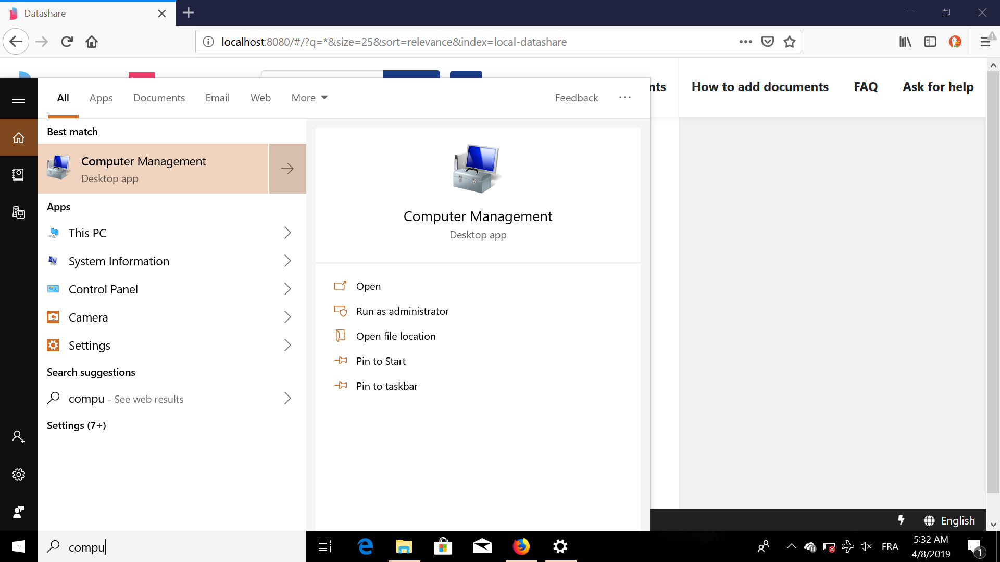
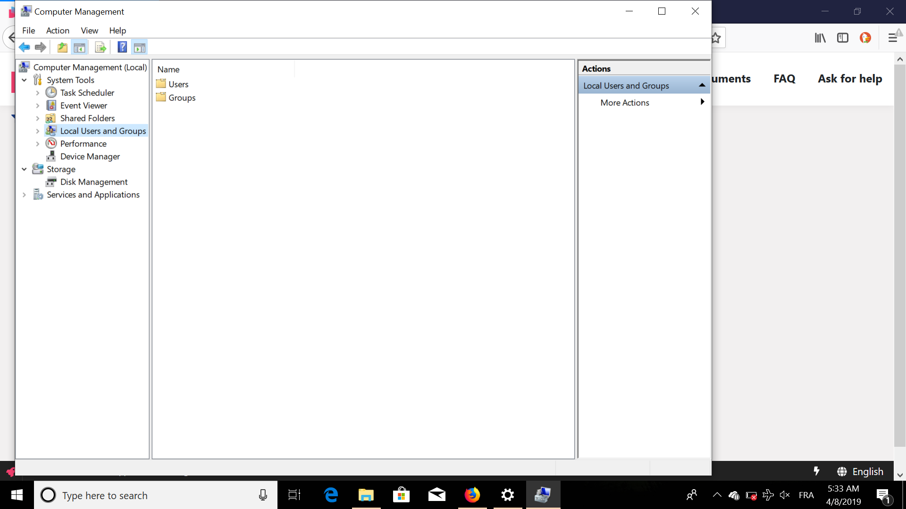
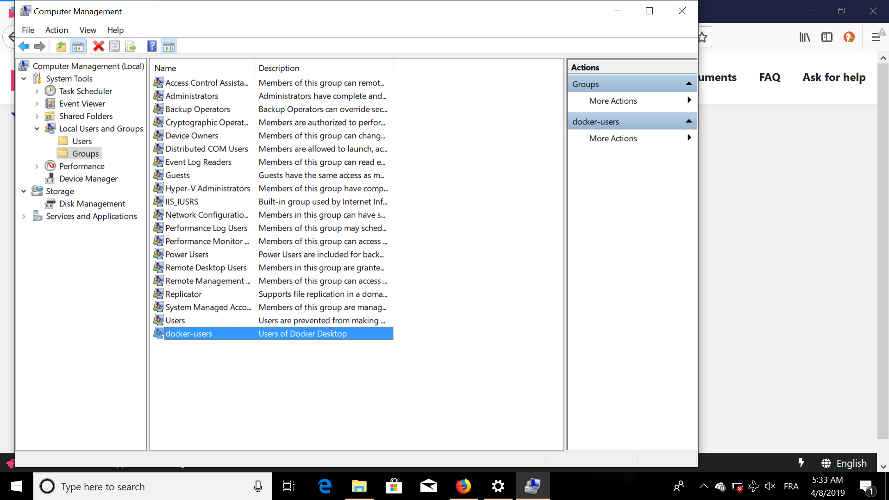
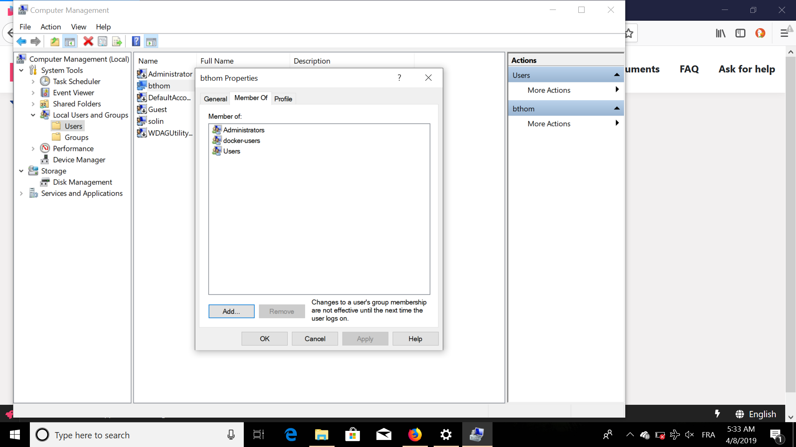

# 'You are not allowed to use Docker, you must be in the "docker-users" group'. What should I do?

It means that you are on **Windows**.

* Search and open '**Computer management**':

* Go to '**Local users and groups**':

* In 'Groups', double-click '**docker-users'**:

* If you are not in 'docker-users', go to '**Users**' on the left filter and add you in the '**docker-users' group** by clicking on you and '**Add...'**:

