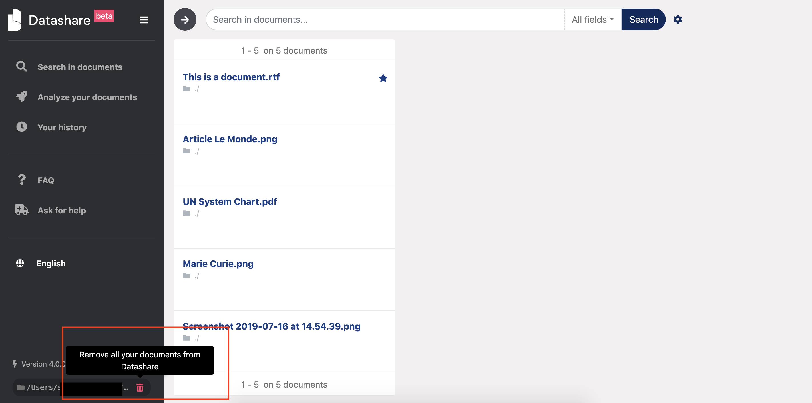
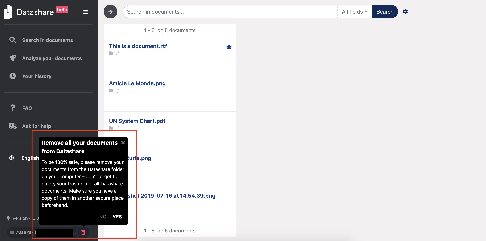

# Can I remove document\(s\) from Datashare?

Yes, you **can** remove documents from Datashare. But at the moment, **it will remove all your documents**. You cannot remove only some documents.

**Click the pink trash icon on the bottom left of Datashare:**

And then click '**Yes'**:

You can them re-analyze a new corpus.

_For advanced users only -_ if you'd like to do it with the Terminal, here are the instructions:

* If you're using Mac: `rm -Rf ~/Library/Datashare/index`
* If you're using Windows: `rd /s /q "%APPDATA%"\Datashare\index`
* If you're using Linux: `rm -Rf ~/.local/share/datashare/index` 

