# How can I install Datashare on a Windows prior to Windows 10 Pro?

1. On [datashare.icij.org](https://datashare.icij.org), click '**Download for free'.** Follow the steps [here](https://icij.gitbook.io/datashare/windows/install-datashare-on-windows) until step 4 included. Docker Toolbox is then going to be installed. To do so, click '**Next &gt;'**:

 2. Click '**Next &gt;'** \(or, if you want to change the location, click 'Browse'\):

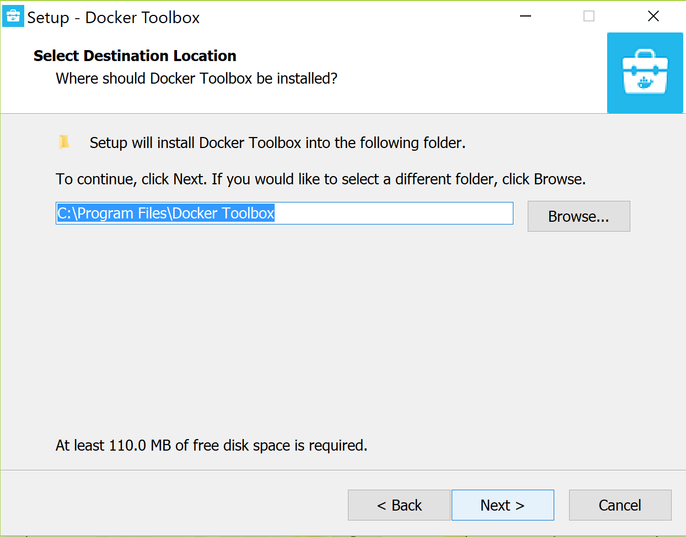

3. Make sure the boxes below are selected and click '**Next &gt;'**:

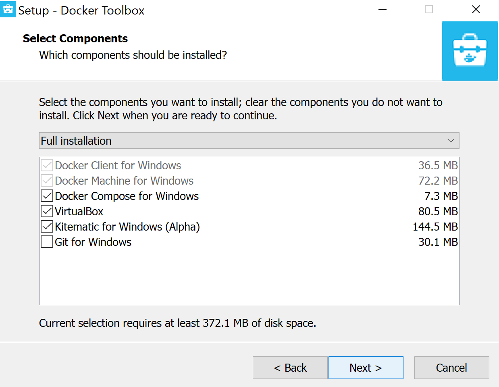

4. Make sure the boxes below are selected and click '**Next &gt;'**:

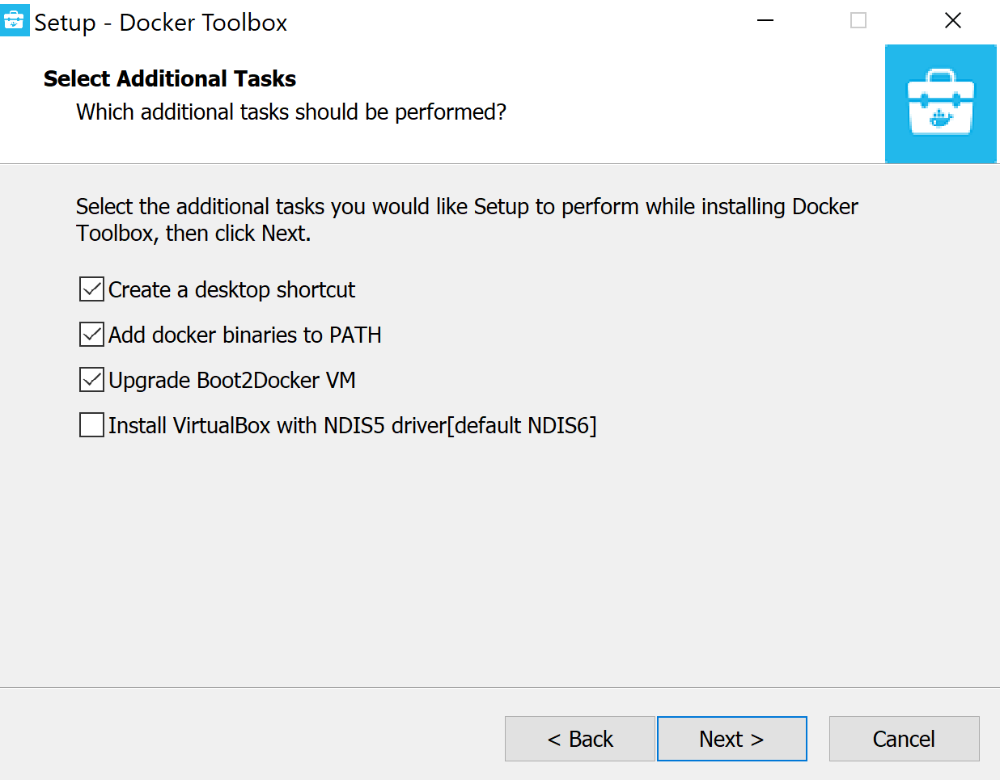

5. Click '**Install'**:

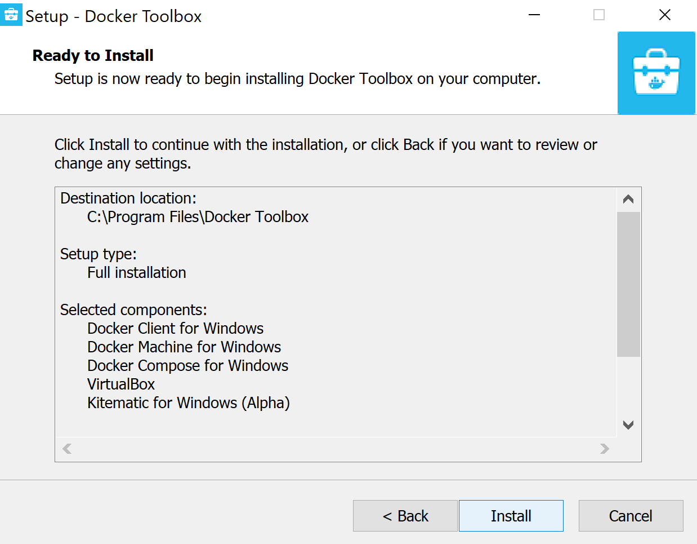

6. Wait for installing:

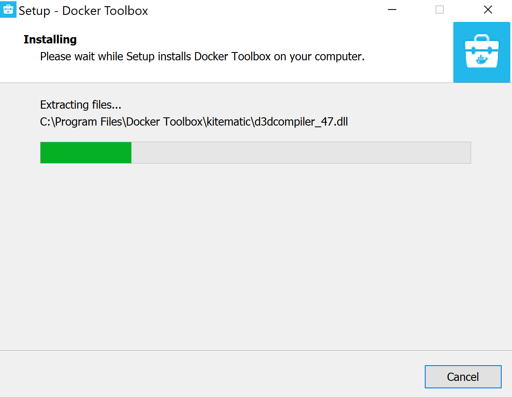

7. Once installing is finished, click '**Finish'**:

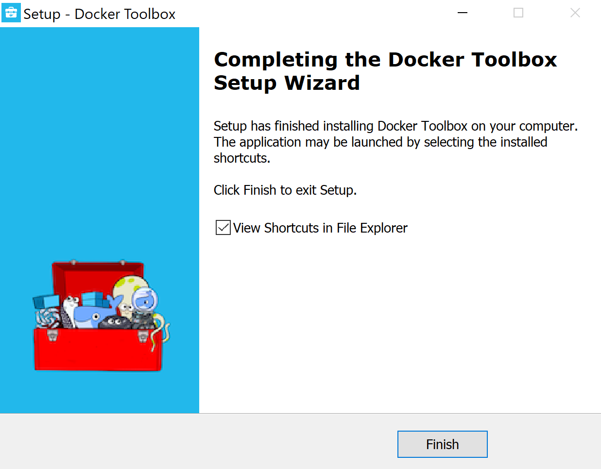

7. Installing Datashare is almost finished. Click '**Yes'** to reboot. Your computer is going to restart:

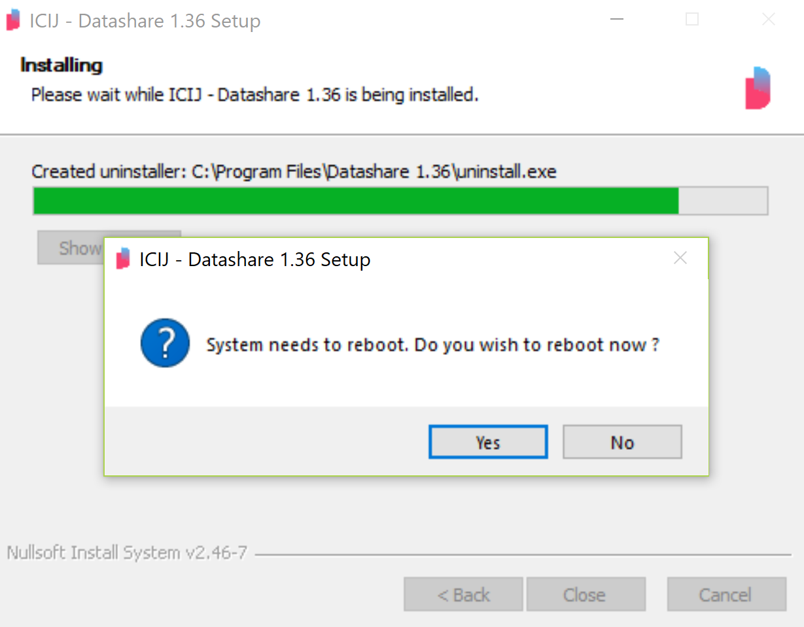

8. Datashare for Windows and Docker Toolbox are installed, we now need to use the Linux launching script. To do so, go back to [datashare.icij.org](https://datashare.icij.org) and, under the blue button, click the text '**Other platforms and versions'**. 

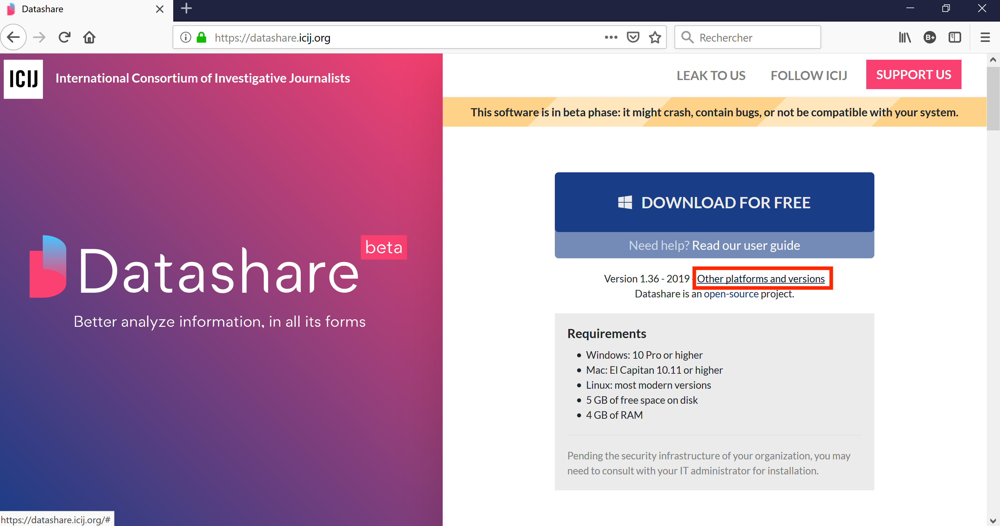

 9. Click '**Linux'** and the **last version available** \(here '1.36'\): 

 10. Click '**Save'**:

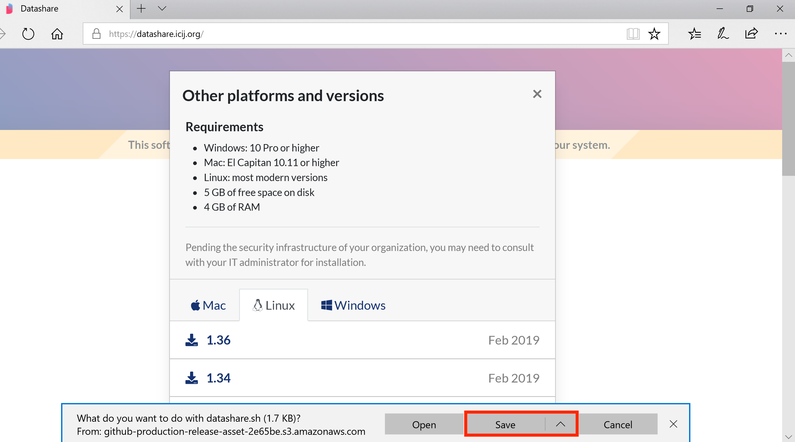

 11. Go to your desktop, you should see a '**Docker Quickstart'** icon. Double-click it:

12. A terminal window opens:

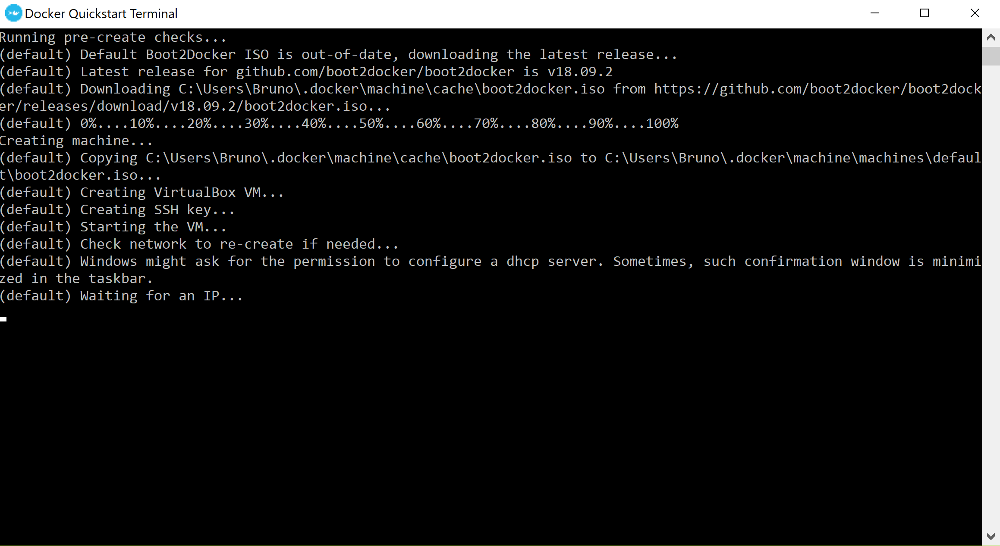

13. Then, you should see the command line windows below. 

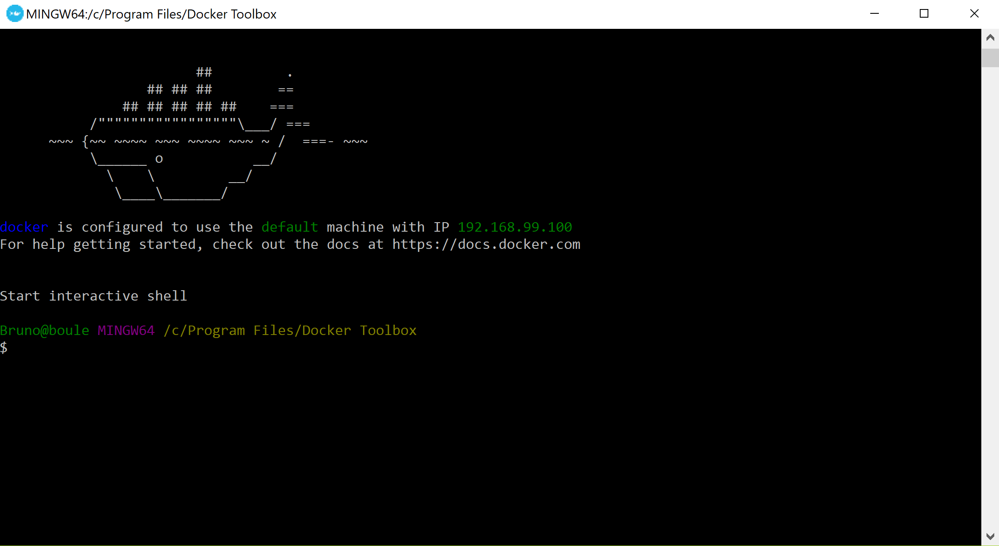

 14. Type '**cd'** and press '**Enter'**:

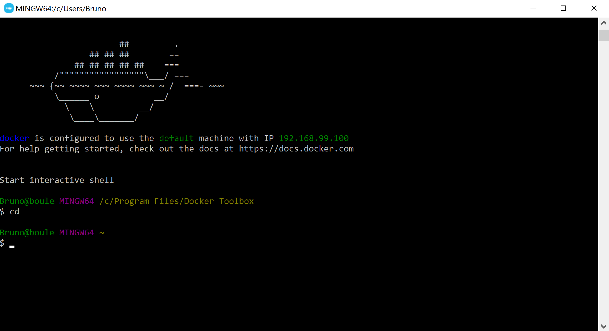

 15. Type '**cd Downloads'** and press '**Enter'**. Then type '**ls'** and check that 'datashare.sh' appears \(there can be other text, just make sure 'datashare.sh' is here\):

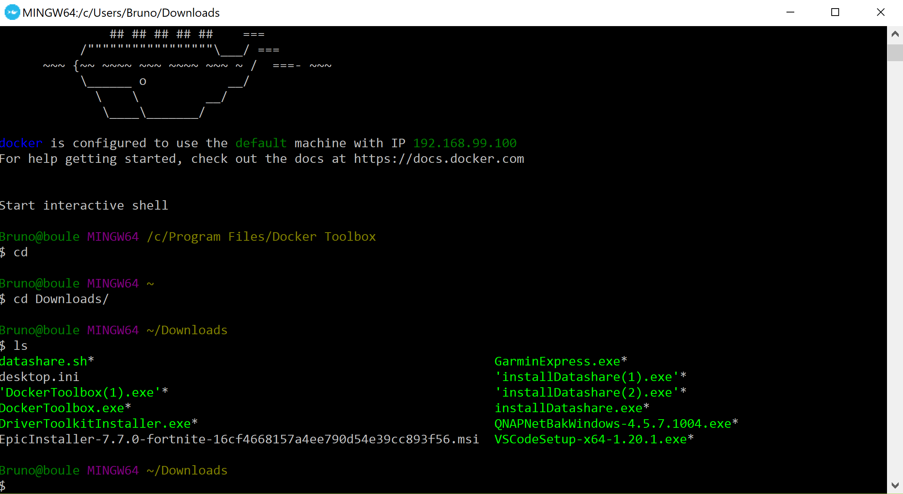

16. Type 'BIND\_HOST=0.0.0.0 ./datashare.sh' and press '**Enter'.**

17. To use Datashare, open your browser and go to URL '**192.168.99.100:8080'**:

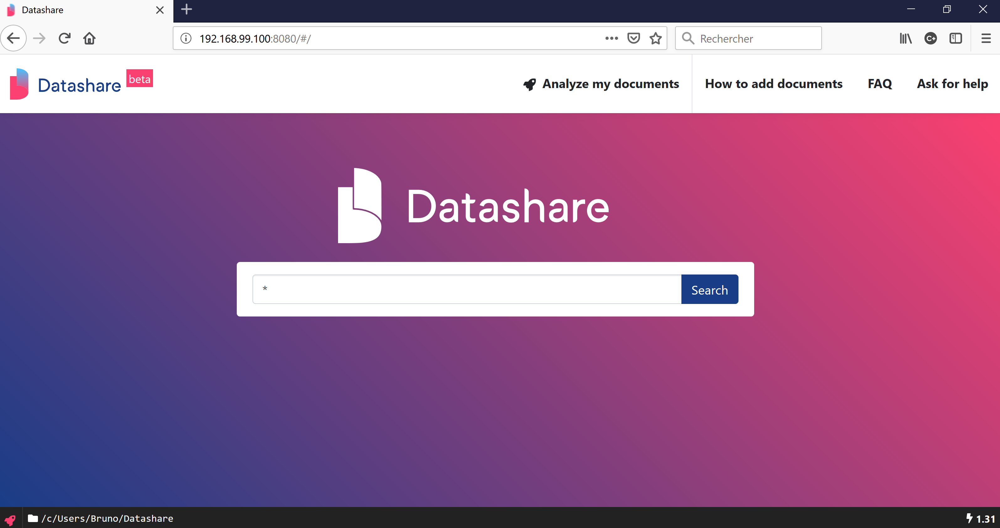

Datashare is now running as a server. **Each time you want to use Datashare**, open URL '**192.168.99.100:8080'** in your browser. 

After having logged out or restarted your computer, **you will need to restart the server and go from step 11 to step 17 above**.

