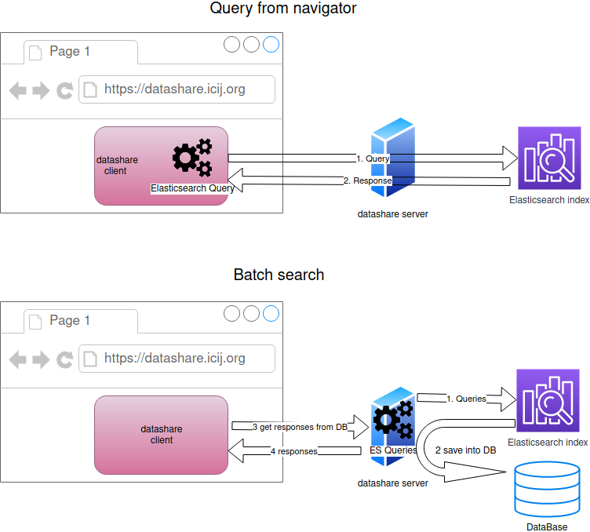

# Why results from a simple search and a batch search can be slightly different?

If you search "Shakespeare" in the search bar and if you run a query containing "Shakespeare" in a batch search, you can get slightly different documents between the two results.

Why?

For technical reasons, Datashare processes both queries in 2 different ways:

 **a. Search bar \(a simple search processed in the browser\):**

The search query sent to Elasticsearch is processed in your browser by Datashare's client. It is then sent to Elasticsearch through Datashare server which forwards your query.

 **b. Batch search \(several searches processed by the server\):**

1. Datashare's server processes each of the batch search's queries  
2. Each query is sent to Elasticsearch. The results are saved into a database  
3. When the batch search is finished, you get the results from Datashare  
4. Datashare sends back the results stored into the database/  
  
Datashare's team attempts to make both results be similar, but slight differences can happen between the two queries.

