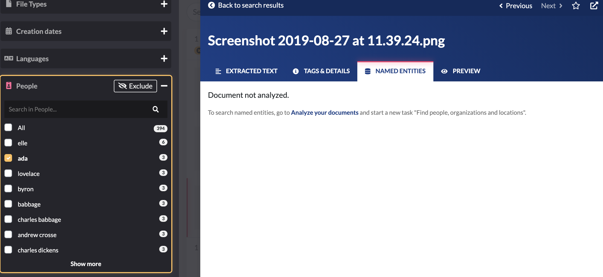

# I see people, organizations and locations in the filters but not in the documents.

Datashare's filters keep the named entities \(people, organizations and locations\) previously recognized.

"Old" named entities stay in the filter of Datashare, even though the documents that contained them were removed from your Datashare folder on your computer later. It means that you removed the documents which contained the named entities after extracting them, you run new analysis, but the named entities stayed in the filters: 

In the future, removing the documents from Datashare before indexing new ones **will remove the named entities of these documents too**. They won't appear in the people, organizations or locations' filters anymore. To do so, you can click the little pink trash icon on the bottom of the left column:

