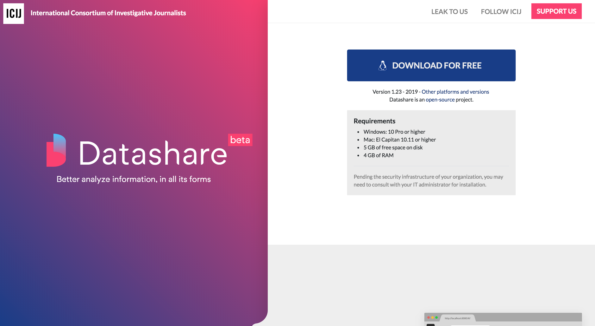
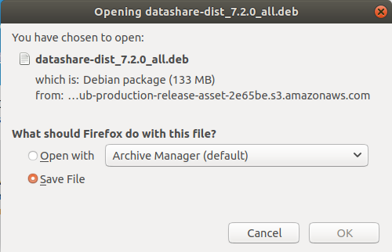
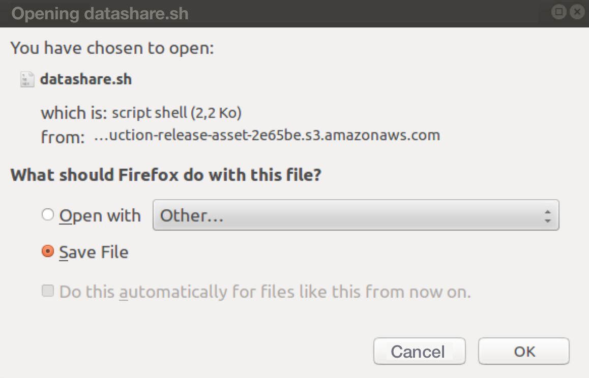
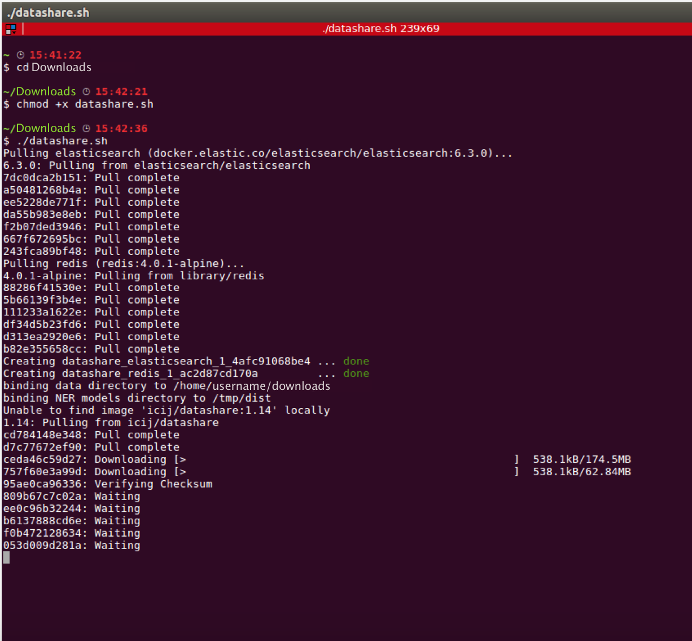
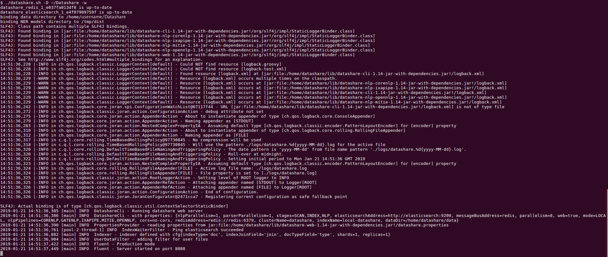

# Install Datashare on Linux

There are two ways of installing Datashare on Linux :

1. install it standalone
2. install it with Docker

### Standalone

There is only a package for debian/ubuntu systems \(.deb file\).

If you want to run it standalone with another Linux distribution, you can download the latest version of the Datashare jar here : [https://github.com/ICIJ/datashare/releases/latest](https://github.com/ICIJ/datashare/releases/latest)

And adapt the following launch script : [https://github.com/ICIJ/datashare/blob/master/datashare-dist/src/main/deb/bin/datashare](https://github.com/ICIJ/datashare/blob/master/datashare-dist/src/main/deb/bin/datashare) to your environment.

1. Go to the **Datashare's website:** [**https://datashare.icij.org/**](https://datashare.icij.org/).

2. Click the blue button '**DOWNLOAD FOR FREE'.**



3. Save the debian package as a file



 4. Install it with the following command line: 

```text
$ sudo apt install /dir/to/debian/package/datashare-dist_7.2.0_all.deb
```

 5. Run Datashare with:

```text
$ datashare
```

### With Docker 

1. Install **Docker for Linux**:   
[ - **https://docs.docker.com/install/linux/docker-ce/centos/**](https://docs.docker.com/install/linux/docker-ce/centos/)\*\*\*\*

 **-** [**https://docs.docker.com/install/linux/docker-ce/debian/**](https://docs.docker.com/install/linux/docker-ce/debian/)\*\*\*\*

 **-** [**https://docs.docker.com/install/linux/docker-ce/fedora/**](https://docs.docker.com/install/linux/docker-ce/fedora/)\*\*\*\*

 **-** [**https://docs.docker.com/install/linux/docker-ce/ubuntu/**](https://docs.docker.com/install/linux/docker-ce/ubuntu/)\*\*\*\*

2. Don't forget \(if not done during the install process\) to **add your user to the docker group**:

```text
sudo usermod -aG docker your-user
```

If you do so, you'll have to close your session and open a new one \(**logout and login again**\). After having logged in again, you can check that it is working with :

```text
docker ps
CONTAINER ID    IMAGE     COMMAND      CREATED     STATUS      PORTS          NAMES
```

3. Install **Docker Compose**: [**https://docs.docker.com/compose/install/**](https://docs.docker.com/compose/install/)\*\*\*\*

4. Download the datashare.sh file from [https://github.com/ICIJ/datashare-installer/releases/latest](https://github.com/ICIJ/datashare-installer/releases/latest)

5. On the next window, select '**Save File'** and click '**OK'**.



6. In your Terminal, you can **start installing Datashare**:



7. Once installation is done, **open your browser and use Datashare at** [http://localhost:8080/\#/](http://localhost:8080/#/):



8. It will :

* download [redis](https://redis.io), [elasticsearch](https://www.elastic.co/) and Datashare [docker](https://www.docker.com/docker-community) containers
* initialize an Elasticsearch index with Datashare mapping
* provide CLI to run Datashare extract, index, name finding tasks
* provide a WEB GUI to run Datashare extract, index, name finding tasks, and search in the documents.

