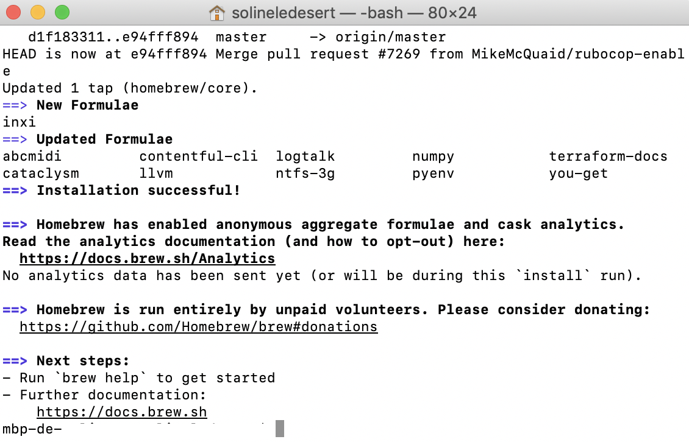

# Install Datashare on Mac

You have **2 options:**

* if you have **OS X El Capitan 10.11** or a more recent version: you can use the **standard** option which installs Datashare with Docker; it is a more powerful version.
* if you have **a less recent version**: you can use the **standalone** option which installs Datashare without Docker.

### Standard \(OS X El Capitan 10.11\)

You need **OS X El Capitan 10.11 or a more recent version.**  
  
1. Go to **Datashare's website:** [**https://datashare.icij.org/**](https://datashare.icij.org/)**.**

2. Click the blue button '**DOWNLOAD FOR FREE.'**


3.  On your desktop:

* Open '**Finder'** by clicking on the blue smiling icon of your Mac's 'Dock.'


* Open '**Downloads.'**
* Double-click on '**Datashare.pkg.'**


4. You might see this window which says '"Datashare.pkg” can’t be opened because it was not downloaded from the App Store.'. Click '**Ok**'.


5. To open 'Dartashare.pkg' despite this, go to your Mac's **System Preferences**:


6. Open '**Security & Privacy**':


7. Click '**Open Anyway**':


8. Click '**Open**':


9. A window entitled 'Install Datashare' will open. Click twice on '**Continue'** and then '**Install**.'


10. A window saying 'Installer is trying to install new software' will require your Mac **username** and **password**. Enter both and click '**Install Software.'**


11. Once the windows says 'The installation was successful. The software was installed,' click on '**Close.'**


12. A new windows will ask 'Do you want to move the "Datashare" Installer to the Trash?'. You can safely click '**Move to Trash'**:


13. You see a small window of 'Terminal' automatically opened. It describes ongoing technical operations and **will close automatically.** If it does not close automatically, please wait for process to be completed before manually closing it.


14. Datashare is now installed as well as another tool that makes it work, called **Docker Desktop**. You can find Docker Desktop on your Mac menu bar, on the top right of your computer's screen. Its icon is a little whale! It contains components necessary for Datashare to work. **Docker Desktop will run automatically when you use Datashare**. 

If you don't see the docker whale, please **continue to open with Datashare**.


If Docker Desktop offers to log in with Docker ID, **do NOT log in and** **close this window**: 


You're now ready to take the next step: let's [open Datashare](https://icij.gitbook.io/datashare/mac/open-datashare-on-mac).

### 

### 

### Standalone \(less recent than OS X El Capitan 10.11\)

 ****0. Before we start, please **uninstall any prior standard version of Datashare** if you had already installed it. Go to **Applications** and put '**Datashare**' in the trash.

 1. Let's first install Homebrew, which is needed for installing Tesseract OCR. Open your **Finder**:


 2. Search for '**Terminal**' in your applications and double click on '**Terminal.app**' to open it:


 3. A Terminal window opens:


**Copy and paste** this and press **Enter**: 

```text
/bin/bash -c "$(curl -fsSL https://raw.githubusercontent.com/Homebrew/install/master/install.sh)"
```

 4. Press '**Enter**' when it displays this message:


 5. **Close the windows** when it displays this:



6. **Go to this page**: [https://github.com/ICIJ/datashare-installer/releases/](https://github.com/ICIJ/datashare-installer/releases/)

7. In 'Latest release', **click** '**DatashareStandalone.pkg**':


  8. Go to your '**Downloads**' and double-click '**DatashareStandalone.pkg**':


9. You might see this window which says '"Datashare.pkg” can’t be opened because it was not downloaded from the App Store.'. Click '**Ok**'.


10. To open 'Dartashare.pkg' despite this, go to your Mac's **System Preferences**:


11. Open '**Security & Privacy**':


12. Click '**Open Anyway**':


13. Click '**Open**':


 

14. Click '**Continue**', '**Install**', enter your password and '**Close**':


The installation begins. You see a progress bar. It stays a long time on "Running package scripts" because it is installing Tesseract OCR, Java Runtime Environment, Datashare backend and Datashare frontend.

You can see what it actually does by typing command+L, it will open a window which logs every action made. 

In the end, you should see this screen:


15. Then, go in your **Applications**, and double-click on '**Datashare.app**':


16. A Terminal windows opens. Wait for it to display 'INFO  Fluent - Server started on port 8080' like this:


 17.  Now, **open your browser, and go to the URL**: [http://localhost:8080](http://localhost:8080/#/)/. 

