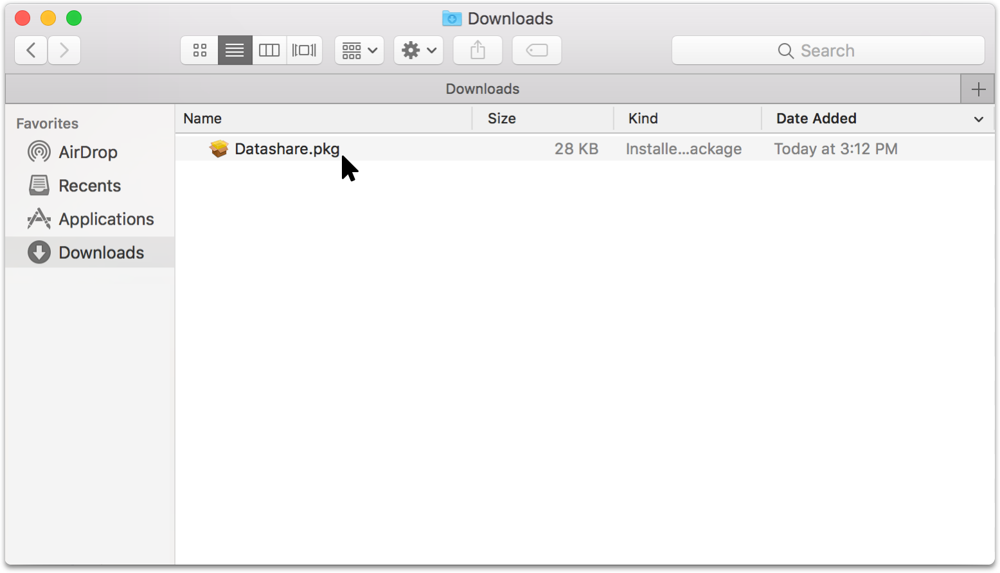

# Install Datashare on Mac

You need **OS X El Capitan 10.11 or a more recent version.**  
  
1. Go to **Datashare's website:** [**https://datashare.icij.org/**](https://datashare.icij.org/)**.**

2. Click the blue button '**DOWNLOAD FOR FREE.'**

3. On your desktop:

* Open '**Finder'** by clicking on the blue smiling icon of your Mac's 'Dock.'

* Open '**Downloads.'**
* Double-click on '**Datashare.pkg.'**

4. A window entitled 'Install Datashare' will open. Click twice on '**Continue'** and then '**Install**.'

5. At step 3, a window saying 'Installer is trying to install new software' will require your Mac **username** and **password**. Enter both and click '**Install Software.'**

6. Once the windows says 'The installation was successful. The software was installed,' click on '**Close.'**

7. A new windows will ask 'Do you want to move the "Datashare" Installer to the Trash?'. You can safely click '**Move to Trash'**:

8. You see a small window of 'Terminal' automatically opened. It describes ongoing technical operations and **will close automatically.** If it does not close automatically, please wait for process to be completed before manually closing it.

9. Datashare is now installed as well as another tool that makes it work, called **Docker Desktop**. You can find Docker Desktop on your Mac menu bar, on the top right of your computer's screen. Its icon is a little whale! It contains components necessary for Datashare to work. **Docker Desktop will run automatically when you use Datashare**. 

If you don't see the docker whale, please **continue to open with Datashare**.

If Docker Desktop offers to log in with Docker ID, **do NOT log in and** **close this window**: 

You're now ready to take the next step: let's [open Datashare](https://icij.gitbook.io/datashare/mac/open-datashare-on-mac).

