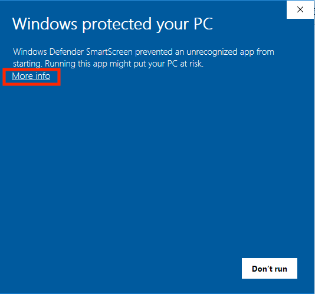
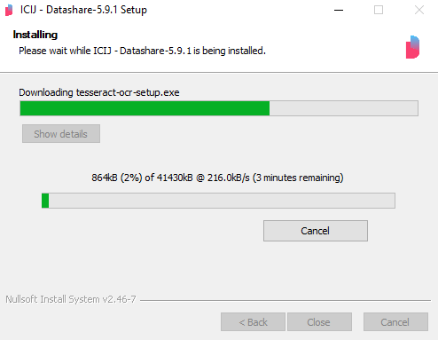
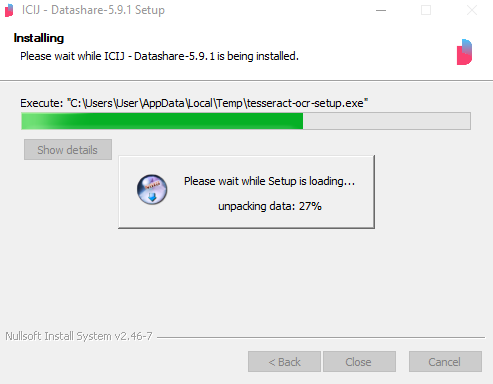
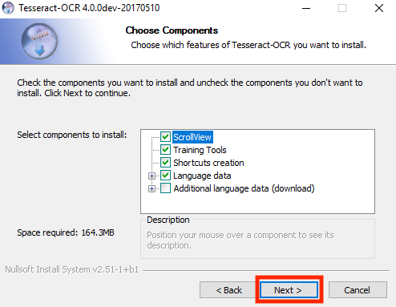
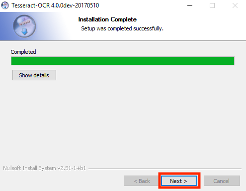

# Install Datashare on Windows

You have **2 options:**

* if you have **Windows 10 Pro**: you can use the **standard** option which installs Datashare with Docker; it is a more powerful version.
* if you have **Windows 7 Service Pack 2 or newer version**: you can use the **standalone** option which installs Datashare without Docker.

### **Standard \(Windows 10 Pro\)**

You will need **Windows 10 Pro** or a newer version.   
****  
1. Go to the **Datashare's website:** [**https://datashare.icij.org/**](https://datashare.icij.org/).

2. Click the blue button '**DOWNLOAD FOR FREE'**.

3. You might see a window saying 'Windows protected your computer'.   
**DO NOT click on the button 'Don't run'**.   
**Click on the text 'More info':**

When the next window opens, click on '**Run anyway'**.

  
4. On the next window, click **'Install'**.

Datashare is installing.

5. The system will ask you to reboot to restart your computer. Click on '**Yes'**.

6. When you restart, another application will automatically open: Docker Desktop with its little whale icon. It will be visible on your Windows' menu bar, at the bottom right of your computer screen. It contains components necessary to have Datashare work. Docker Desktop will automatically be running when you use Datashare. You don't need an I.D. for this. To close this window, **click on the white 'x' on the right side of the red background.**

You're now ready to the next step. Let's [open Datashare](https://icij.gitbook.io/datashare/windows/open-datashare-on-windows).

### **Standalone \(Windows 7 Service Pack 2 or newer version\)**

You will need **Windows 7 Service Pack 2** or a newer version.

1. Download the latest release installer by **clicking the link below**:

[**https://github.com/ICIJ/datashare-installer/releases/download/5.9.1/installDatashareStandalone.exe**](https://github.com/ICIJ/datashare-installer/releases/download/5.9.1/installDatashareStandalone.exe)

 2. The file '**InstallDatashareStandalone.exe**' was downloaded. **Double click** on the name of the file in order to execute it.

 3. As Datashare is not signed, this popup asks for your permission. Don't click 'Don't run' but click '**More info'**: 

 4. Click '**Run anyway**':

 5. It asks if you want to allow the app to make changes to your device. Click '**Yes**':

 6. On the Installer Wizard, as you need to download and install OpenJDK8 if it is not installed on your device, click '**Install**':

The following windows with progress bars will be displayed:

Choose a language and click '**OK**':

 7. To install **Tesseract OCR**, click the following buttons on the Installer Wizard's windows:

Untick '**Show README**' and click '**Finish**':

Finally, click "**Close**" to close the installer of TesseractOCR.

 8. It now downloads the back end and the front end, Datashare.jar:

When it is finished, click '**Close**':

 9. **Datashare is now installed**. Click the Windows key, type 'Datashare' and you will see the App and its version number. Click '**Datashare**':

  
 10. It will open a '**command line**' window, a window that shows the logs of Datashare's server \(that is to say a description of the actions run by Datashare's server\):

 ****11. **Do you see this error screen?** \(It can happen on Windows 8.1 for instance\)

**If yes**, you need to allow 'running scripts' as explained here:  

[https://superuser.com/questions/106360/how-to-enable-execution-of-powershell-scripts](https://superuser.com/questions/106360/how-to-enable-execution-of-powershell-scripts)

In an administrator powershell, **type**:

`Set-ExecutionPolicy -Scope CurrentUser Bypass`

Then launch Datashare.

When you'll see the log '**Server started on port 8080**', you will be able to open your browser and go to the URL [http://localhost:8080](http://localhost:8080/).

